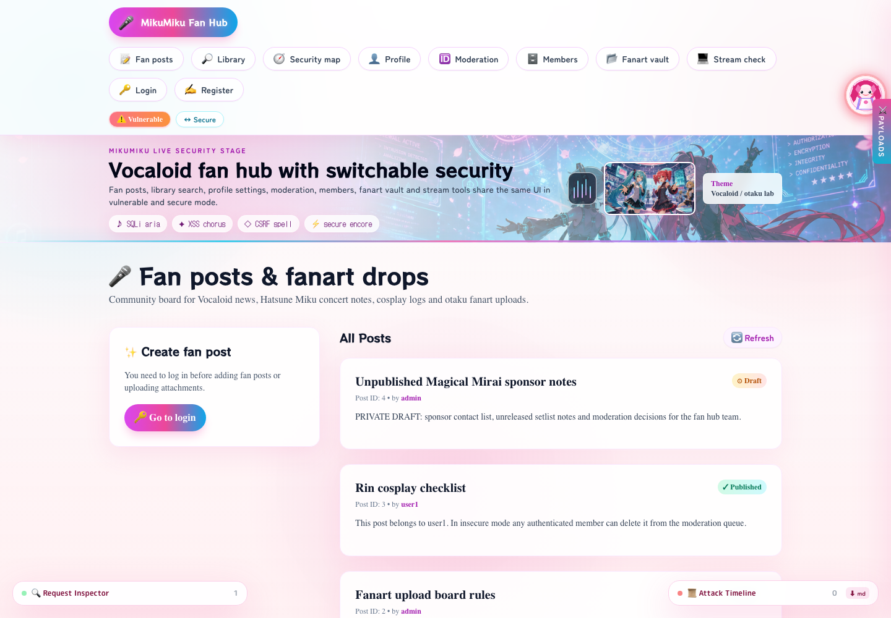
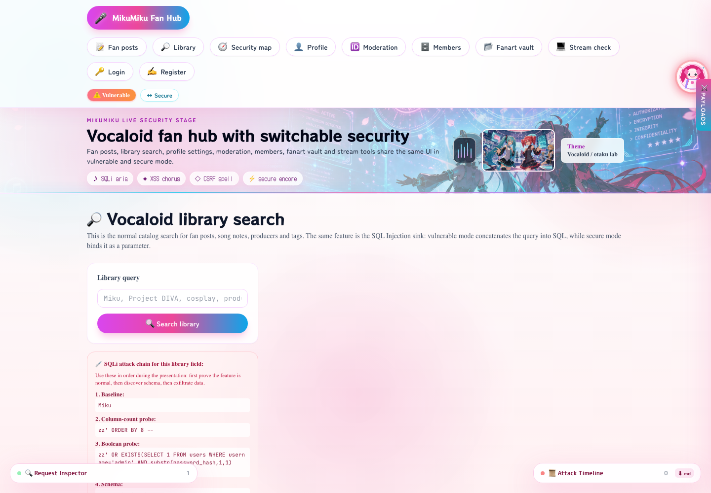
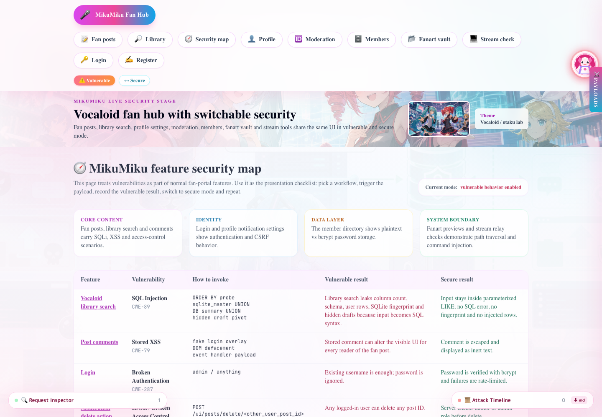
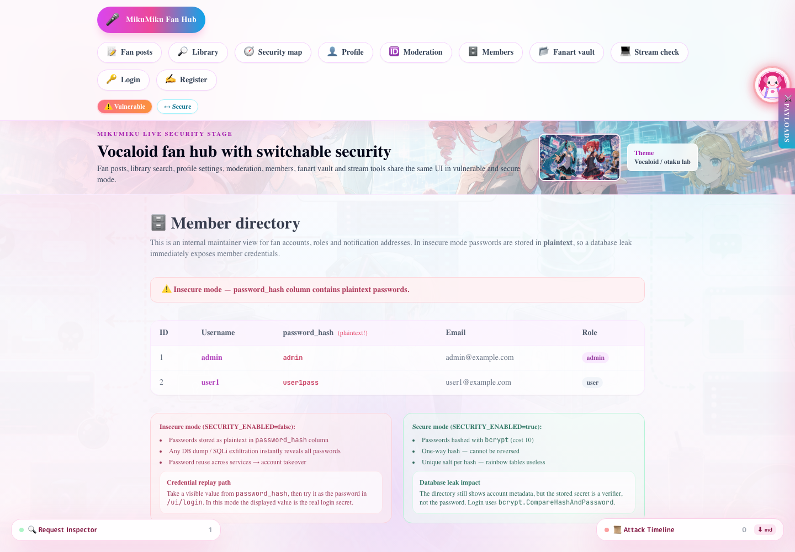
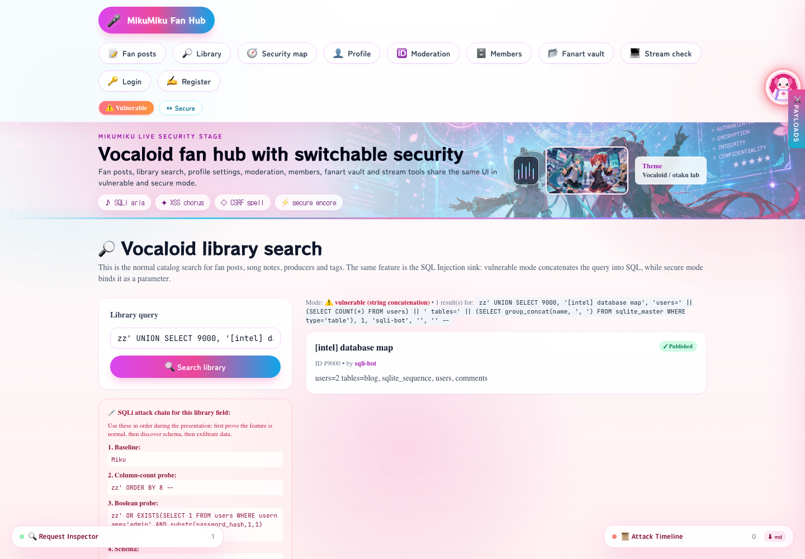
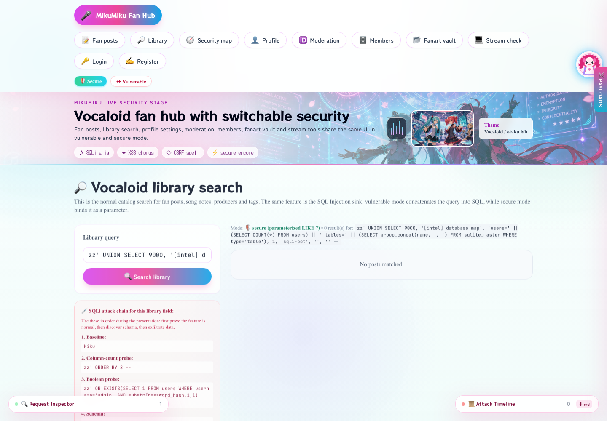
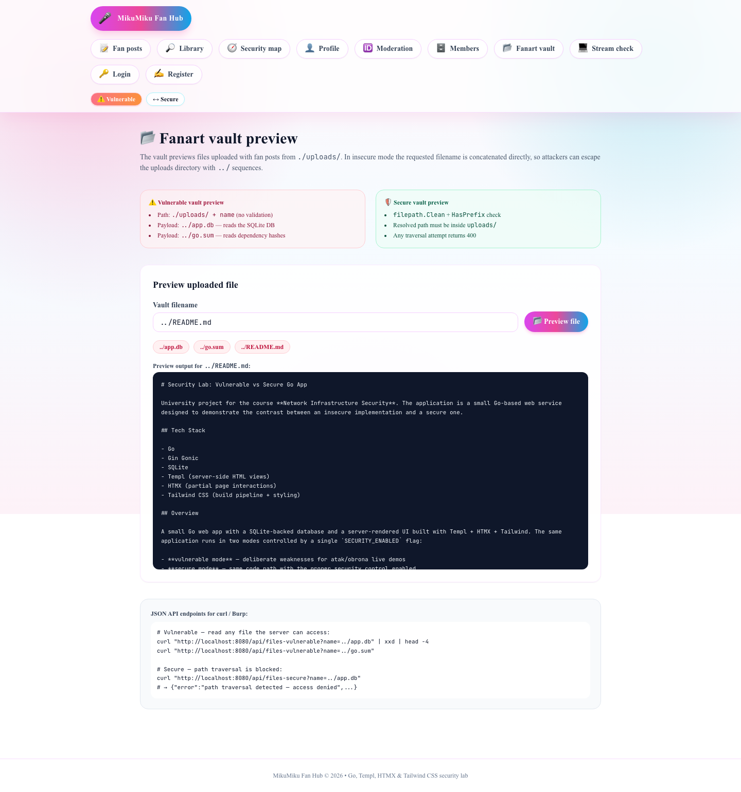
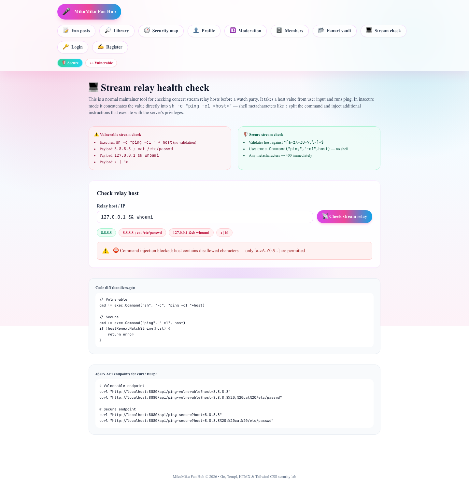
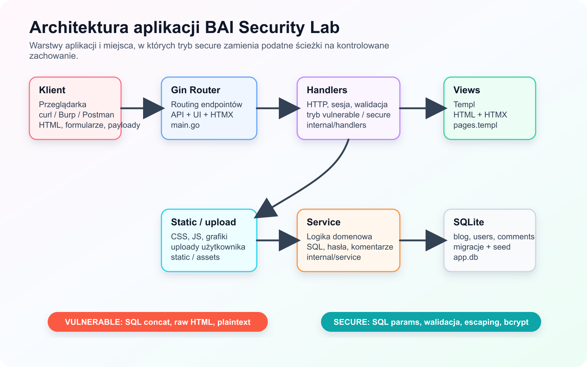
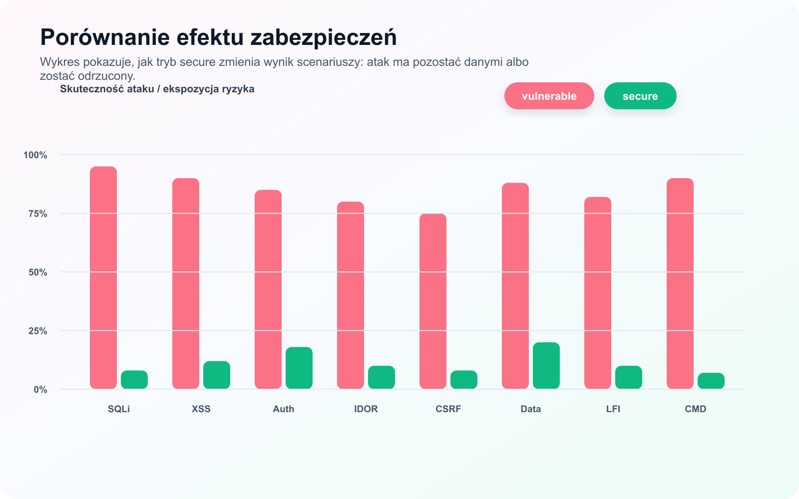

# BAI 1IZ21B Security Lab

[](https://github.com/stigi99/BAI_1IZ21B_PROJEKT/actions/workflows/ci.yml)


Projekt laboratoryjny z przedmiotu **Bezpieczeństwo Aplikacji Internetowych**.
Aplikacja pokazuje te same funkcje biznesowe w dwóch trybach: podatnym i zabezpieczonym.
Tryb wybiera się flagą `SECURITY_ENABLED` albo przełącznikiem w interfejsie.

**Autorzy:** Mateusz Misiak, Kamil Erbel<br>
**Grupa:** 1IZ21B<br>
**Uczelnia:** Politechnika Świętokrzyska w Kielcach


> **Uwaga bezpieczeństwa:** repozytorium zawiera celowo podatne ścieżki aplikacji.
> Kod jest przeznaczony do lokalnego laboratorium, sprawozdania i obrony projektu.
> Nie uruchamiaj tej aplikacji publicznie ani w środowisku produkcyjnym.

## Spis Treści

- [Cel Projektu](#cel-projektu)
- [Galeria](#galeria)
- [Funkcje Aplikacji](#funkcje-aplikacji)
- [Podatności](#podatności)
- [Architektura](#architektura)
- [Szybki Start](#szybki-start)
- [Tryby Bezpieczeństwa](#tryby-bezpieczeństwa)
- [Testy I Walidacja](#testy-i-walidacja)
- [Dokumentacja](#dokumentacja)
- [Struktura Repozytorium](#struktura-repozytorium)
- [Praca Deweloperska](#praca-deweloperska)

## Cel Projektu

Projekt nie jest zbiorem oderwanych demonstracji. Podatności są osadzone w normalnych
funkcjach strony fanowskiej: bibliotece wpisów, komentarzach, katalogu członków,
galerii plików, panelu moderacji, profilu użytkownika oraz narzędziu sprawdzania
dostępności streamu.

Każdy scenariusz ma dwa zachowania:

- **vulnerable** - atak przechodzi i pokazuje realny skutek błędnej implementacji,
- **secure** - ta sama funkcja działa dalej, ale wejście jest walidowane, kodowane,
  parametryzowane albo blokowane przez kontrolę dostępu.

## Galeria

### Widoki Funkcjonalne

| Strona główna | Biblioteka / SQLi |
|---|---|
|  |  |

| Mapa bezpieczeństwa | Katalog członków |
|---|---|
|  |  |

### Porównanie Ataku I Obrony

| SQL Injection - vulnerable | SQL Injection - secure |
|---|---|
|  |  |

| Path Traversal - vulnerable | Command Injection - secure |
|---|---|
|  |  |

### Diagramy Projektowe

| Architektura | Wynik zabezpieczeń |
|---|---|
|  |  |

## Funkcje Aplikacji

- fanowska tablica wpisów z tworzeniem, edycją, usuwaniem i komentarzami,
- biblioteka wyszukiwania wpisów, w której pokazano SQL Injection,
- katalog członków i widok danych użytkowników,
- profil użytkownika z operacją podatną na CSRF w trybie vulnerable,
- panel moderacji pokazujący Broken Access Control / IDOR,
- galeria plików fanartów z kontrolowanym scenariuszem Path Traversal,
- narzędzie diagnostyczne streamu z podatnością Command Injection,
- mapa bezpieczeństwa z opisem funkcji, metody ataku i sposobu naprawy,
- przełącznik runtime `vulnerable` / `secure` bez zmiany adresów URL.

## Podatności

| # | Podatność | CWE / OWASP | Funkcja aplikacji | Tryb secure |
|---|---|---|---|---|
| 1 | SQL Injection | CWE-89 / A03:2021 | `/ui/library`, `/api/search` | zapytania parametryzowane |
| 2 | Stored XSS | CWE-79 / A03:2021 | komentarze pod wpisami | escaping HTML i sanitizacja wejścia |
| 3 | Broken Authentication | CWE-287 / A07:2021 | logowanie | bcrypt i weryfikacja hasła |
| 4 | Broken Access Control / IDOR | CWE-639 / A01:2021 | `/ui/moderation` | kontrola właściciela i roli |
| 5 | Sensitive Data Exposure | CWE-200 / A02:2021 | `/ui/members` | maskowanie i brak zrzutu sekretów |
| 6 | CSRF | CWE-352 / A01:2021 | `/ui/profile` | token CSRF w formularzu |
| 7 | Security Misconfiguration | CWE-16 / A05:2021 | `/debug/crash` | bezpieczne 500, CSP, HSTS i nagłówki ochronne |
| 8 | Path Traversal / LFI | CWE-22 / A01:2021 | `/ui/gallery` | normalizacja i ograniczenie ścieżki |
| 9 | Command Injection | CWE-78 / A03:2021 | `/ui/stream-check` | walidacja hosta i brak `sh -c` |

Szczegółowe kroki ataku, wynik w trybie vulnerable i kontrprzykład w trybie secure
są opisane w sprawozdaniu: [docs/generated/Sprawozdanie_BAI_Funkcjonalnosci.pdf](docs/generated/Sprawozdanie_BAI_Funkcjonalnosci.pdf).

## Architektura

```text
HTTP request
    |
    v
Gin router
    |
    +--> security headers / panic sanitizer
    |
    +--> handlers
            |
            +--> service layer
                    |
                    +--> SQLite
            |
            +--> Templ views + HTMX partials
```

Najważniejsze założenie architektoniczne: tryb bezpieczeństwa jest centralnie
przechowywany w `internal/security.ModeStore`, a warstwy `handlers` i `service`
odczytują go przy obsłudze żądania. Dzięki temu jedna funkcja aplikacji może
pokazać podatne oraz zabezpieczone zachowanie bez duplikowania całego projektu.

## Szybki Start

### Wymagania

- Go 1.25 lub nowszy,
- Node.js i npm,
- lokalny toolchain C wymagany przez `github.com/mattn/go-sqlite3`,
- macOS, Linux albo Windows z kompatybilnym środowiskiem Go.

### Uruchomienie

```bash
git clone https://github.com/stigi99/BAI_1IZ21B_PROJEKT.git
cd BAI_1IZ21B_PROJEKT

go mod tidy
npm install
npm run build:css

SECURITY_ENABLED=false go run .
```

Aplikacja startuje pod adresem:

```text
http://localhost:8080
```

Domyślne konto administracyjne:

```text
login:    admin
password: admin
```

## Tryby Bezpieczeństwa

Tryb można ustawić przez zmienną środowiskową:

```bash
SECURITY_ENABLED=false go run .  # tryb podatny
SECURITY_ENABLED=true go run .   # tryb zabezpieczony
```

W interfejsie działa również przełącznik runtime pod `POST /ui/mode/toggle`.
Dla scenariuszy zależnych od sposobu zapisu danych, np. plaintext vs bcrypt,
najczytelniejsze wyniki daje świeża baza:

```bash
rm -f app.db
SECURITY_ENABLED=true go run .
```

## Najważniejsze Trasy

### UI

| Trasa | Opis |
|---|---|
| `/ui/posts` | tablica wpisów |
| `/ui/library` | wyszukiwarka wpisów i SQL Injection |
| `/ui/security-map` | mapa funkcji i podatności |
| `/ui/members` | katalog członków i Sensitive Data Exposure |
| `/ui/profile` | profil użytkownika i CSRF |
| `/ui/moderation` | panel moderacji i IDOR |
| `/ui/gallery` | galeria plików i Path Traversal |
| `/ui/stream-check` | diagnostyka streamu i Command Injection |

### API

| Trasa | Opis |
|---|---|
| `GET /ping` | health check |
| `GET /posts` | lista wpisów |
| `POST /login` | logowanie |
| `POST /register` | rejestracja |
| `GET /api/search?q=...` | wyszukiwanie zależne od trybu |
| `GET /api/search-vulnerable?q=...` | wymuszony wariant SQLi do testów narzędziowych |
| `GET /api/files-vulnerable?name=...` | podatny odczyt pliku |
| `GET /api/files-secure?name=...` | zabezpieczony odczyt pliku |
| `GET /api/ping-vulnerable?host=...` | podatna diagnostyka hosta |
| `GET /api/ping-secure?host=...` | zabezpieczona diagnostyka hosta |
| `GET /debug/crash` | kontrolowany scenariusz błędnej konfiguracji |

## Testy I Walidacja

```bash
go test ./...
go test -tags=integration -count=1 -v .
```

Dodatkowo projekt zawiera artefakty z testów narzędziowych:

- [docs/generated/sqlmap-library-sqli.txt](docs/generated/sqlmap-library-sqli.txt) - wynik SQLMap dla wariantu podatnego,
- [docs/generated/sqlmap-library-secure.txt](docs/generated/sqlmap-library-secure.txt) - wynik SQLMap dla wariantu secure,
- [docs/generated/zap/zap-baseline-console.txt](docs/generated/zap/zap-baseline-console.txt) - uruchomienie OWASP ZAP Baseline z Dockera,
- [docs/generated/assets/zap-docker-baseline.png](docs/generated/assets/zap-docker-baseline.png) - zrzut z raportu ZAP.

## Dokumentacja

| Dokument | Format | Opis |
|---|---|---|
| [docs/generated/Sprawozdanie_BAI_Funkcjonalnosci.pdf](docs/generated/Sprawozdanie_BAI_Funkcjonalnosci.pdf) | PDF | finalne sprawozdanie projektu |
| [docs/generated/Sprawozdanie_BAI_Funkcjonalnosci.docx](docs/generated/Sprawozdanie_BAI_Funkcjonalnosci.docx) | DOCX | wersja edytowalna sprawozdania |
| [docs/generated/godocs/BAI_GoDocs.pdf](docs/generated/godocs/BAI_GoDocs.pdf) | PDF | dokumentacja kodu Go |
| [SCENARIUSZ_OBRONY_LIVE_DEMO.md](SCENARIUSZ_OBRONY_LIVE_DEMO.md) | Markdown | scenariusz prezentacji i obrony |
| [VULNERABLE_ENDPOINTS.md](VULNERABLE_ENDPOINTS.md) | Markdown | katalog endpointów podatnych |
| [KATALOG_PODATNOSCI.md](KATALOG_PODATNOSCI.md) | Markdown | katalog podatności i mechanizmów obronnych |
| [docs/README.md](docs/README.md) | Markdown | indeks dokumentacji i artefaktów |

## Struktura Repozytorium

```text
.
├── assets/css/                 # źródło Tailwind CSS
├── docs/                       # sprawozdania, diagramy, screeny, wyniki narzędzi
├── gotest/                     # pomocniczy skrypt testów integracyjnych
├── internal/
│   ├── config/                 # konfiguracja środowiska
│   ├── db/                     # migracje i seed SQLite
│   ├── handlers/               # HTTP, UI, API, scenariusze bezpieczeństwa
│   ├── security/               # współdzielony tryb vulnerable/secure
│   ├── service/                # logika biznesowa i dostęp do danych
│   └── views/                  # szablony Templ
├── static/                     # CSS, JS i grafiki aplikacji
├── main.go                     # bootstrap routera i serwera
└── main_integration_test.go    # testy trybów vulnerable/secure
```

## Praca Deweloperska

Najwygodniejsze komendy są zebrane w `Makefile`:

```bash
make deps              # zależności Go i npm
make css               # build Tailwind
make templ             # generowanie pages_templ.go
make test              # testy jednostkowe/pakietowe
make test-integration  # testy integracyjne
make run-vulnerable    # start w trybie podatnym
make run-secure        # start w trybie secure
```

Przy zmianach widoków edytuj `internal/views/pages.templ`, a następnie uruchom:

```bash
make templ
```

Nie edytuj ręcznie `internal/views/pages_templ.go`, ponieważ jest generowany.

## Zmienne Środowiskowe

| Zmienna | Domyślnie | Opis |
|---|---|---|
| `PORT` | `:8080` | adres nasłuchiwania Gin |
| `DB_PATH` | `app.db` | lokalizacja bazy SQLite |
| `SECURITY_ENABLED` | `false` | tryb zabezpieczeń |
| `ADMIN_USERNAME` | `admin` | login konta administracyjnego |
| `ADMIN_PASSWORD` | `admin` | hasło konta administracyjnego |
| `ADMIN_EMAIL` | `admin@example.com` | email konta administracyjnego |

## Status

Projekt zawiera kompletną aplikację, dokumentację PDF/DOCX, zrzuty ekranów,
diagramy, testy integracyjne oraz wyniki narzędzi bezpieczeństwa. Główna gałąź
`main` jest przeznaczona do finalnej prezentacji i obrony projektu.
