# Sprawozdanie z projektu BAI

**Temat:** aplikacja laboratoryjna w Go pokazująca różnicę między implementacją podatną i bezpieczną
**Przedmiot:** Bezpieczeństwo Aplikacji Internetowych
**Kierunek / poziom:** Informatyka, studia magisterskie
**Projekt:** BAI_1IZ21B_PROJEKT
**Autorzy:** Mateusz Misiak, Kamil Erbel
**Grupa:** 1IZ21B
**Prowadzący:** prowadzący przedmiot Bezpieczeństwo Aplikacji Internetowych
**Rok akademicki:** 2025/2026
**Forma pracy:** projekt zespołowy, implementacyjno-analityczny
**Technologie:** Go, Gin, SQLite, Templ, HTMX, Tailwind CSS
**Data opracowania:** 22 maja 2026

> Dokument stanowi sprawozdanie inżynierskie z projektu wykonanego na potrzeby przedmiotu Bezpieczeństwo Aplikacji Internetowych. Obejmuje opis celu, architektury, funkcjonalności, podatności, sposobu ich wywołania, efektów ataku, implementacji zabezpieczeń, wyników testów oraz wniosków końcowych.

## Streszczenie

Projekt obejmuje implementację aplikacji webowej w języku Go, której celem jest praktyczne pokazanie ośmiu typowych podatności aplikacji internetowych oraz ich napraw. Aplikacja działa jako prosty blog z logowaniem, rejestracją, postami, komentarzami, załącznikami, widokiem konta oraz narzędziami pomocniczymi. Każda podatność została powiązana z konkretną funkcją aplikacji, dzięki czemu atak nie jest oderwanym przykładem, lecz wynika z normalnego przepływu użytkownika. Projekt zawiera przełącznik trybu vulnerable/secure, który pozwala wykonać ten sam scenariusz w wersji podatnej i zabezpieczonej. W kodzie pokazano m.in. różnicę między konkatenacją SQL a parametryzacją, renderowaniem surowego HTML a escapowaniem, brakiem kontroli właściciela a autoryzacją obiektu, brakiem tokena CSRF a walidacją tokena oraz uruchamianiem komendy przez shell a bezpiecznym przekazaniem argumentu. Po ocenie krytycznej kod został zrefaktoryzowany: globalny stan trybu zastąpiono współdzielonym `ModeStore`, poprawiono seedowanie kont demonstracyjnych, obsługę cookie, CSRF, timeout komendy `ping` oraz migracje SQLite. Działanie aplikacji potwierdzono testami integracyjnymi oraz zrzutami ekranów dla wszystkich ośmiu podatności. Raport zawiera także diagramy architektury, mapę ataków, macierz ryzyka, przykłady CVE i bibliografię.

<div style="page-break-after: always;"></div>

## Spis treści

Przy eksporcie do DOCX/PDF skrypt generuje spis treści z numerami stron na podstawie nagłówków dokumentu i zweryfikowanego renderu A4. W wersji Markdown poniższa lista pełni rolę jawnego indeksu rozdziałów.

0. Informacje organizacyjne i podział pracy
1. Cel projektu
2. Zakres funkcjonalny aplikacji
3. Architektura i uruchomienie
4. Mechanizm vulnerable / secure
5. Dokumentacja funkcjonalności użytkowej
6. Zestawienie podatności
6A. Infografiki, diagramy i wizualizacje AI
6B. Podatności jako funkcjonalności aplikacji
7. SQL Injection
8. Stored XSS
9. Broken Authentication
10. Broken Access Control / IDOR
11. CSRF
12. Sensitive Data Exposure
13. Path Traversal / LFI
14. Command Injection
15. Testy integracyjne
16. Propozycje dalszych zmian w kodzie
17. Wnioski końcowe
18. Załącznik: scenariusz demonstracji
19. Załącznik: mapa ekranów aplikacji
20. Załącznik: macierz ryzyka
21. Załącznik: analiza plików
22. Załącznik: szczegółowa checklista testowania manualnego
23. Załącznik: propozycja narracji na obronę
24. Załącznik: rekomendowany format PDF
25. Krótkie podsumowanie dla prowadzącego
26. Diagramy Mermaid do wersji elektronicznej
27. Realne incydenty, CVE i ciekawostki
28. Literatura, książki, artykuły naukowe i źródła branżowe

## Spis rysunków i tabel

Najważniejsze rysunki wykorzystane w raporcie:

- Rysunek 1: hub podatności w trybie vulnerable.
- Rysunek 2: hub podatności w trybie secure.
- Rysunek 3: SQL Injection w trybie vulnerable.
- Rysunek 4: SQL Injection zablokowany w trybie secure.
- Rysunek 5: Stored XSS w trybie vulnerable.
- Rysunek 6: Stored XSS w trybie secure.
- Rysunek 7: Broken Authentication w trybie vulnerable i secure.
- Rysunek 8: IDOR w trybie vulnerable i secure.
- Rysunek 9: CSRF w trybie vulnerable i secure.
- Rysunek 10: Sensitive Data Exposure w trybie vulnerable i secure.
- Rysunek 11: Path Traversal w trybie vulnerable i secure.
- Rysunek 12: Command Injection w trybie vulnerable i secure.
- Rysunek 13: diagramy architektury, przepływu requestu, mapy ryzyka i łańcuchów ataku.
- Rysunek 14: wykres porównania skuteczności ataku w trybie vulnerable i secure.
- Rysunek 15: wykres pokrycia scenariuszy testami i walidacją.

Najważniejsze tabele wykorzystane w raporcie:

- Tabela 1: podział pracy w zespole.
- Tabela 2: zakres podatności OWASP/CWE.
- Tabela 3: endpointy aplikacji.
- Tabela 4: zestawienie podatności, wejść użytkownika, skutków i napraw.
- Tabela 5: macierz ryzyka.
- Tabela 6: wyniki testów integracyjnych.
- Tabela 7: bibliografia, CVE i źródła naukowe.

<div style="page-break-after: always;"></div>

## 0. Informacje organizacyjne i podział pracy

Projekt został wykonany jako praca zespołowa przez dwóch studentów grupy 1IZ21B: Mateusza Misiaka oraz Kamila Erbla. Charakter projektu jest implementacyjno-analityczny: oprócz przygotowania działającej aplikacji webowej wykonano analizę podatności, porównanie wariantu podatnego i bezpiecznego, dokumentację techniczną, scenariusze testowe oraz sprawozdanie z materiałem graficznym.

Zespół przyjął założenie, że aplikacja ma być czytelna dla osoby oceniającej oraz użyteczna podczas prezentacji. Z tego powodu podatności nie są ukryte w przypadkowych fragmentach kodu, lecz zostały powiązane z konkretnymi funkcjami aplikacji: wyszukiwarką, komentarzami, logowaniem, usuwaniem postów, ustawieniami konta, widokiem bazy danych, przeglądarką plików i narzędziem ping. Pozwala to pokazać problem bezpieczeństwa w sposób praktyczny, a następnie wskazać konkretny fragment kodu odpowiedzialny za naprawę.

| Osoba | Główna odpowiedzialność | Zakres prac |
|---|---|---|
| Mateusz Misiak | backend, integracja aplikacji, eksport dokumentacji | konfiguracja projektu Go/Gin, routing, warstwa handlerów, integracja `ModeStore`, widoki Templ, seed bazy SQLite, obsługa uploadu, eksport DOCX/PDF, przygotowanie części zrzutów ekranów i diagramów |
| Kamil Erbel | analiza bezpieczeństwa, scenariusze podatności, weryfikacja merytoryczna | dobór podatności z OWASP/CWE, przygotowanie payloadów, analiza CVE i incydentów, opis metody wywołania i wyniku, weryfikacja różnic vulnerable/secure, testy manualne i kontrola jakości sprawozdania |

Podział pracy miał charakter współdzielony: końcowe funkcjonalności, opisy podatności, scenariusze demonstracyjne i wnioski były wzajemnie weryfikowane. W tabeli wskazano główne obszary odpowiedzialności, natomiast finalny rezultat należy traktować jako wspólną pracę zespołu.

Z perspektywy inżynierskiej projekt obejmuje pełny cykl przygotowania małej aplikacji bezpieczeństwa: identyfikację wymagań, implementację funkcji użytkowych, celowe wprowadzenie podatnych wariantów, implementację wariantów bezpiecznych, testy regresyjne, przygotowanie dokumentacji oraz opracowanie scenariusza obrony. Takie podejście pozwala nie tylko wymienić podatności, ale również pokazać ich realne konsekwencje i sposób ograniczania ryzyka w kodzie.

<div style="page-break-after: always;"></div>

## 1. Cel projektu

Celem projektu jest zaprojektowanie i wykonanie aplikacji webowej, która w kontrolowany sposób prezentuje różnicę między implementacją podatną a implementacją bezpieczną. Aplikacja nie jest klasycznym systemem produkcyjnym, lecz narzędziem dydaktyczno-inżynierskim, przygotowanym do analizy bezpieczeństwa aplikacji internetowych. Najważniejszą cechą projektu jest możliwość porównania tego samego przypadku użycia w dwóch wariantach: bez kontroli bezpieczeństwa oraz po włączeniu zabezpieczeń.

Projekt realizuje ten cel przez przełącznik trybu bezpieczeństwa przechowywany we współdzielonym `ModeStore` w [internal/security/mode.go](../internal/security/mode.go). Gdy tryb ma wartość `false`, aplikacja działa w wariancie podatnym. Gdy wartość wynosi `true`, aplikacja uruchamia zabezpieczenia, takie jak parametryzowane zapytania SQL, walidacja haseł, ograniczenia dostępu, sanityzacja danych oraz walidacja ścieżek i poleceń.

Kod celowo zachowuje wyraźny kontrast między podatną i bezpieczną ścieżką wykonania. Nie jest to przypadkowy zbiór błędów, ale zaplanowany mechanizm laboratoryjny, który pozwala podczas prezentacji pokazać:

- wejściowy payload ataku,
- efekt ataku w trybie vulnerable,
- blokadę tego samego payloadu w trybie secure,
- konkretną różnicę w kodzie odpowiedzialną za naprawę.

Zakres końcowy obejmuje osiem scenariuszy:

| Nr | Podatność | CWE | OWASP | Status |
|---:|---|---|---|---|
| 1 | SQL Injection | CWE-89 | A03:2021 Injection | gotowe |
| 2 | Stored XSS | CWE-79 | A03:2021 Injection | gotowe |
| 3 | Broken Authentication | CWE-287 | A07:2021 Identification and Authentication Failures | gotowe |
| 4 | Broken Access Control / IDOR | CWE-639 | A01:2021 Broken Access Control | gotowe |
| 5 | CSRF | CWE-352 | A01:2021 Broken Access Control | gotowe |
| 6 | Sensitive Data Exposure | CWE-200 | A02:2021 Cryptographic Failures | gotowe |
| 7 | Path Traversal / LFI | CWE-22 | A01:2021 Broken Access Control | gotowe |
| 8 | Command Injection | CWE-78 | A03:2021 Injection | gotowe |

<div style="page-break-after: always;"></div>

## 2. Zakres funkcjonalny aplikacji

Aplikacja jest prostym blogiem z wbudowaną warstwą analizy bezpieczeństwa. Użytkownik może przeglądać posty, logować się, rejestrować konto, tworzyć posty, edytować posty, usuwać posty, dodawać komentarze oraz korzystać z ekranów funkcjonalnych, na których pokazano skutki konkretnych podatności i ich napraw.

### 2.1. Funkcjonalności podstawowe

Podstawowa część aplikacji obejmuje:

- listę postów,
- widok szczegółów posta,
- dodawanie komentarzy,
- formularz tworzenia posta,
- edycję posta,
- usuwanie posta,
- rejestrację użytkownika,
- logowanie użytkownika,
- wylogowanie,
- obsługę załączników,
- tryb HTMX dla częściowych aktualizacji widoku.

Widoki są renderowane po stronie serwera przez Templ. Style są generowane przez Tailwind CSS. Interakcje częściowe, takie jak logowanie bez pełnego przeładowania lub odświeżenie listy postów, są realizowane przez HTMX.

### 2.2. Funkcjonalności bezpieczeństwa

Po aktualizacji podatności są prezentowane przede wszystkim jako część normalnych funkcji aplikacji, a nie wyłącznie jako osobne dema. Najważniejszym ekranem orientacyjnym jest `/ui/security-map`, czyli mapa: funkcja aplikacji -> podatność -> metoda wywołania -> wynik.

- `/ui/security-map` - mapa funkcjonalna podatności,
- `/ui/search` - wyszukiwarka postów i SQL Injection,
- `/ui/posts/view/1` - komentarze i Stored XSS,
- `/ui/login` - logowanie i Broken Authentication,
- `/ui/access-control` - usuwanie postów i IDOR / Broken Access Control,
- `/ui/account` oraz `/ui/account-secure` - aktualizacja emaila konta i CSRF,
- `/ui/database` - widok danych użytkowników i Sensitive Data Exposure,
- `/ui/files` - przeglądarka plików i Path Traversal / LFI,
- `/ui/tools/ping` - narzędzie ping i Command Injection,
- `/ui/vuln-demos` - dodatkowy hub wszystkich scenariuszy, zostawiony jako skrót laboratoryjny.

Starsze ścieżki demonstracyjne, takie jak `/ui/idor-demo`, `/ui/csrf-demo`, `/ui/db-expose`, `/ui/path-traversal` i `/ui/cmd-injection`, nadal działają. Dzięki temu nie psujemy istniejących testów ani scenariusza obrony, ale główna narracja może iść przez funkcje aplikacji.

Dodatkowo aplikacja udostępnia endpointy JSON, które można testować przez `curl`, Burp Suite albo Postmana. Przykładowe endpointy:

| Endpoint | Metoda | Zastosowanie |
|---|---:|---|
| `/ping` | GET | health check |
| `/posts` | GET | lista opublikowanych postów |
| `/posts` | POST | utworzenie posta |
| `/posts/:id` | PUT | aktualizacja posta |
| `/posts/:id` | DELETE | usunięcie posta |
| `/login` | POST | logowanie |
| `/register` | POST | rejestracja |
| `/logout` | POST | wylogowanie |
| `/api/search` | GET | wyszukiwanie zależne od aktualnego trybu w `ModeStore` |
| `/api/search-vulnerable` | GET | wymuszone podatne SQLi |
| `/api/comments-vulnerable` | POST | wymuszone podatne XSS |
| `/api/comments-secure` | POST | bezpieczne komentarze |
| `/api/files-vulnerable` | GET | podatny odczyt plików |
| `/api/files-secure` | GET | bezpieczny odczyt plików |
| `/api/ping-vulnerable` | GET | podatne wykonanie polecenia |
| `/api/ping-secure` | GET | bezpieczne wykonanie ping |

<div style="page-break-after: always;"></div>

## 3. Architektura i uruchomienie

Kod jest podzielony na kilka warstw:

| Warstwa | Pliki | Odpowiedzialność |
|---|---|---|
| Bootstrap i routing | [main.go](../main.go) | inicjalizacja konfiguracji, bazy, serwera i tras |
| Konfiguracja | [internal/config/config.go](../internal/config/config.go) | odczyt zmiennych środowiskowych |
| Baza danych | [internal/db/db.go](../internal/db/db.go) | połączenie SQLite, migracje, seed |
| Tryb bezpieczeństwa | [internal/security/mode.go](../internal/security/mode.go) | atomowy, współdzielony stan vulnerable/secure |
| Serwis | [internal/service/service.go](../internal/service/service.go) | logika biznesowa i zapytania SQL |
| Handlery | [internal/handlers/handlers.go](../internal/handlers/handlers.go) | obsługa HTTP, walidacja, odpowiedzi |
| Widoki | [internal/views/pages.templ](../internal/views/pages.templ) | szablony HTML |
| Frontend | [assets/css/input.css](../assets/css/input.css), [static/css/app.css](../static/css/app.css) | style Tailwind |

Najważniejszy fragment routingu znajduje się w `buildRouter`:

```go
func buildRouter(dbConn *sql.DB, initialSecurityEnabled bool) *gin.Engine {
    router := gin.Default()
    router.Static("/static", "./static")
    router.Static("/uploads", uploadsDir)

    mode := security.NewModeStore(initialSecurityEnabled)
    svc := service.NewWithMode(dbConn, mode)
    h := handlers.New(svc, initialSecurityEnabled)

    registerHealthRoutes(router)
    registerAPIRoutes(router, h)
    registerUIRoutes(router, h, mode)
    registerLabRoutes(router, h)

    return router
}
```

Wersja w repozytorium znajduje się w [main.go](../main.go:23). Po refaktoryzacji routing jest podzielony na funkcje `registerHealthRoutes`, `registerAPIRoutes`, `registerUIRoutes` oraz `registerLabRoutes`, dzięki czemu lista tras jest czytelniejsza i łatwiej utrzymać zgodność endpointów.

### 3.1. Uruchomienie aplikacji

Polecenia uruchomieniowe:

```bash
go mod tidy
npm install
npm run build:css
go run .
```

Tryb podatny:

```bash
SECURITY_ENABLED=false go run .
```

Tryb bezpieczny:

```bash
SECURITY_ENABLED=true go run .
```

Domyślna baza danych to `app.db`. Po aktualizacji seed kont demonstracyjnych jest świadomie zależny od trybu: w vulnerable mode konta `admin` i `user1` mają hasła jawne, a w secure mode są przepisywane do bcrypt. Usuwanie bazy nie jest już wymagane do naprawy formatu haseł kont demonstracyjnych, ale nadal bywa przydatne, gdy chcemy rozpocząć pokaz od czystych danych.

```bash
rm app.db
SECURITY_ENABLED=true go run .
```

Uwaga: usuwanie bazy jest tylko czynnością demonstracyjną. Nie jest wymagane do samego działania przełącznika.

<div style="page-break-after: always;"></div>

## 4. Mechanizm vulnerable / secure

Sercem projektu jest przełącznik trybu bezpieczeństwa. W pierwszej wersji był to globalny `SecurityEnabled`; po refaktoryzacji stan został przeniesiony do `ModeStore`, który używa `atomic.Bool`. Dzięki temu handler i serwis odczytują ten sam, spójny stan, a przełączenie trybu nie polega już na modyfikowaniu globalnej zmiennej.

```go
type ModeStore struct {
    enabled atomic.Bool
}

func (s *ModeStore) Toggle() bool {
    for {
        current := s.enabled.Load()
        next := !current
        if s.enabled.CompareAndSwap(current, next) {
            return next
        }
    }
}
```

Kod źródłowy: [internal/security/mode.go](../internal/security/mode.go).

Trasa UI przełącza tryb przez wspólny store:

```go
router.POST("/ui/mode/toggle", func(c *gin.Context) {
    h.SetSecurityEnabled(mode.Toggle())

    next := c.PostForm("next")
    if next == "" || !strings.HasPrefix(next, "/") || strings.HasPrefix(next, "//") {
        next = "/ui/vuln-demos"
    }
    c.Redirect(http.StatusSeeOther, next)
})
```

Kod źródłowy: [main.go](../main.go:90).

Handler nie przechowuje już osobnej kopii pola boolean. Odczytuje stan z serwisu:

```go
func (h *Handler) securityEnabled() bool {
    return h.svc.SecurityEnabled()
}

func (s *Service) SecurityEnabled() bool {
    return s.mode.Enabled()
}
```

Taki układ pozostaje praktyczny dydaktycznie, ale jest lepszy inżyniersko. Nie trzeba utrzymywać dwóch osobnych aplikacji ani dwóch gałęzi kodu, a różnice nadal są widoczne w blokach `if h.securityEnabled()` albo `if s.SecurityEnabled()`. Jednocześnie testy i requesty nie zależą już od globalnego mutable state.

### 4.1. Zrzut ekranu: hub podatności w trybie vulnerable

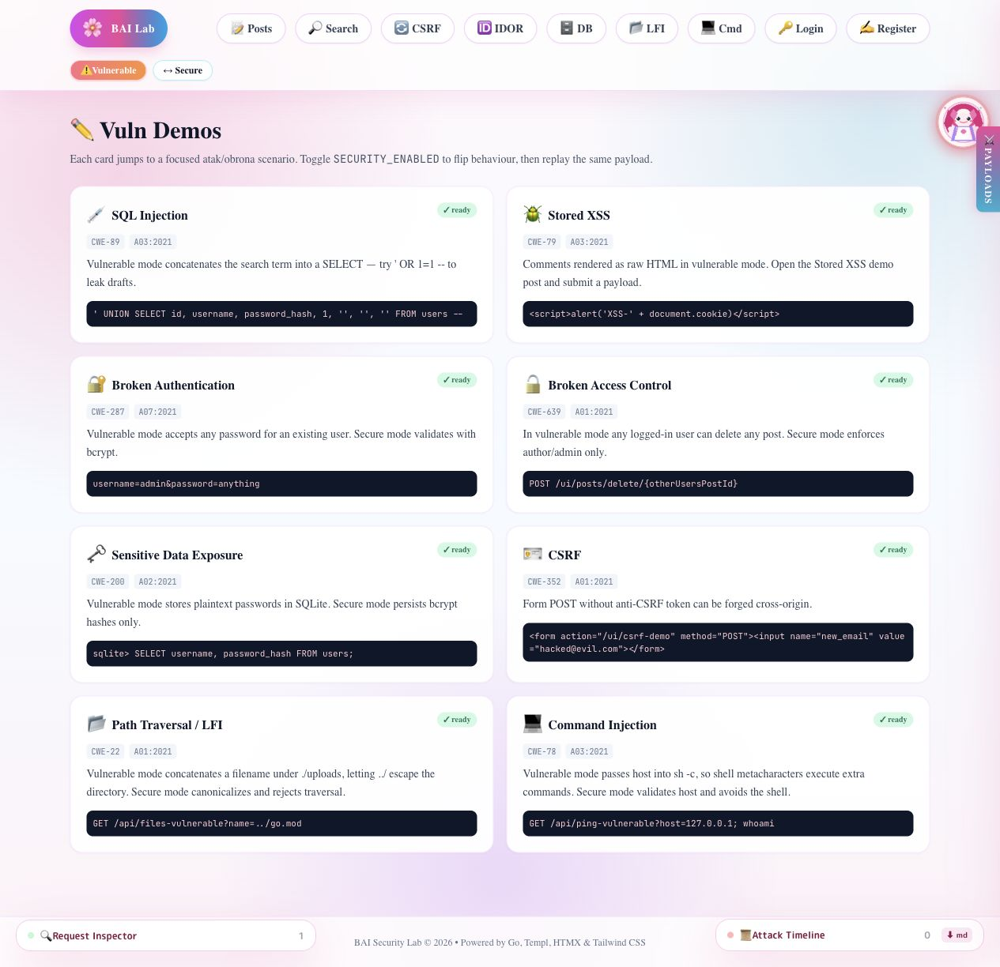

Na ekranie widać listę scenariuszy, etykiety CWE/OWASP oraz payloady przykładowe. Tryb vulnerable oznacza, że podstawowe ścieżki demonstracyjne działają bez zabezpieczeń.

### 4.2. Zrzut ekranu: hub podatności po przełączeniu na secure

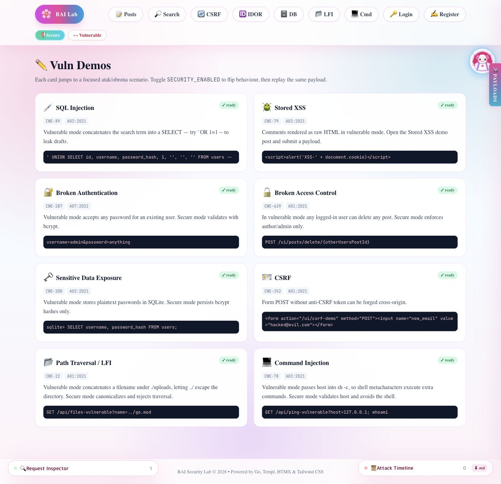

Po przełączeniu trybu UI pokazuje stan secure. Te same formularze pozwalają powtórzyć payload i zobaczyć, że bezpieczna ścieżka blokuje atak lub traktuje payload jako zwykły tekst.

<div style="page-break-after: always;"></div>

## 5. Dokumentacja funkcjonalności użytkowej

### 5.1. Lista postów

Główna strona `/ui/posts` pokazuje posty z bazy danych. Użytkownik niezalogowany może przeglądać treści, ale nie może dodawać, edytować ani usuwać postów. Użytkownik zalogowany widzi formularz tworzenia posta oraz przyciski edycji i usuwania.

Najważniejsze elementy:

- tytuł posta,
- treść posta,
- informacja o autorze,
- status publikacji,
- opcjonalny załącznik,
- przyciski edycji i usuwania, jeśli użytkownik jest zalogowany.

Kod widoku znajduje się w [internal/views/pages.templ](../internal/views/pages.templ), głównie w komponentach `PostsPage`, `PostsList` i `PostsListContainer`.

### 5.2. Tworzenie i edycja postów

Tworzenie posta wymaga logowania. Handler `PagePostsCreate` sprawdza sesję przez `requireLoginUI`, odczytuje pola formularza i zapisuje post przez `svc.CreatePost`.

```go
if !h.requireLoginUI(c, "/ui/login?err=1&msg=Please+log+in+to+add+posts") {
    return
}

title := c.PostForm("title")
content := c.PostForm("post_content")
published := readPublishedFromForm(c)

if _, err := h.svc.CreatePost(title, content, published, author, attachmentPath, attachmentName); err != nil {
    c.Redirect(http.StatusSeeOther, "/ui/posts?err=1&msg=Failed+to+create+post")
    return
}
```

W serwisie zapis używa parametrów `?`, więc zwykłe operacje CRUD nie składają SQL-a przez konkatenację:

```go
res, err := s.db.Exec(
    `INSERT INTO blog (title, post_content, published, author_username, attachment_path, attachment_name)
     VALUES (?, ?, ?, ?, ?, ?)`,
    title, content, published, author, attachmentPath, attachmentName,
)
```

Kod źródłowy: [internal/service/service.go](../internal/service/service.go:222).

### 5.3. Załączniki

Załącznik jest zapisywany w katalogu `uploads`. Nazwa pliku przechodzi przez `sanitizeFilename`, która usuwa separatory ścieżek i odrzuca wartości puste, `.` oraz `..`.

```go
func sanitizeFilename(name string) string {
    name = filepath.Base(name)
    if name == "" || name == "." || name == ".." {
        return ""
    }
    if strings.ContainsAny(name, `/\`) {
        return ""
    }
    return name
}
```

To jest dobra praktyka w zwykłej funkcjonalności uploadu. Osobny endpoint `/api/files-vulnerable` istnieje tylko jako cel demonstracji podatności Path Traversal.

### 5.4. Logowanie i rejestracja

Rejestracja tworzy użytkownika przez `CreateUser`. W trybie vulnerable hasło jest zapisywane jawnie. W trybie secure hasło jest hashowane bcryptem. Logowanie korzysta z `evaluateLogin`, które celowo działa inaczej zależnie od trybu.

Tryb vulnerable:

- użytkownik musi istnieć,
- hasło nie jest weryfikowane,
- każde hasło dla istniejącego użytkownika jest akceptowane.

Tryb secure:

- użytkownik musi istnieć,
- hasło musi pasować do hasha bcrypt,
- po nieudanych próbach działa prosty rate limiter.

### 5.5. Komentarze

Komentarze są kluczowym elementem demonstracji Stored XSS. W trybie vulnerable treść komentarza jest zapisywana i renderowana jako surowy HTML. W trybie secure treść jest czyszczona i escapowana.

Kod widoku:

```go
if securityEnabled {
    <p class="text-sm text-slate-800">{ c.Body }</p>
} else {
    <div class="text-sm text-slate-800">@templ.Raw(c.Body)</div>
}
```

Kod źródłowy: [internal/views/pages.templ](../internal/views/pages.templ:858).

<div style="page-break-after: always;"></div>

## 6. Zestawienie podatności

| Podatność | Wejście użytkownika | Miejsce podatne | Efekt ataku | Naprawa w secure |
|---|---|---|---|---|
| SQL Injection | parametr `q` | `SearchPostsVulnerable` | wyciek postów, draftów i tabeli users przez UNION | `LIKE ?`, parametry SQL |
| Stored XSS | komentarz `body` | `templ.Raw(c.Body)` | wykonanie JS w przeglądarce ofiary | strip + `html.EscapeString`, render jako tekst |
| Broken Authentication | `username`, `password` | `evaluateLogin` / `ValidateUserCredentials` | logowanie na dowolne hasło | bcrypt + rate limiting |
| IDOR | `post id` | delete bez ownership check | usunięcie cudzego posta | sprawdzenie autora albo roli admin |
| CSRF | formularz email | brak tokena | zmiana emaila przez obcą stronę | token w cookie i hidden input |
| Sensitive Data Exposure | baza SQLite | plaintext password storage | wyciek haseł po odczycie DB | bcrypt |
| Path Traversal | parametr `name` | `uploadsDir + "/" + name` | odczyt plików poza uploads | `filepath.Clean`, `Abs`, `HasPrefix` |
| Command Injection | parametr `host` | `sh -c "ping -c1 " + host` | wykonanie dodatkowej komendy | regex hosta + `exec.Command` bez shella |

### 6.1. Dlaczego podatne endpointy nadal istnieją?

W aplikacji istnieją endpointy wymuszone podatne, np. `/api/search-vulnerable`, `/api/comments-vulnerable`, `/api/files-vulnerable` i `/api/ping-vulnerable`. To jest świadoma decyzja projektowa. Ich celem jest umożliwienie demonstracji ataku nawet wtedy, gdy główna ścieżka aplikacji działa w trybie secure.

W projekcie produkcyjnym takich endpointów nie wolno byłoby utrzymywać. W projekcie laboratoryjnym są one oznaczone jako demonstracyjne i opisane w kodzie komentarzami.

<div style="page-break-after: always;"></div>

## 6A. Infografiki, diagramy i wizualizacje AI

Poniższe grafiki zostały przygotowane jako dodatkowy materiał wizualny do sprawozdania. Są zapisane lokalnie w katalogu `docs/diagrams/`, dzięki czemu działają bez zewnętrznych zależności i poprawnie eksportują się do PDF. Po korekcie grafiki mają większy obszar roboczy, grubsze strzałki, większe marginesy i krótsze podpisy, aby na stronie A4 nie nachodziły na siebie teksty, karty ani groty strzałek. Każda grafika opisuje inny aspekt projektu: architekturę, przepływ żądania, przełącznik trybu, macierz ryzyka, łańcuchy ataku, mapę zabezpieczeń oraz porównawcze wykresy skuteczności zabezpieczeń.

### 6A.1. Infografika architektury

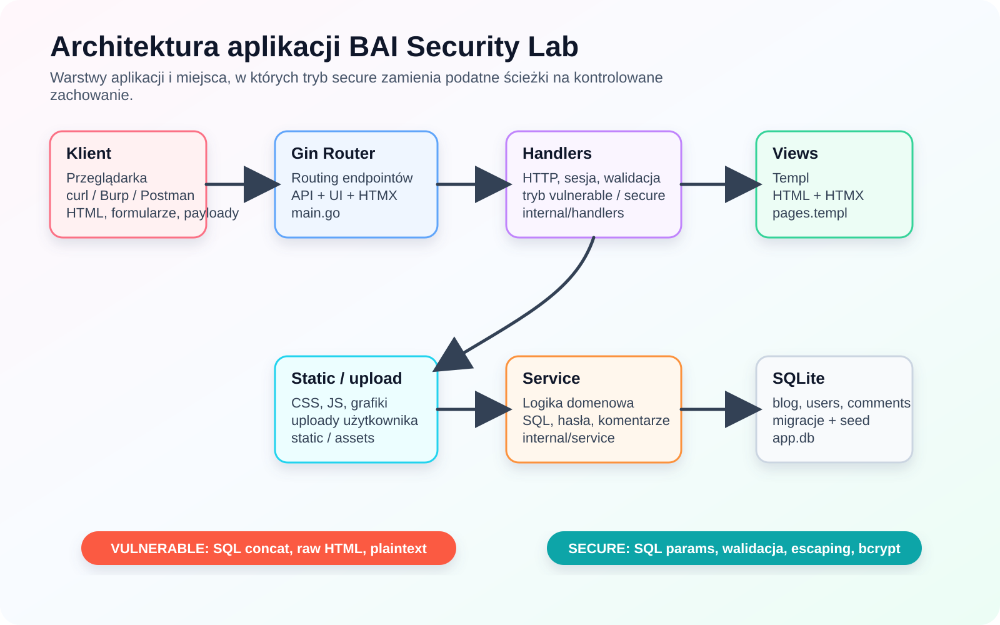

Diagram pokazuje główne warstwy aplikacji: klienta, router Gin, handlery, serwis, bazę SQLite, widoki Templ i zasoby statyczne. Najważniejszym elementem jest wspólny `ModeStore`, który zastąpił wcześniejszą globalną flagę `SecurityEnabled`. Dzięki temu te same endpointy mogą zachowywać się inaczej w trybie vulnerable i secure, ale stan trybu jest trzymany w jednym miejscu.

### 6A.2. Przepływ przełącznika vulnerable / secure

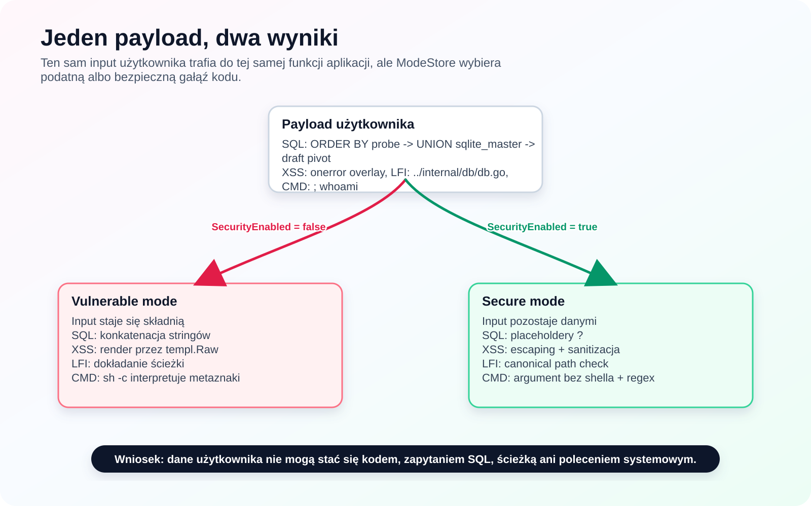

Ta grafika jest przydatna podczas tłumaczenia, dlaczego ten sam payload daje dwa różne wyniki. W trybie vulnerable input staje się składnią SQL, HTML, ścieżką albo poleceniem. W trybie secure input pozostaje danymi, ponieważ przechodzi przez parametryzację, escaping, walidację ścieżki lub bezpieczne wywołanie procesu bez shella.

### 6A.3. Mapa łańcuchów ataku

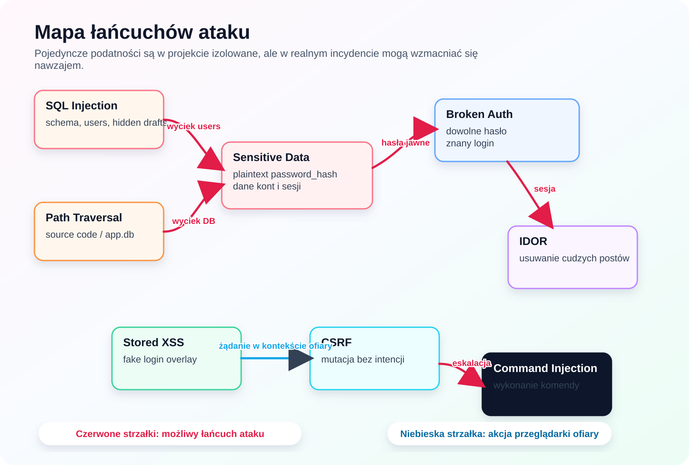

Mapa pokazuje, że podatności nie są od siebie całkowicie odizolowane. SQL Injection albo Path Traversal mogą prowadzić do odczytu danych użytkowników. Jeżeli hasła są zapisane jawnie, Sensitive Data Exposure staje się kolejnym etapem ataku. Broken Authentication może prowadzić do IDOR, a Stored XSS może wywoływać akcje w kontekście ofiary.

### 6A.4. Macierz ryzyka

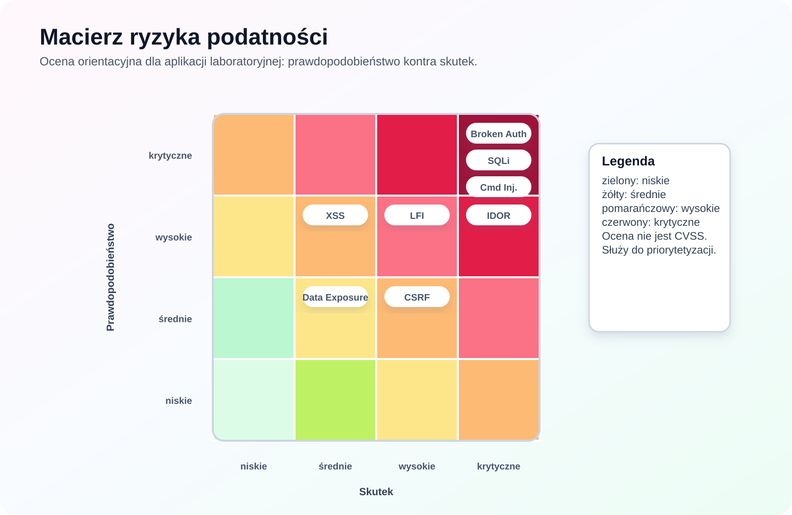

Macierz porządkuje podatności według prawdopodobieństwa i skutku. Najwyżej ocenione są Broken Authentication, SQL Injection, Command Injection i Path Traversal, ponieważ mogą prowadzić do przejęcia kont, wycieku danych lub wykonania komend. Macierz pomaga uzasadnić kolejność omawiania podatności i priorytety napraw.

### 6A.5. Cykl życia żądania HTTP

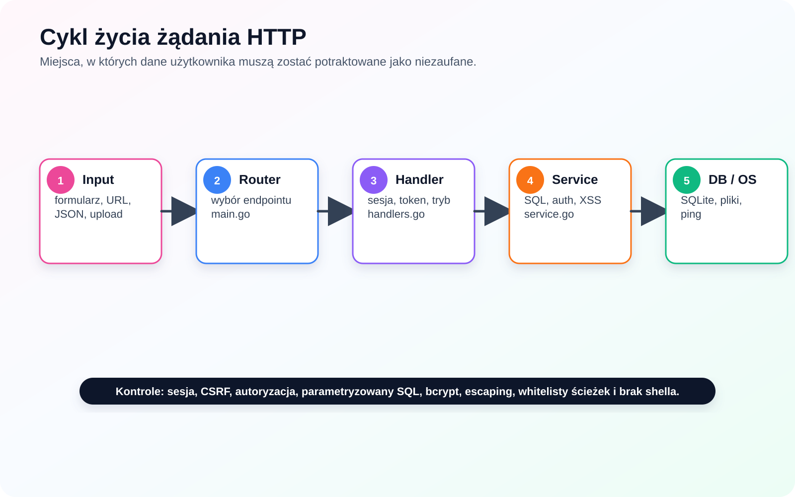

Ten diagram pokazuje, gdzie w architekturze aplikacji znajdują się kontrole bezpieczeństwa. Router wybiera endpoint, handler sprawdza sesję, token CSRF i autoryzację, serwis obsługuje SQL, hasła i komentarze, a najniższa warstwa dotyka bazy danych, plików lub systemowego `ping`.

### 6A.6. Wykres porównania skuteczności zabezpieczeń

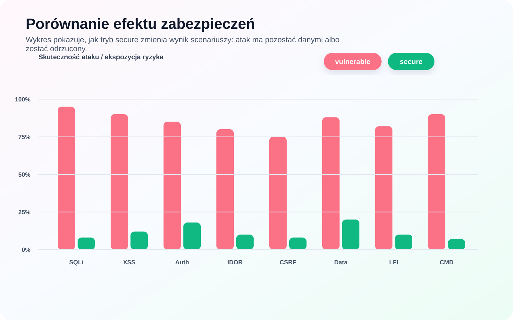

Wykres porównuje ekspozycję ryzyka w trybie vulnerable i secure. Nie jest to formalna metryka CVSS, lecz syntetyczna wizualizacja do obrony projektu: w trybie vulnerable payload osiąga cel ataku, a w trybie secure powinien zostać potraktowany jako dane albo odrzucony przez walidację.

### 6A.7. Wykres pokrycia scenariuszy testami

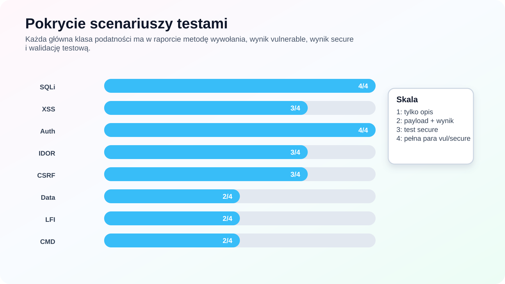

Wykres pokazuje, które scenariusze mają pełną parę: opis podatności, payload, wynik vulnerable, wynik secure oraz walidację testową. Najpełniej pokryte są SQL Injection, XSS, Broken Authentication, IDOR i CSRF, ponieważ są najważniejsze dla obrony projektu i mają bezpośrednie testy integracyjne.

### 6A.8. Mapa podatność -> kontrola bezpieczeństwa

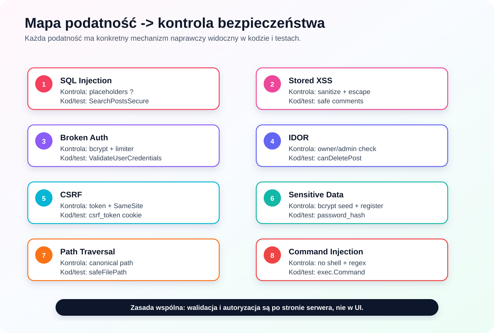

Infografika syntetycznie łączy każdą podatność z konkretną kontrolą bezpieczeństwa. Nadaje się jako slajd końcowy lub strona podsumowująca w sprawozdaniu, bo pokazuje dokładnie, jaka praktyka programistyczna naprawia dany błąd.

### 6A.9. Mapa funkcji aplikacji do podatności

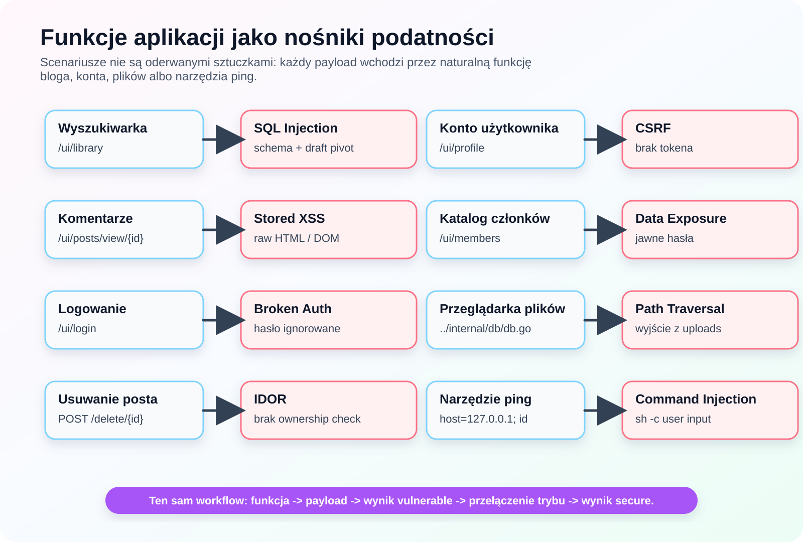

Ta grafika pokazuje podatności jako elementy normalnych funkcjonalności aplikacji. Wyszukiwarka jest miejscem SQL Injection, komentarze są miejscem Stored XSS, logowanie pokazuje Broken Authentication, usuwanie postów pokazuje IDOR, ustawienia konta pokazują CSRF, widok bazy pokazuje Sensitive Data Exposure, przeglądarka plików pokazuje Path Traversal, a narzędzie ping pokazuje Command Injection.

### 6A.10. Podatność, metoda wywołania i wynik

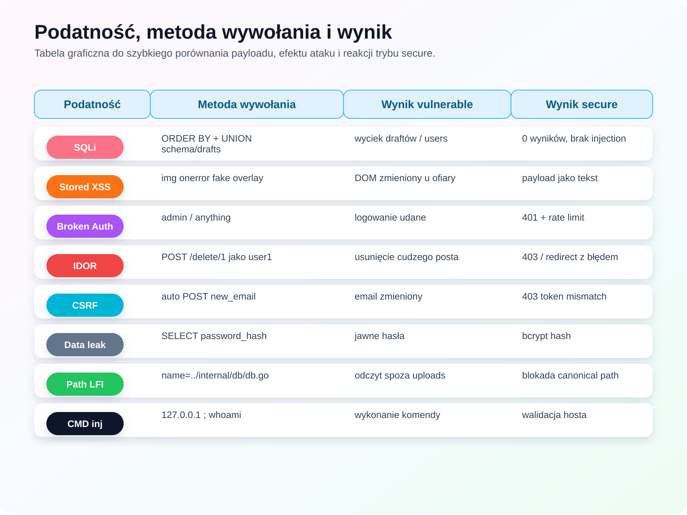

Ten wykres jest skróconą kartą demonstracyjną do obrony. Dla każdej podatności zawiera przykładową metodę wywołania, efekt w trybie vulnerable oraz oczekiwany efekt w trybie secure.

### 6A.11. Rozszerzony diagram architektury

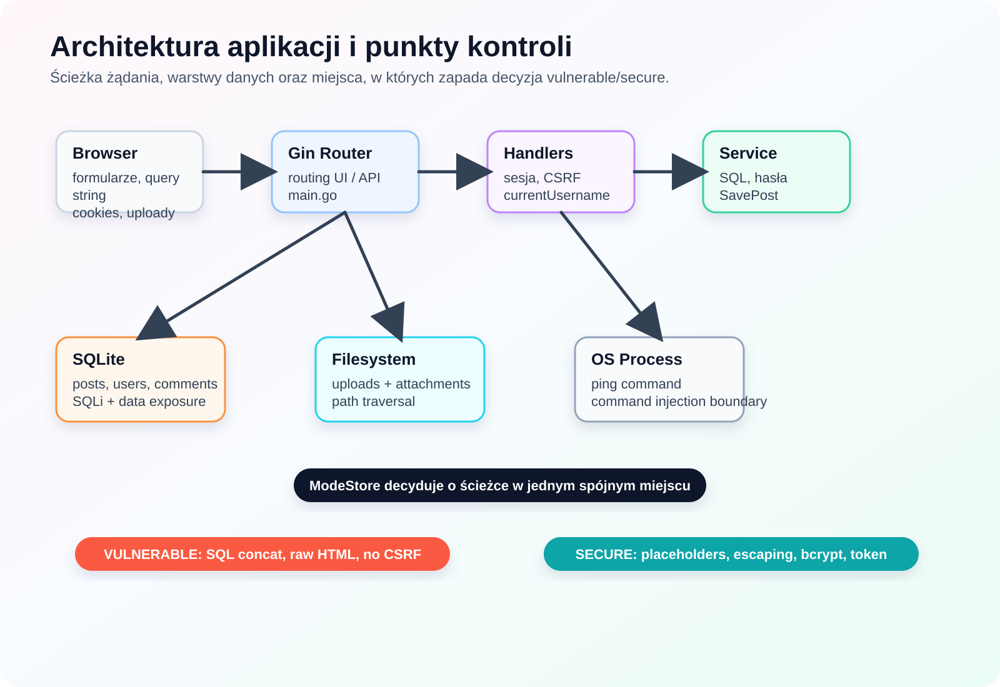

Diagram pokazuje przepływ żądania przez przeglądarkę, router Gin, handlery, serwis, bazę SQLite, filesystem oraz proces systemowy `ping`. Najważniejszym elementem jest rozgałęzienie na ścieżkę vulnerable i secure przez `ModeStore`.

<div style="page-break-after: always;"></div>

## 6B. Podatności jako funkcjonalności aplikacji

Po ostatniej aktualizacji sprawozdanie opisuje podatności nie tylko jako osobne demonstracje, ale jako elementy zwykłych funkcji systemu. Osobne endpointy typu `/api/search-vulnerable`, `/api/files-vulnerable` i `/api/ping-vulnerable` nadal istnieją, bo są wygodne do testów przez `curl`, Burp Suite albo Postmana. Główna narracja prezentacji może jednak opierać się na normalnych ekranach aplikacji.

| Funkcja aplikacji | Podatność | Metoda wywołania | Wynik w trybie vulnerable | Wynik w trybie secure |
|---|---|---|---|---|
| Wyszukiwarka postów `/ui/search` | SQL Injection | `q=' OR 1=1 --` albo payload `UNION SELECT` | wyszukiwarka zwraca nieautoryzowane dane, np. drafty albo rekordy z tabeli `users` | payload jest traktowany jako tekst w `LIKE ?`, brak wycieku |
| Komentarze pod postem `/ui/posts/view/:id` | Stored XSS | komentarz `<script>alert(document.cookie)</script>` | skrypt zostaje zapisany i wykonuje się przy wejściu na stronę posta | treść jest escapowana i wyświetlana jako tekst |
| Logowanie `/ui/login` | Broken Authentication | `admin / anything` | istniejący login wystarcza do zalogowania, hasło jest ignorowane | hasło jest weryfikowane przez bcrypt, błędne hasło daje 401 |
| Usuwanie postów `/ui/posts/delete/:id` | IDOR / Broken Access Control | zalogowany `user1` usuwa post autora `admin` przez znane ID | post zostaje usunięty mimo braku właścicielstwa | handler sprawdza autora albo rolę admina i blokuje operację |
| Konto użytkownika `/ui/account` | CSRF | obca strona wysyła automatyczny `POST new_email=...` | email ofiary zostaje zmieniony, bo cookie sesyjne wystarcza do autoryzacji | token CSRF z formularza musi zgadzać się z tokenem z cookie |
| Widok bazy `/ui/database` | Sensitive Data Exposure | odczyt kolumny `password_hash` | kolumna zawiera jawne hasła użytkowników | kolumna zawiera hashe bcrypt |
| Przeglądarka plików `/ui/files` | Path Traversal / LFI | `name=../go.mod` albo `name=../app.db` | aplikacja czyta plik spoza katalogu `uploads` | `filepath.Clean`, `Abs` i kontrola prefiksu blokują wyjście poza katalog |
| Narzędzie ping `/ui/tools/ping` | Command Injection | `host=127.0.0.1 ; whoami` | dodatkowa komenda wykonuje się przez `sh -c` | walidacja hosta odrzuca metaznaki, a `exec.Command` nie używa shella |

W aplikacji dodano także stronę `/ui/security-map`. Jest to praktyczna mapa funkcjonalna dla prowadzącego i dla osoby prezentującej projekt. Pozwala ona szybko zobaczyć, która funkcja jest nośnikiem której podatności, jak ją wywołać i jaki wynik powinien pojawić się po przełączeniu trybu bezpieczeństwa.

<div style="page-break-after: always;"></div>

## 7. SQL Injection

### 7.1. Opis podatności

SQL Injection występuje wtedy, gdy dane użytkownika są wstawiane bezpośrednio do zapytania SQL. Atakujący może wtedy zamknąć literał tekstowy, dopisać własny warunek, dodać UNION albo zmodyfikować strukturę zapytania.

W aplikacji podatność jest pokazana na wyszukiwarce postów. Parametr `q` jest używany do wyszukiwania po tytule i treści posta.

Endpointy:

- podatny zależny od trybu: `/api/search?q=...`,
- zawsze podatny: `/api/search-vulnerable?q=...`,
- widok UI: `/ui/search`.

### 7.2. Payload ataku

Payload podstawowy:

```text
' OR 1=1 --
```

Payload z UNION:

```text
zz' UNION SELECT id, username, password_hash, 1, '', '', '' FROM users --
```

Pierwszy payload zmienia warunek WHERE w tautologię. Drugi payload dopina do wyników wyszukiwania dane z tabeli `users`, przez co pola `username` i `password_hash` mogą pojawić się w odpowiedzi jako tytuł i treść posta.

### 7.3. Kod podatny

Podatny kod znajduje się w `SearchPostsVulnerable`:

```go
func (s *Service) SearchPostsVulnerable(query string) ([]Post, error) {
    sqlQuery := "SELECT id, title, post_content, published, " +
        "COALESCE(author_username, ''), COALESCE(attachment_path, ''), COALESCE(attachment_name, '') " +
        "FROM blog WHERE title LIKE '%" + query + "%' OR post_content LIKE '%" + query + "%'"

    rows, err := s.db.Query(sqlQuery)
    if err != nil {
        return nil, err
    }
    return scanPostRows(rows)
}
```

Kod źródłowy: [internal/service/service.go](../internal/service/service.go:170).

Problem polega na tym, że `query` jest traktowane jako część kodu SQL, a nie jako wartość parametru. Jeżeli użytkownik poda znak `'`, może wyjść poza cudzysłów i przejąć składnię zapytania.

### 7.4. Efekt ataku w trybie vulnerable

Polecenie:

```bash
curl "http://localhost:8080/api/search?q=' OR 1=1 --"
```

Oczekiwany efekt:

- status HTTP 200,
- zwrócone zostają wszystkie pasujące rekordy,
- w testach specjalnie dodany draft również wycieka,
- filtr `published = 1` nie chroni, jeżeli zapytanie jest podatne.

Zrzut ekranu:

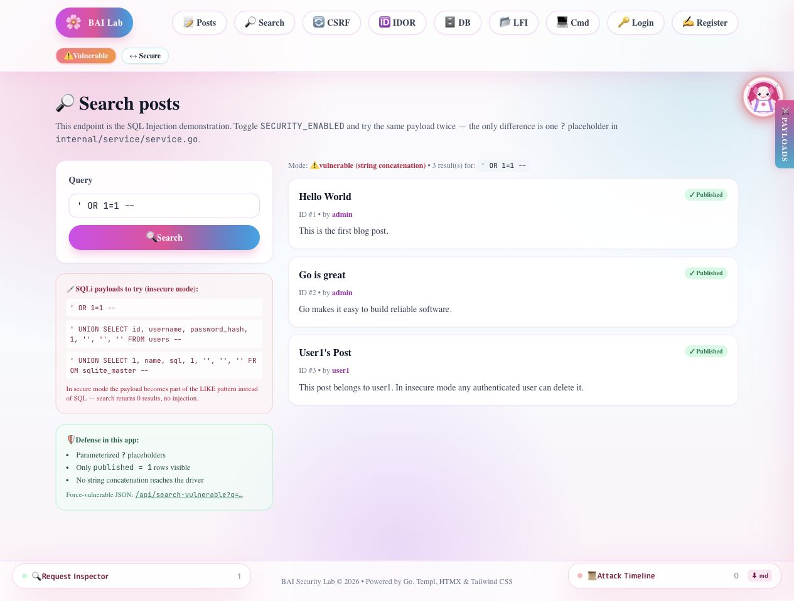

Na zrzucie widać, że payload nie jest zwykłym tekstem wyszukiwania. Staje się fragmentem SQL i powoduje zwrócenie wyników, których użytkownik nie powinien zobaczyć.

### 7.5. Kod bezpieczny

Bezpieczna implementacja używa placeholderów `?`:

```go
func (s *Service) SearchPostsSecure(query string) ([]Post, error) {
    pattern := "%" + query + "%"
    rows, err := s.db.Query(
        `SELECT id, title, post_content, published,
                COALESCE(author_username, ''),
                COALESCE(attachment_path, ''),
                COALESCE(attachment_name, '')
         FROM blog
         WHERE published = 1
           AND (title LIKE ? OR post_content LIKE ?)`,
        pattern, pattern,
    )
    if err != nil {
        return nil, err
    }
    return scanPostRows(rows)
}
```

Kod źródłowy: [internal/service/service.go](../internal/service/service.go:186).

W tej wersji payload `' OR 1=1 --` jest tylko wartością parametru. Sterownik SQLite nie traktuje go jako składni SQL.

### 7.6. Efekt w trybie secure

Polecenie:

```bash
curl "http://localhost:8080/api/search?q=' OR 1=1 --"
```

Oczekiwany efekt:

- status HTTP 200,
- brak wyników dla payloadu,
- brak wycieku draftów,
- brak możliwości wykonania UNION.

Zrzut ekranu:

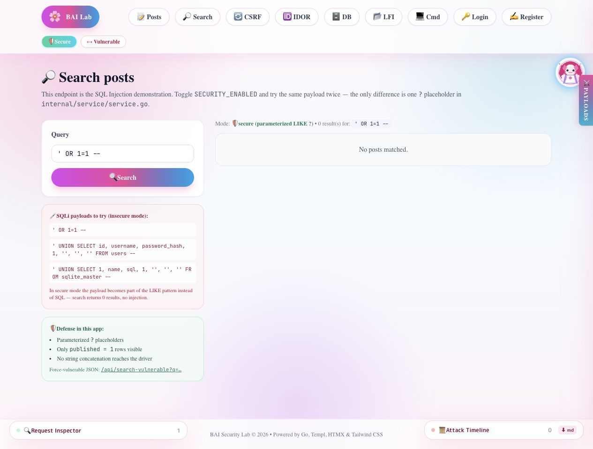

### 7.7. Ocena ryzyka

Ryzyko SQL Injection jest wysokie. W prawdziwej aplikacji skutkiem może być odczyt całej bazy danych, obejście logowania, modyfikacja danych lub wykonanie operacji administracyjnych zależnie od uprawnień konta bazy. W projekcie laboratoryjnym pokazano przede wszystkim odczyt danych, ponieważ jest bezpieczniejszy do demonstracji niż niszczenie tabel.

### 7.8. Rekomendacja

Należy stosować wyłącznie zapytania parametryzowane. Dodatkowo warto:

- testować wszystkie endpointy z parametrami tekstowymi,
- nie mieszać budowania SQL z logiką HTTP,
- dodać testy regresji dla payloadów SQLi,
- ograniczać zakres danych zwracanych przez wyszukiwarkę, np. tylko `published = 1`.

<div style="page-break-after: always;"></div>

## 8. Stored XSS

### 8.1. Opis podatności

Stored XSS polega na zapisaniu złośliwego kodu HTML lub JavaScript w aplikacji, a następnie wyświetleniu go innym użytkownikom. Jest to szczególnie groźne, ponieważ payload nie musi być przekazywany za każdym razem w URL. Wystarczy, że zostanie zapisany w bazie.

W aplikacji wektorem ataku są komentarze do posta. Atakujący dodaje komentarz zawierający tag `<script>` albo element HTML z atrybutem zdarzenia, np. `onerror`.

### 8.2. Payload ataku

Przykładowy payload:

```html
<script>alert('XSS-' + document.cookie)</script>
```

Drugi payload:

```html

```

Payload z `img` bywa praktyczny, ponieważ część filtrów skupia się tylko na tagach `<script>`, a ignoruje atrybuty zdarzeń.

### 8.3. Kod podatny

Podatność wynika z dwóch decyzji:

1. komentarz jest zapisywany verbatim,
2. komentarz jest renderowany przez `templ.Raw`.

Zapisywanie podatne:

```go
func (s *Service) CreateCommentVulnerable(postID int, author, body string) (int64, error) {
    res, err := s.db.Exec(
        "INSERT INTO comments (post_id, author, body) VALUES (?, ?, ?)",
        postID, author, body,
    )
    if err != nil {
        return 0, err
    }
    return res.LastInsertId()
}
```

Renderowanie podatne:

```go
if securityEnabled {
    <p class="text-sm text-slate-800">{ c.Body }</p>
} else {
    <div class="text-sm text-slate-800">@templ.Raw(c.Body)</div>
}
```

Kod źródłowy: [internal/views/pages.templ](../internal/views/pages.templ:858).

W trybie vulnerable przeglądarka dostaje prawdziwy HTML. Jeżeli komentarz zawiera skrypt, zostanie on wykonany w kontekście domeny aplikacji.

### 8.4. Atak przez API

Polecenie:

```bash
curl -X POST http://localhost:8080/api/comments-vulnerable \
  -H "Content-Type: application/json" \
  -d '{"post_id":1,"body":"","author":"attacker"}'
```

Następnie należy wejść na:

```text
http://localhost:8080/ui/posts/view/1
```

W trybie vulnerable payload zostanie wyświetlony jako HTML i może uruchomić JavaScript.

Zrzut ekranu w trybie vulnerable:

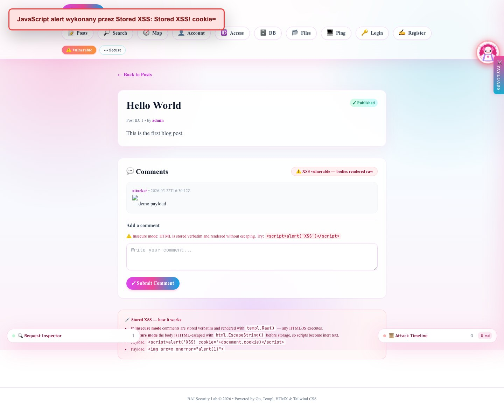

### 8.5. Kod bezpieczny

Bezpieczna ścieżka używa oczyszczania i escapingu:

```go
func (s *Service) CreateComment(postID int, author, body string) (int64, error) {
    stored := body
    if s.SecurityEnabled() {
        stored = html.EscapeString(stripUnsafeHTML(body))
    }
    res, err := s.db.Exec(
        "INSERT INTO comments (post_id, author, body) VALUES (?, ?, ?)",
        postID, author, stored,
    )
    if err != nil {
        return 0, err
    }
    return res.LastInsertId()
}
```

Kod źródłowy: [internal/service/service.go](../internal/service/service.go:369).

Funkcja `stripUnsafeHTML` usuwa tagi script, atrybuty zdarzeń i schemat `javascript:`:

```go
func stripUnsafeHTML(body string) string {
    cleaned := scriptTagRE.ReplaceAllString(body, "")
    cleaned = eventAttributeRE.ReplaceAllString(cleaned, "")
    cleaned = javascriptSchemeRE.ReplaceAllString(cleaned, "")
    return cleaned
}
```

### 8.6. Efekt w trybie secure

Ten sam payload nie wykonuje się jako JavaScript. Jest usunięty albo zamieniony na bezpieczny tekst HTML. W testach integracyjnych aplikacja sprawdza, że odpowiedź nie zawiera surowego `<script>alert(` ani `onerror=`.

Zrzut ekranu w trybie secure:

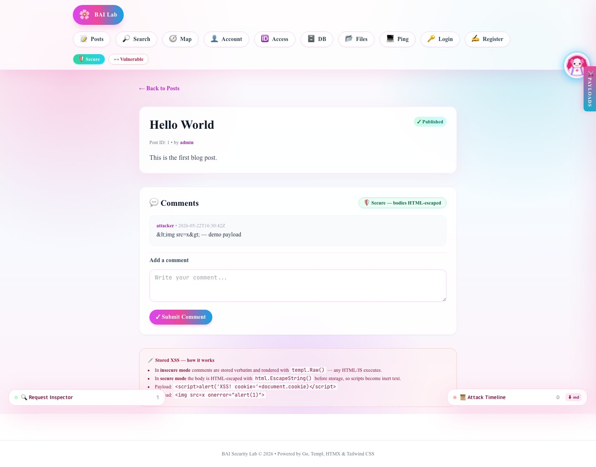

### 8.7. Ocena ryzyka

Stored XSS jest podatnością wysokiego ryzyka. Atakujący może kraść dane z DOM, wykonywać akcje jako użytkownik, przekierowywać ofiarę, wyświetlać fałszywe formularze lub próbować kraść tokeny. W tej aplikacji ciasteczko sesyjne ma `HttpOnly`, więc JavaScript nie powinien odczytać go bezpośrednio, ale nadal XSS pozwala wykonywać akcje w kontekście zalogowanego użytkownika.

### 8.8. Rekomendacja

Najważniejsze zalecenia:

- domyślnie renderować dane jako tekst, nie HTML,
- używać `templ.Raw` wyłącznie dla zaufanych treści,
- jeżeli aplikacja musi wspierać HTML użytkownika, użyć allowlisty tagów,
- dodać Content Security Policy,
- dodać testy regresji dla `<script>`, `onerror`, `javascript:` oraz SVG payloadów.

<div style="page-break-after: always;"></div>

## 9. Broken Authentication

### 9.1. Opis podatności

Broken Authentication oznacza błędy w procesie uwierzytelniania. W tej aplikacji tryb vulnerable akceptuje dowolne hasło dla istniejącego użytkownika. To jest bardzo czytelna demonstracja, ponieważ wystarczy znać login `admin`, aby zalogować się jako administrator.

### 9.2. Payload / próba ataku

Polecenie:

```bash
curl -i -X POST http://localhost:8080/login \
  -H "Content-Type: application/json" \
  -d '{"username":"admin","password":"wrong"}'
```

W trybie vulnerable odpowiedź ma status 200. W trybie secure powinna mieć status 401.

Zrzut ekranu: tryb vulnerable akceptuje błędne hasło:

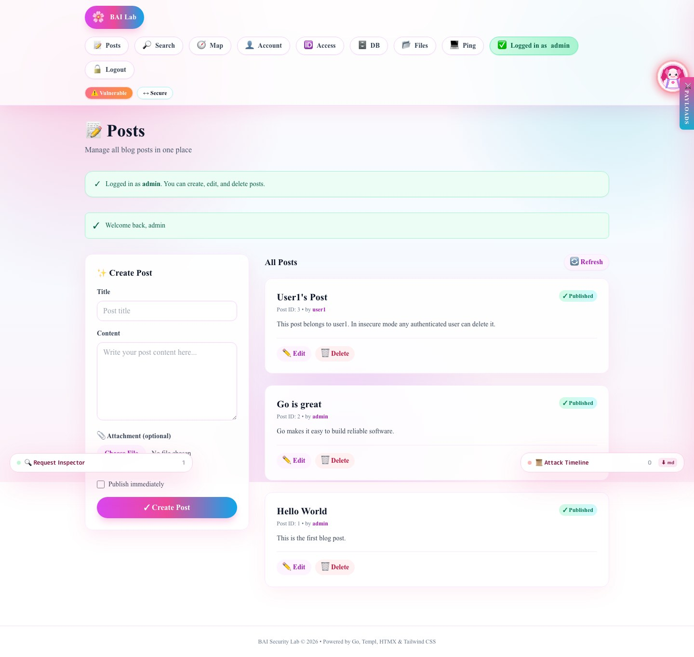

Zrzut ekranu: tryb secure odrzuca błędne hasło:

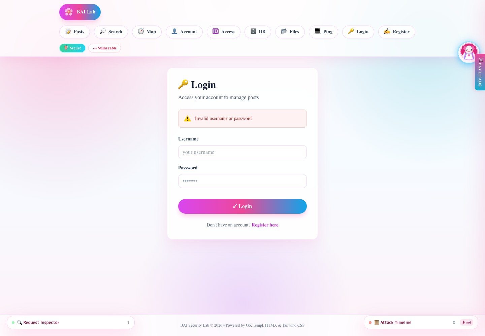

### 9.3. Kod podatny

Fragment w handlerze:

```go
if h.securityEnabled() {
    valid, err := h.svc.ValidateUserCredentials(username, password)
    if err != nil {
        return "Database error", true, http.StatusInternalServerError
    }
    if !valid {
        h.svc.RecordLoginFailure(username)
        return "Invalid username or password", true, http.StatusUnauthorized
    }
    return fmt.Sprintf("Login successful for %s", username), false, http.StatusOK
}

exists, err := h.svc.UserExists(username)
if err != nil {
    return "Database error", true, http.StatusInternalServerError
}
if !exists {
    return "User not found", true, http.StatusUnauthorized
}

return fmt.Sprintf("Login successful for %s", username), false, http.StatusOK
```

Kod źródłowy: [internal/handlers/handlers.go](../internal/handlers/handlers.go:653).

W trybie vulnerable wykonywane jest tylko `UserExists`. Hasło nie bierze udziału w decyzji.

### 9.4. Kod bezpieczny

Bezpieczna weryfikacja znajduje się w `ValidateUserCredentials`:

```go
func (s *Service) ValidateUserCredentials(username, password string) (bool, error) {
    var stored string
    err := s.db.QueryRow(
        "SELECT password_hash FROM users WHERE username = ?",
        username,
    ).Scan(&stored)
    if err == sql.ErrNoRows {
        return false, nil
    }
    if err != nil {
        return false, err
    }

    if !s.SecurityEnabled() {
        return true, nil
    }

    if err := bcrypt.CompareHashAndPassword([]byte(stored), []byte(password)); err != nil {
        return false, nil
    }
    return true, nil
}
```

Kod źródłowy: [internal/service/service.go](../internal/service/service.go:316).

W trybie secure hasło z żądania jest porównywane z bcrypt hashem z bazy.

### 9.5. Dodatkowe zabezpieczenie: rate limiting

Aplikacja ma prosty limiter nieudanych prób logowania. W trybie secure `CheckRateLimit` blokuje użytkownika po przekroczeniu limitu, a `RecordLoginFailure` zapisuje nieudane próby.

Jest to rozwiązanie demonstracyjne, trzymane w pamięci procesu. W systemie produkcyjnym należałoby przenieść taki licznik do współdzielonego storage, np. Redis, oraz uwzględnić IP, user-agent i mechanizm resetowania blokady.

### 9.6. Ocena ryzyka

Ryzyko jest krytyczne. Jeżeli aplikacja akceptuje dowolne hasło, to cała kontrola dostępu przestaje mieć znaczenie. Atakujący może przejąć konto administratora i wykonywać akcje administracyjne.

### 9.7. Rekomendacja

Należy:

- zawsze porównywać hasła z bezpiecznym hashem,
- używać bcrypt, Argon2 albo innego algorytmu do haseł,
- wymusić silny sekret sesyjny poza kodem źródłowym,
- dodać rate limiting,
- logować nieudane próby,
- unikać komunikatów typu "User not found", które ułatwiają enumerację kont.

<div style="page-break-after: always;"></div>

## 10. Broken Access Control / IDOR

### 10.1. Opis podatności

IDOR oznacza Insecure Direct Object Reference. Problem występuje, gdy aplikacja pozwala użytkownikowi operować na obiekcie wskazanym przez ID, ale nie sprawdza, czy użytkownik ma do niego uprawnienia.

W aplikacji podatność dotyczy usuwania postów. W trybie vulnerable wystarczy być zalogowanym. Nie ma sprawdzenia, czy post należy do aktualnego użytkownika.

### 10.2. Scenariusz ataku

1. Uruchomić aplikację w trybie vulnerable.
2. Zalogować się jako `user1` z dowolnym hasłem.
3. Wejść na `/ui/idor-demo`.
4. Usunąć post, którego autorem jest `admin`.

W trybie vulnerable operacja przechodzi. W trybie secure zwykły użytkownik może usuwać tylko własne posty, a admin może usuwać wszystkie.

Zrzut ekranu: user `user1` usuwa post administratora w trybie vulnerable:

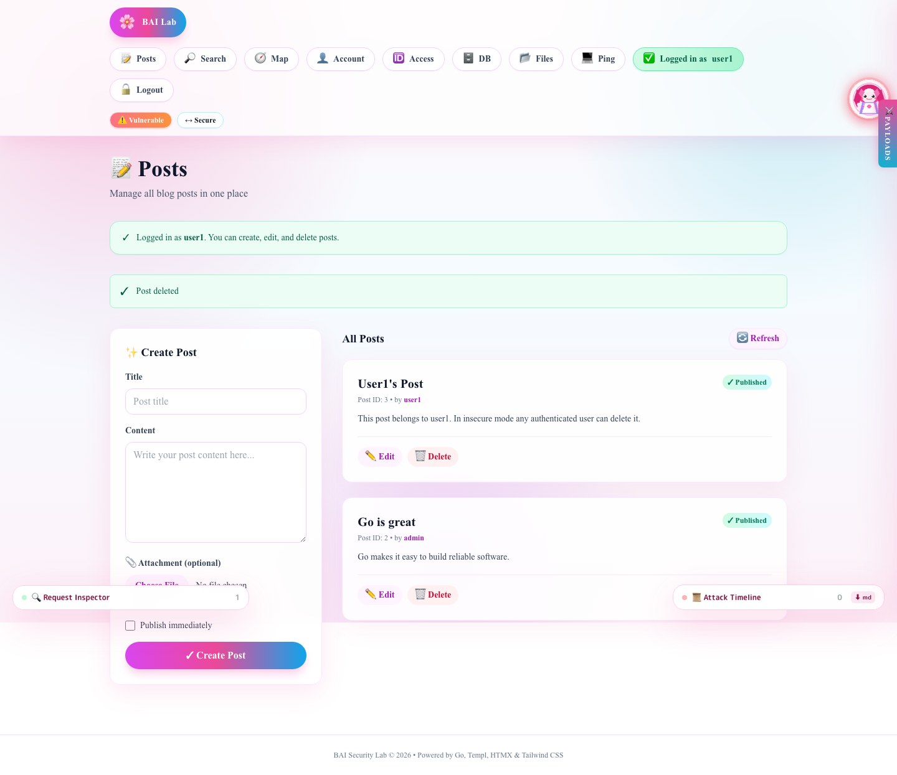

Zrzut ekranu: tryb secure blokuje usunięcie cudzego posta:

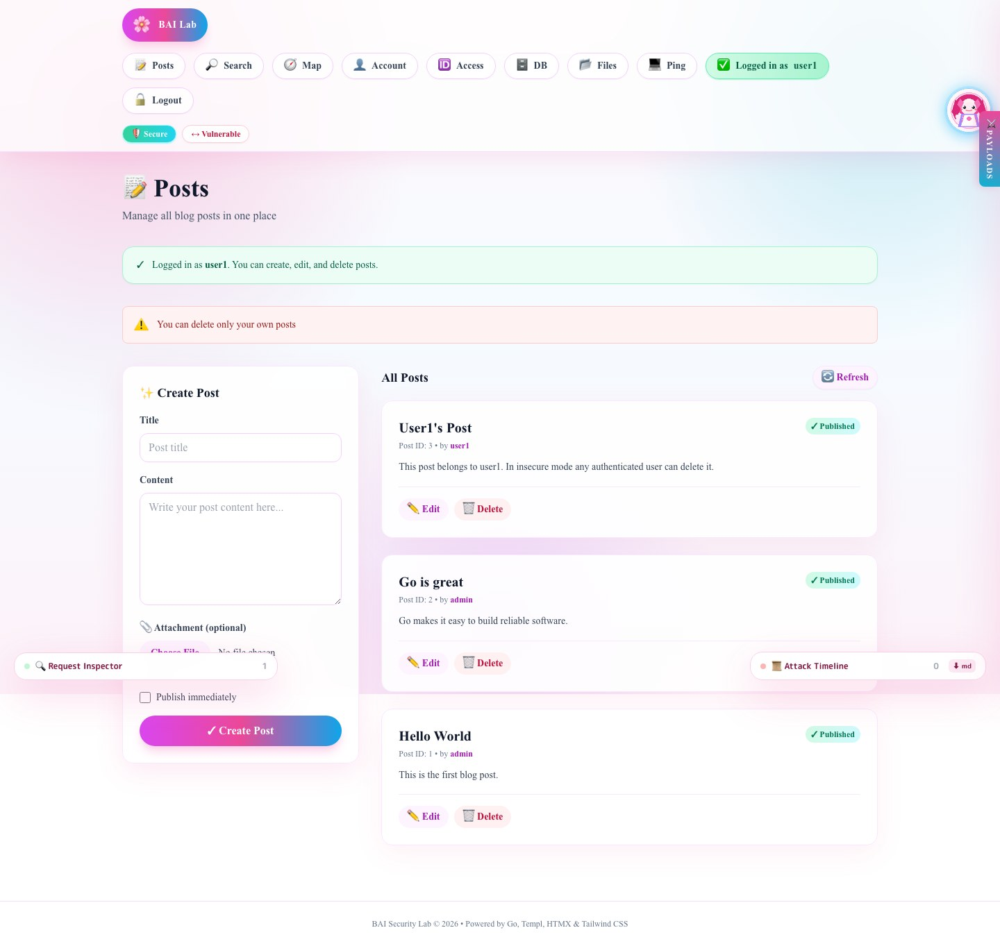

### 10.3. Kod podatny i bezpieczny

Handler `PagePostDelete` ma wspólną logikę usuwania, ale dodatkowy warunek działa tylko w trybie secure:

```go
if h.securityEnabled() {
    username, ok := h.currentUsername(c)
    if !ok {
        c.Redirect(http.StatusSeeOther, "/ui/login?err=1&msg=Please+log+in+to+delete+posts")
        return
    }

    allowed, authErr := h.canDeletePost(username, id)
    if authErr != nil {
        c.Redirect(http.StatusSeeOther, "/ui/posts?err=1&msg=Failed+to+authorize+delete")
        return
    }
    if !allowed {
        c.Redirect(http.StatusSeeOther, "/ui/posts?err=1&msg=You+can+delete+only+your+own+posts")
        return
    }
}

if err := h.svc.DeletePost(id); err != nil {
    c.Redirect(http.StatusSeeOther, "/ui/posts?err=1&msg=Failed+to+delete+post")
    return
}
```

W trybie vulnerable blok `if h.securityEnabled()` jest pomijany, więc aplikacja przechodzi od razu do `DeletePost`.

### 10.4. Sprawdzenie właściciela

Funkcja `canDeletePost` sprawdza rolę użytkownika i autora posta:

```go
func (h *Handler) canDeletePost(username string, postID int) (bool, error) {
    isAdmin, err := h.svc.IsUserAdmin(username)
    if err != nil {
        return false, err
    }
    if isAdmin {
        return true, nil
    }

    author, err := h.svc.GetPostAuthor(postID)
    if err != nil {
        if err == sql.ErrNoRows {
            return false, nil
        }
        return false, err
    }

    return author == username, nil
}
```

Kod źródłowy: [internal/handlers/handlers.go](../internal/handlers/handlers.go:691).

### 10.5. Ocena ryzyka

Ryzyko jest wysokie. IDOR często pozwala odczytywać, modyfikować lub usuwać cudze dane. W tym projekcie skutkiem jest usunięcie cudzego posta, ale w prawdziwym systemie analogiczny błąd mógłby dotyczyć faktur, danych osobowych, kont bankowych albo dokumentów.

### 10.6. Rekomendacja

Należy:

- sprawdzać autoryzację przy każdej akcji mutującej,
- nie polegać na ukryciu przycisku w UI,
- pisać testy dla użytkownika zwykłego i administratora,
- stosować zasadę "deny by default",
- używać spójnej warstwy autoryzacji zamiast ręcznych warunków rozproszonych po handlerach.

<div style="page-break-after: always;"></div>

## 11. CSRF

### 11.1. Opis podatności

CSRF polega na zmuszeniu przeglądarki zalogowanej ofiary do wysłania żądania mutującego do aplikacji. Przeglądarka automatycznie dołącza ciasteczka, więc serwer może uznać żądanie za autentyczne, mimo że użytkownik nie wykonał świadomej akcji.

W aplikacji CSRF jest pokazany na zmianie adresu email. W trybie vulnerable formularz nie ma tokena. W trybie secure formularz zawiera token i serwer go sprawdza.

### 11.2. Payload ataku

Złośliwa strona może zawierać:

```html
<form method="POST" action="http://localhost:8080/ui/csrf-demo">
  <input name="new_email" value="hacked@evil.com">
</form>
<script>document.forms[0].submit()</script>
```

Jeżeli ofiara jest zalogowana w aplikacji i odwiedzi tę stronę, jej przeglądarka wyśle żądanie do aplikacji.

Zrzut ekranu: tryb vulnerable przyjmuje zmianę emaila bez tokena:


### 11.3. Kod podatny

W podatnym handlerze POST nie ma weryfikacji tokena:

```go
// POST — vulnerable: no CSRF token check.
newEmail := c.PostForm("new_email")
if !loggedIn {
    c.Redirect(http.StatusSeeOther, "/ui/login?err=1&msg=Please+log+in+to+update+email")
    return
}
if newEmail == "" {
    // ...
    return
}
if err := h.svc.UpdateUserEmail(username, newEmail); err != nil {
    // ...
    return
}
```

Kod źródłowy: [internal/handlers/handlers.go](../internal/handlers/handlers.go:990).

### 11.4. Kod bezpieczny

Tryb secure generuje token na GET:

```go
token := generateCSRFToken()
setCSRFCookie(c, token)
component := views.CSRFDemoPage(h.securityEnabled(), loggedIn, username, token, email, "", false)
```

Następnie sprawdza token przy POST:

```go
formToken := c.PostForm("csrf_token")
cookieToken, cookieErr := c.Cookie(csrfCookieName)
if cookieErr != nil || formToken == "" || formToken != cookieToken {
    token := generateCSRFToken()
    setCSRFCookie(c, token)
    component := views.CSRFDemoPage(
        h.securityEnabled(), loggedIn, username, token, email,
        "CSRF token validation failed", true,
    )
    renderHTML(c, http.StatusForbidden, "csrf_secure", component)
    return
}
```

Kod źródłowy: [internal/handlers/handlers.go](../internal/handlers/handlers.go:1180).

Widok osadza token jako hidden input:

```go
if csrfToken != "" {
    <input type="hidden" name="csrf_token" value={ csrfToken } />
}
```

Zrzut ekranu: tryb secure odrzuca POST bez tokena:

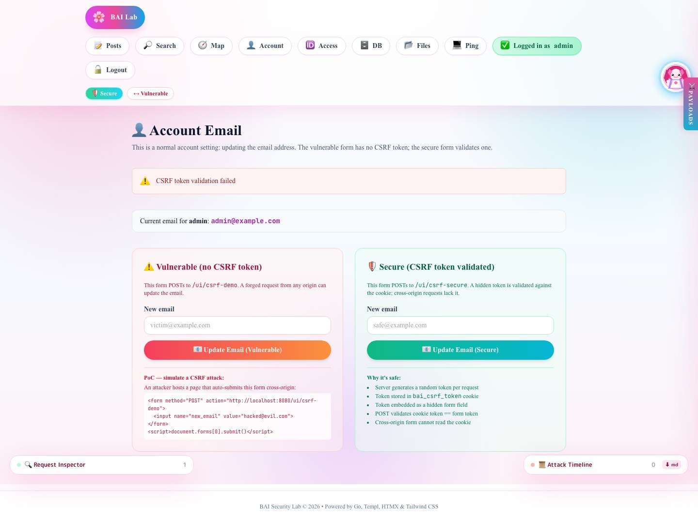

### 11.5. Ocena ryzyka

Ryzyko zależy od akcji. Sama zmiana emaila jest istotna, bo może umożliwić przejęcie procesu resetu hasła. W prawdziwych aplikacjach CSRF może wykonywać przelewy, zmieniać hasła, dodawać administratorów albo usuwać dane.

### 11.6. Rekomendacja

Należy:

- stosować tokeny CSRF dla żądań mutujących,
- ustawić `SameSite=Lax` albo `SameSite=Strict` dla ciasteczek sesji,
- unikać akcji mutujących przez GET,
- wymagać reautoryzacji dla operacji krytycznych,
- testować POST bez tokena i z nieprawidłowym tokenem.

<div style="page-break-after: always;"></div>

## 12. Sensitive Data Exposure

### 12.1. Opis podatności

Sensitive Data Exposure w projekcie dotyczy przechowywania haseł. W trybie vulnerable hasła są zapisywane w bazie jako plaintext, mimo że kolumna nazywa się `password_hash`. W trybie secure hasła są zapisywane jako bcrypt.

Widok funkcji aplikacji:

```text
/ui/db-expose
```

### 12.2. Kod podatny

Funkcja `preparePassword`:

```go
func (s *Service) preparePassword(plain string) (string, error) {
    if !s.SecurityEnabled() {
        // VULNERABLE: plaintext storage (Sensitive Data Exposure)
        return plain, nil
    }
    hash, err := bcrypt.GenerateFromPassword([]byte(plain), bcrypt.DefaultCost)
    if err != nil {
        return "", err
    }
    return string(hash), nil
}
```

Kod źródłowy: [internal/service/service.go](../internal/service/service.go:286).

Seed bazy działa analogicznie:

```go
func encodePasswordForSeed(password string, securityEnabled bool) (string, error) {
    if !securityEnabled {
        return password, nil
    }
    hash, err := bcrypt.GenerateFromPassword([]byte(password), bcrypt.DefaultCost)
    if err != nil {
        return "", err
    }
    return string(hash), nil
}
```

Kod źródłowy: [internal/db/db.go](../internal/db/db.go:219).

Po refaktoryzacji seed kont demonstracyjnych nie używa już `INSERT OR IGNORE`. Funkcja `upsertSeedUser` aktualizuje hasła `admin` i `user1` zgodnie z aktualnym trybem, dzięki czemu przełączenie z vulnerable na secure nie zostawia plaintextu w bazie.

### 12.3. Atak / weryfikacja

W trybie vulnerable:

```bash
sqlite3 app.db "SELECT username, password_hash, email FROM users;"
```

Przykładowy efekt:

```text
admin|admin|admin@example.com
user1|user1pass|user1@example.com
```

W trybie secure:

```text
admin|$2a$10$...|admin@example.com
user1|$2a$10$...|user1@example.com
```

W secure wyciek bazy nadal jest incydentem, ale nie oznacza natychmiastowego ujawnienia haseł jawnych.

Zrzut ekranu: tryb vulnerable pokazuje plaintext w kolumnie `password_hash`:

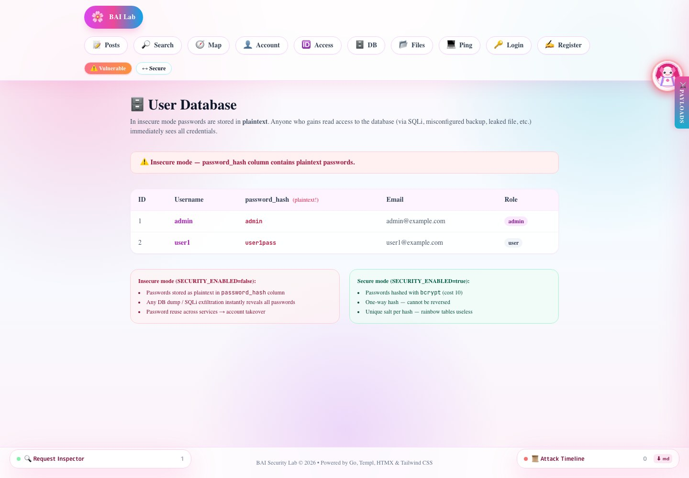

Zrzut ekranu: tryb secure pokazuje hashe bcrypt:

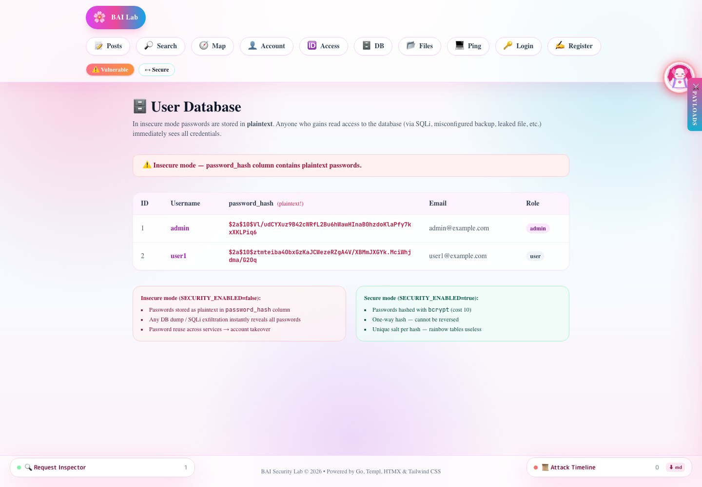

### 12.4. Ocena ryzyka

Ryzyko jest krytyczne, jeżeli użytkownicy używają tych samych haseł w wielu serwisach. Wyciek plaintextu pozwala natychmiast przejąć konto w tej aplikacji i próbować credential stuffing w innych systemach.

### 12.5. Rekomendacja

Należy:

- nigdy nie zapisywać haseł jawnych,
- używać bcrypt/Argon2,
- wymusić minimalne wymagania haseł,
- rozważyć politykę zmiany hasła po incydencie,
- nie wyświetlać tabeli użytkowników publicznie,
- dodać osobne uprawnienia administracyjne dla widoków diagnostycznych.

<div style="page-break-after: always;"></div>

## 13. Path Traversal / LFI

### 13.1. Opis podatności

Path Traversal pozwala odczytać pliki spoza katalogu przeznaczonego do udostępniania. W aplikacji endpoint ma czytać pliki z `./uploads`, ale tryb vulnerable dokleja nazwę pliku bez walidacji.

Endpoint podatny:

```text
/api/files-vulnerable?name=../go.mod
```

Endpoint bezpieczny:

```text
/api/files-secure?name=../go.mod
```

### 13.2. Kod podatny

```go
func (h *Handler) FilesVulnerable() gin.HandlerFunc {
    return func(c *gin.Context) {
        name := c.Query("name")
        if name == "" {
            c.JSON(http.StatusBadRequest, gin.H{"error": "name parameter required"})
            return
        }

        path := uploadsDir + "/" + name
        data, err := os.ReadFile(path)
        if err != nil {
            c.JSON(http.StatusNotFound, gin.H{"error": "file not found", "path": path})
            return
        }

        c.Header("Content-Type", "text/plain; charset=utf-8")
        c.String(http.StatusOK, string(data))
    }
}
```

Kod źródłowy: [internal/handlers/handlers.go](../internal/handlers/handlers.go:1242).

Jeżeli `name=../go.mod`, to finalna ścieżka staje się:

```text
./uploads/../go.mod
```

Po normalizacji prowadzi to do pliku `go.mod` w katalogu projektu.

### 13.3. Efekt ataku

Polecenie:

```bash
curl "http://localhost:8080/api/files-vulnerable?name=../go.mod"
```

Efekt:

- status 200,
- treść pliku `go.mod`,
- potwierdzenie, że atakujący wyszedł poza `uploads`.

Zrzut ekranu:

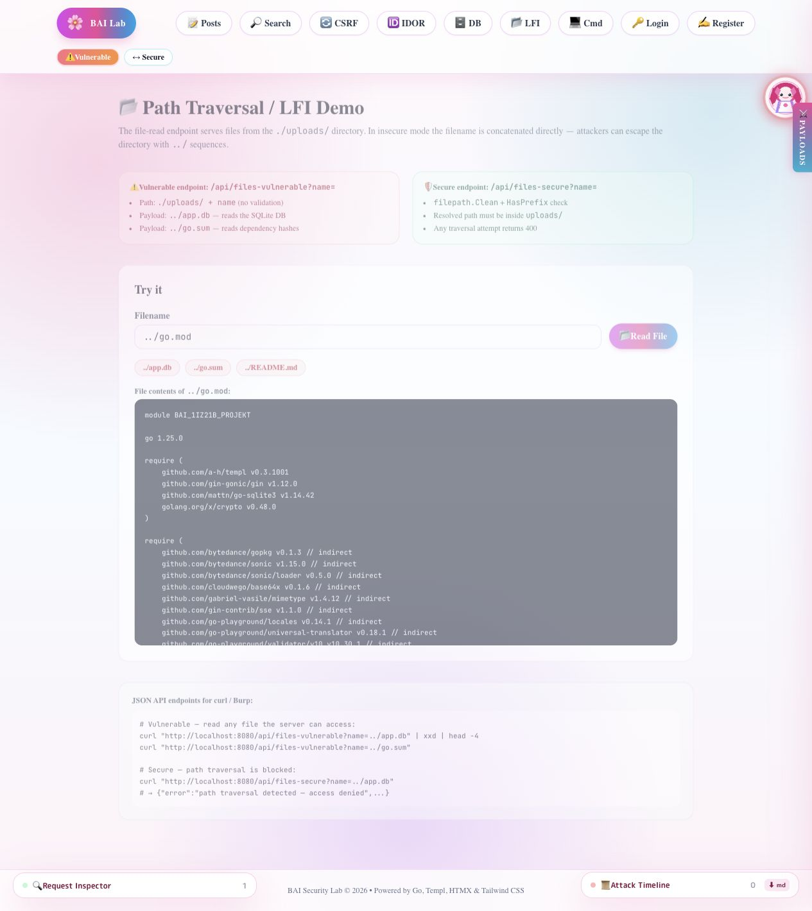

### 13.4. Kod bezpieczny

Bezpieczna ścieżka używa `safeUploadPath`:

```go
func safeUploadPath(name string) (string, bool) {
    if filepath.IsAbs(name) {
        return "", false
    }

    cleaned := filepath.Clean(name)
    if cleaned == "." || cleaned == ".." || strings.HasPrefix(cleaned, ".."+string(filepath.Separator)) {
        return "", false
    }

    base, err := filepath.Abs(uploadsDir)
    if err != nil {
        return "", false
    }
    candidate := filepath.Join(base, cleaned)
    if !strings.HasPrefix(candidate, base+string(filepath.Separator)) && candidate != base {
        return "", false
    }

    return candidate, true
}
```

Kod źródłowy: [internal/handlers/handlers.go](../internal/handlers/handlers.go:1296).

Endpoint secure zwraca błąd 400, jeżeli ścieżka wychodzi poza katalog `uploads`.

Zrzut ekranu:

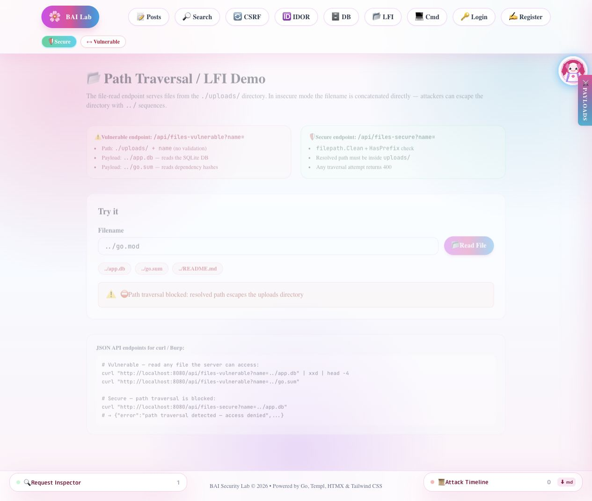

### 13.5. Ocena ryzyka

Ryzyko jest wysokie. Atakujący może odczytać pliki konfiguracyjne, bazę SQLite, kod źródłowy, klucze lub inne dane procesu. W projekcie szczególnie widoczny jest scenariusz odczytu `app.db`, który może połączyć się z Sensitive Data Exposure.

### 13.6. Rekomendacja

Należy:

- nie doklejać ścieżek ręcznie,
- odrzucać ścieżki absolutne,
- normalizować ścieżkę,
- porównywać ścieżkę wynikową z katalogiem bazowym,
- dla plików publicznych używać losowych nazw i mapowania ID -> plik,
- nie zwracać pełnej ścieżki serwerowej w błędach.

<div style="page-break-after: always;"></div>

## 14. Command Injection

### 14.1. Opis podatności

Command Injection występuje, gdy dane użytkownika trafiają do polecenia systemowego jako składnia, a nie jako argument. W aplikacji podatność jest pokazana przez endpoint ping.

Endpoint podatny:

```text
/api/ping-vulnerable?host=127.0.0.1; echo BAI_CMD_INJECTION
```

Endpoint bezpieczny:

```text
/api/ping-secure?host=127.0.0.1; echo BAI_CMD_INJECTION
```

### 14.2. Kod podatny

```go
func (h *Handler) PingVulnerable() gin.HandlerFunc {
    return func(c *gin.Context) {
        host := c.Query("host")
        if host == "" {
            c.JSON(http.StatusBadRequest, gin.H{"error": "host parameter required"})
            return
        }

        cmd := exec.Command("sh", "-c", "ping -c1 "+host)
        out, _ := cmd.CombinedOutput()

        c.Header("Content-Type", "text/plain; charset=utf-8")
        c.String(http.StatusOK, string(out))
    }
}
```

Kod źródłowy: [internal/handlers/handlers.go](../internal/handlers/handlers.go:1378).

Problemem jest `sh -c`. Znak `;`, `&&`, `|` albo backtick jest interpretowany przez shell. Atakujący może dopisać kolejną komendę.

### 14.3. Efekt ataku

Polecenie:

```bash
curl "http://localhost:8080/api/ping-vulnerable?host=127.0.0.1%3B%20echo%20BAI_CMD_INJECTION"
```

Efekt:

- aplikacja uruchamia `ping`,
- następnie shell wykonuje `echo BAI_CMD_INJECTION`,
- wynik dopisanej komendy pojawia się w odpowiedzi.

Zrzut ekranu:

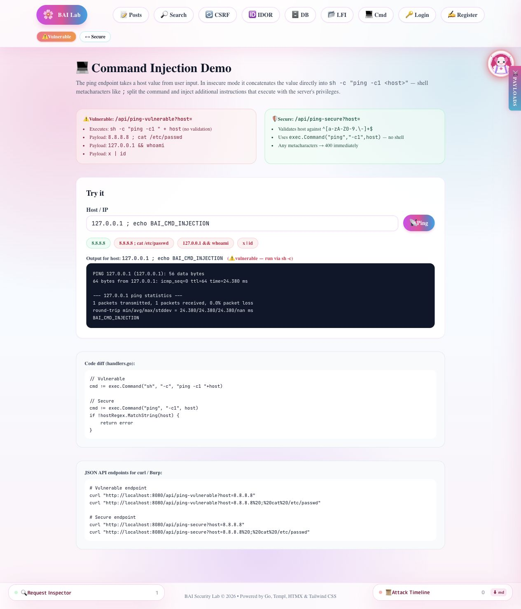

### 14.4. Kod bezpieczny

Bezpieczna wersja waliduje host, nie używa shella i uruchamia proces z timeoutem:

```go
var validHostRE = regexp.MustCompile(`^[a-zA-Z0-9.\-]+$`)

func runSecurePing(ctx context.Context, host string) (string, error) {
    if err := validatePingHost(host); err != nil {
        return "", err
    }

    pingCtx, cancel := context.WithTimeout(ctx, securePingTimeout)
    defer cancel()

    out, err := exec.CommandContext(pingCtx, "ping", "-c1", host).CombinedOutput()
    if pingCtx.Err() == context.DeadlineExceeded {
        return string(out), fmt.Errorf("ping timed out after %s", securePingTimeout)
    }
    _ = err
    return string(out), nil
}

func (h *Handler) PingSecure() gin.HandlerFunc {
    return func(c *gin.Context) {
        host := c.Query("host")
        if host == "" {
            c.JSON(http.StatusBadRequest, gin.H{"error": "host parameter required"})
            return
        }

        if err := validatePingHost(host); err != nil {
            c.JSON(http.StatusBadRequest, gin.H{
                "error":  err.Error(),
                "detail": "shell metacharacters (;, &, |, $, `, etc.) are rejected",
            })
            return
        }

        out, err := runSecurePing(c.Request.Context(), host)
        if err != nil {
            c.String(http.StatusGatewayTimeout, out+"\n"+err.Error())
            return
        }
        c.Header("Content-Type", "text/plain; charset=utf-8")
        c.String(http.StatusOK, out)
    }
}
```

Kod źródłowy: [internal/handlers/handlers.go](../internal/handlers/handlers.go:1416).

Zrzut ekranu:

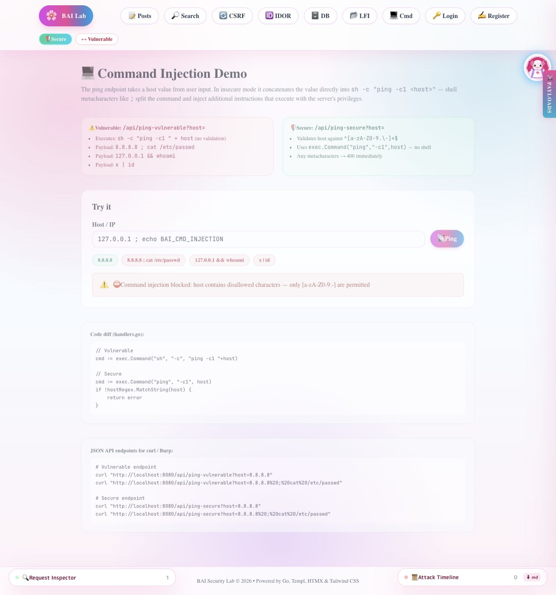

### 14.5. Ocena ryzyka

Ryzyko jest krytyczne. Command Injection może prowadzić do wykonania dowolnego kodu z uprawnieniami procesu aplikacji. W zależności od środowiska może to oznaczać odczyt sekretów, modyfikację plików, pivoting w sieci lub przejęcie hosta.

### 14.6. Rekomendacja

Należy:

- unikać shella,
- przekazywać dane użytkownika jako osobny argument,
- stosować allowlistę znaków,
- ograniczać timeout wykonania,
- logować próby użycia metaznaków,
- rozważyć całkowite usunięcie funkcji ping z aplikacji produkcyjnej.

<div style="page-break-after: always;"></div>

## 15. Testy integracyjne

Testy znajdują się w [main_integration_test.go](../main_integration_test.go). Uruchamia się je przez:

```bash
go test -tags=integration -v .
```

Testy używają tymczasowej bazy danych w `t.TempDir()`, więc nie modyfikują lokalnego `app.db`.

Ostatnia walidacja po refaktoryzacji została wykonana 22 maja 2026 r.:

| Komenda | Wynik |
|---|---|
| `go test ./...` | PASS |
| `go test -tags=integration -v .` | PASS |
| `go build -o /private/tmp/bai-refactor-check main.go` | PASS |

### 15.1. Zakres testów

Najważniejsze testy:

| Test | Cel |
|---|---|
| `TestIntegration_Ping` | health check |
| `TestIntegration_Posts` | lista postów |
| `TestIntegration_Login` | logowanie w trybie vulnerable |
| `TestIntegration_UI_PostsPage` | renderowanie strony postów |
| `TestIntegration_UIModeToggle` | przełączenie trybu i blokada SQLi |
| `TestIntegration_Register` | rejestracja API i UI |
| `TestIntegration_SeedDB_RewritesDemoCredentialsForSecurityMode` | potwierdzenie, że secure seed przepisuje hasła demonstracyjne do bcrypt |
| `TestIntegration_SecureAuthCookieIsSignedAndSameSiteStrict` | podpisane cookie, `HttpOnly`, `SameSite=Strict`, odrzucenie sfałszowanego cookie |
| `TestIntegration_CSRFSecureFormRejectsAndAcceptsTokens` | odrzucenie POST bez tokena i akceptacja poprawnego tokena CSRF |
| `TestIntegration_DeleteAuthorization_SecurityEnabled` | autoryzacja usuwania postów |
| `TestIntegration_SearchSQLi_VulnerableMode` | potwierdzenie SQLi |
| `TestIntegration_SearchSQLi_SecureMode` | blokada SQLi |
| `TestIntegration_StoredXSS_VulnerableMode` | surowe renderowanie XSS |
| `TestIntegration_StoredXSS_SecureMode` | escaping/stripping XSS |
| `TestIntegration_PathTraversal_LFI` | LFI podatne i blokowane |
| `TestIntegration_CommandInjection` | command injection i blokada |

### 15.2. Przykład testu SQL Injection

Test w trybie vulnerable dodaje draft, a następnie sprawdza, że payload `OR 1=1` ujawnia ten draft:

```go
payload := url.QueryEscape("' OR 1=1 --")
resp := doRequest(t, router, http.MethodGet, "/api/search?q="+payload, "")
results := decodeSearchResults(t, resp.Body.Bytes())
if len(results) < 3 {
    t.Fatalf("expected SQLi to leak >=3 rows, got %d", len(results))
}
```

Test w trybie secure oczekuje zera wyników dla tego samego payloadu.

### 15.3. Przykład testu Stored XSS

W trybie vulnerable test wymaga obecności surowego `<script>` w odpowiedzi. W trybie secure test wymaga, aby odpowiedź nie zawierała surowego tagu i nie zachowała atrybutu `onerror=`.

To jest dobry przykład testu regresji: jeżeli ktoś przypadkowo użyje `templ.Raw` w trybie secure, test powinien to wykryć.

### 15.4. Przykład testu Command Injection

Payload:

```go
payload := url.QueryEscape("127.0.0.1; echo BAI_CMD_INJECTION")
resp := doRequest(t, router, http.MethodGet, "/api/ping-vulnerable?host="+payload, "")
if !strings.Contains(resp.Body.String(), "BAI_CMD_INJECTION") {
    t.Fatalf("expected injected command output")
}
```

W trybie secure test oczekuje statusu 400 oraz komunikatu `invalid host`.

<div style="page-break-after: always;"></div>

## 16. Propozycje dalszych zmian w kodzie

Poniższa sekcja została zaktualizowana po krytycznym przeglądzie kodu. Część wcześniejszych rekomendacji została już wdrożona, dlatego rozdzielono stan na poprawki wykonane oraz prace pozostające.

### 16.1. Poprawki wykonane po ocenie krytycznej

| Obszar | Wykonana poprawka | Pliki |
|---|---|---|
| Stan trybu secure/vulnerable | globalną zmienną runtime zastąpiono współdzielonym `ModeStore` opartym o `atomic.Bool` | `internal/security/mode.go`, `main.go`, `internal/service/service.go`, `internal/handlers/handlers.go` |
| Routing | trasy podzielono na `registerHealthRoutes`, `registerAPIRoutes`, `registerUIRoutes`, `registerLabRoutes` | `main.go` |
| Seed kont demonstracyjnych | `admin` i `user1` są aktualizowani zgodnie z trybem; secure seed nie zostawia plaintextu | `internal/db/db.go` |
| Bcrypt fallback | usunięto fallback z bcrypt do plaintextu w secure mode | `internal/db/db.go` |
| Migracje SQLite | `ALTER TABLE` poprzedzono sprawdzeniem `PRAGMA table_info`, bez logów `duplicate column name` | `internal/db/db.go` |
| Cookie sesji | secure cookie jest podpisane, `HttpOnly` i `SameSite=Strict`; sekret można podać przez `BAI_SESSION_SECRET` | `internal/handlers/handlers.go` |
| CSRF | POST bez tokena zwraca stronę HTML z błędem i status 403; dodano test accept/reject | `internal/handlers/handlers.go`, `main_integration_test.go` |
| Command Injection | secure ping działa bez shella i z `context.WithTimeout` | `internal/handlers/handlers.go` |
| Testy | dodano testy seedowania, signed cookie i CSRF | `main_integration_test.go` |
| Dokumentacja | uzupełniono zrzuty dla XSS, logowania, IDOR, CSRF i DB exposure | `docs/screenshots` |

### 16.2. Zmiany zachowujące tryb lab

1. Dodać osobny endpoint `/ui/security-summary`, który automatycznie wyświetla tabelę: podatność, payload, tryb vulnerable, tryb secure, plik z kodem.
2. Dodać przycisk "Copy curl" przy każdej podatności.
3. Dodać eksport timeline ataku do Markdown jako załącznik do sprawozdania.
4. Dodać test dla Sensitive Data Exposure: w trybie vulnerable hasło admina jest jawne, w trybie secure zaczyna się od `$2a$` albo `$2b$`.
5. Dodać seed większej liczby postów, aby SQL Injection lepiej pokazywał różnicę między publicznymi i prywatnymi danymi.
6. Dodać ostrzeżenie w UI, że endpointy force-vulnerable są celowo podatne i nie są częścią bezpiecznej aplikacji.

### 16.3. Zmiany produkcyjne

1. Wymagać produkcyjnego sekretu przez konfigurację i nie pozwalać na fallback demonstracyjny.
2. Ustawić ciasteczka sesyjne z `Secure=true` przy HTTPS. Obecnie lab działa po HTTP, więc flaga `Secure` jest wyłączona.
3. Użyć centralnego middleware sesji i autoryzacji zamiast ręcznego sprawdzania w wielu handlerach.
4. Usunąć lub skompilować warunkowo endpointy force-vulnerable.
5. Dodać Content Security Policy ograniczającą skrypty inline.
6. Wprowadzić logowanie zdarzeń bezpieczeństwa.
7. Dodać limity rozmiarów requestów.
8. Zastąpić własny sanitizer HTML biblioteką allowlistową, jeżeli aplikacja ma dopuszczać ograniczony HTML użytkownika.
9. Nie udostępniać `/ui/database` publicznie albo wymagać roli admin.
10. Ujednolicić odpowiedzi błędów logowania, żeby nie ułatwiać enumeracji użytkowników.
11. Dodać migracje wersjonowane zamiast migracji bez numeracji.
12. Dodać statyczną analizę bezpieczeństwa w CI, np. `gosec`, z wyjątkami opisanymi przy celowych podatnościach.
13. Dodać sprawdzenie zależności, np. `govulncheck`.
14. Dodać testy e2e dla najważniejszych widoków UI.

### 16.4. Najważniejsze ryzyka pozostające

| Ryzyko | Dlaczego istnieje | Propozycja |
|---|---|---|
| Fallback sekretu sesji | wygodny w labie, zły w produkcji | wymagany sekret w env + rotacja |
| Force-vulnerable endpointy | cel labu, ale groźne poza labem | build tag albo flaga demo |
| Brak pełnej CSP | XSS byłby mniej ograniczony | nagłówki CSP |
| Prosty rate limiter w pamięci | reset po restarcie, brak współdzielenia | Redis / storage |
| Publiczny widok danych użytkowników | cel dydaktyczny, ale ryzykowny poza labem | rola admin albo usunięcie widoku |
| Brak testów e2e UI | integracje pokrywają API i część UI, ale nie pełny browser flow | Playwright w CI |

<div style="page-break-after: always;"></div>

## 17. Wnioski końcowe

Projekt spełnia główny cel dydaktyczny: pokazuje różnicę między podatną i bezpieczną implementacją w jednej aplikacji. Największą zaletą jest to, że podatności nie są opisane tylko teoretycznie. Każda z nich ma:

- trasę UI,
- payload,
- podatny fragment kodu,
- bezpieczny fragment kodu,
- test integracyjny albo czytelny scenariusz manualny.

Zrzuty ekranów obejmują wszystkie osiem podatności: SQL Injection, Stored XSS, Broken Authentication, IDOR, CSRF, Sensitive Data Exposure, Path Traversal oraz Command Injection. Dla najważniejszych przypadków pokazano parę vulnerable/secure, co ułatwia porównanie skutku ataku i naprawy.

Aplikacja dobrze pokazuje też ważną zasadę projektową: zabezpieczenie musi być po stronie serwera. Ukrycie przycisku w UI nie naprawia IDOR. Komunikat ostrzegawczy nie naprawia SQL Injection. Sama nazwa kolumny `password_hash` nie zabezpiecza hasła, jeżeli wpisywana jest tam wartość jawna.

Najważniejszy wniosek techniczny jest prosty: większość pokazanych podatności wynika z traktowania danych użytkownika jako zaufanych. Naprawy polegają na zmianie tej relacji:

- SQL: dane użytkownika są parametrem, nie składnią,
- XSS: dane użytkownika są tekstem, nie HTML,
- auth: hasło jest weryfikowane kryptograficznie,
- IDOR: ID obiektu wymaga autoryzacji,
- CSRF: cookie nie wystarcza jako dowód intencji,
- hasła: baza nie może przechowywać sekretów jawnych,
- pliki: ścieżka musi zostać ograniczona do katalogu bazowego,
- komendy: input nie może trafić do shella.

<div style="page-break-after: always;"></div>

## 18. Załącznik: scenariusz demonstracji

### 18.1. Przygotowanie

```bash
go mod tidy
npm install
npm run build:css
go test -tags=integration -v .
SECURITY_ENABLED=false go run .
```

Otworzyć:

```text
http://localhost:8080/ui/vuln-demos
```

### 18.2. Kolejność prezentacji

1. Pokazać hub podatności.
2. Pokazać przełącznik vulnerable / secure.
3. Uruchomić SQL Injection w `/ui/search`.
4. Przełączyć na secure i powtórzyć payload.
5. Pokazać Stored XSS na komentarzu.
6. Pokazać logowanie admina z błędnym hasłem.
7. Pokazać IDOR przez usunięcie cudzego posta.
8. Pokazać CSRF przez formularz bez tokena.
9. Pokazać tabelę haseł w `/ui/db-expose`.
10. Pokazać Path Traversal przez `../go.mod`.
11. Pokazać Command Injection przez `; echo BAI_CMD_INJECTION`.
12. Podsumować różnice w kodzie.

### 18.3. Komendy do demonstracji

SQL Injection:

```bash
curl "http://localhost:8080/api/search?q=' OR 1=1 --"
curl "http://localhost:8080/api/search-vulnerable?q=zz' UNION SELECT id, username, password_hash, 1, '', '', '' FROM users --"
```

Stored XSS:

```bash
curl -X POST http://localhost:8080/api/comments-vulnerable \
  -H "Content-Type: application/json" \
  -d '{"post_id":1,"body":"","author":"attacker"}'
```

Broken Authentication:

```bash
curl -i -X POST http://localhost:8080/login \
  -H "Content-Type: application/json" \
  -d '{"username":"admin","password":"wrong"}'
```

CSRF:

```html
<form method="POST" action="http://localhost:8080/ui/csrf-demo">
  <input name="new_email" value="hacked@evil.com">
</form>
<script>document.forms[0].submit()</script>
```

Sensitive Data Exposure:

```bash
sqlite3 app.db "SELECT username, password_hash, email FROM users;"
```

Path Traversal:

```bash
curl "http://localhost:8080/api/files-vulnerable?name=../go.mod"
curl "http://localhost:8080/api/files-secure?name=../go.mod"
```

Command Injection:

```bash
curl "http://localhost:8080/api/ping-vulnerable?host=127.0.0.1%3B%20echo%20BAI_CMD_INJECTION"
curl "http://localhost:8080/api/ping-secure?host=127.0.0.1%3B%20echo%20BAI_CMD_INJECTION"
```

### 18.4. Lista zrzutów wykorzystanych w sprawozdaniu

| Plik | Opis |
|---|---|
| `docs/screenshots/01-vuln-demos-vulnerable.jpg` | hub podatności w trybie vulnerable |
| `docs/screenshots/02-sqli-vulnerable-results.jpg` | SQL Injection zwracający wyniki |
| `docs/screenshots/03-path-traversal-vulnerable.jpg` | Path Traversal odczytujący plik spoza uploads |
| `docs/screenshots/04-command-injection-vulnerable.jpg` | Command Injection wykonujący dodatkową komendę |
| `docs/screenshots/05-vuln-demos-secure-after-toggle.jpg` | hub po przełączeniu na secure |
| `docs/screenshots/06-sqli-secure-blocked.jpg` | SQL Injection zablokowany przez parametryzację |
| `docs/screenshots/07-path-traversal-secure-blocked.jpg` | Path Traversal zablokowany przez walidację ścieżki |
| `docs/screenshots/08-command-injection-secure-blocked.jpg` | Command Injection zablokowany przez walidację hosta |
| `09-xss-vulnerable-alert.jpg` | komentarz XSS uruchamiający alert |
| `10-xss-secure-escaped.jpg` | ten sam payload jako tekst w secure |
| `11-login-vulnerable-any-password.jpg` | admin loguje się z błędnym hasłem |
| `12-login-secure-rejected.jpg` | secure odrzuca błędne hasło |
| `13-idor-vulnerable-delete.jpg` | user1 usuwa post admina |
| `14-idor-secure-forbidden.jpg` | secure blokuje usunięcie cudzego posta |
| `15-csrf-vulnerable-updated.jpg` | email zmieniony bez tokena |
| `16-csrf-secure-forbidden.jpg` | secure zwraca 403 bez tokena |
| `17-db-expose-plaintext.jpg` | plaintext w kolumnie `password_hash` |
| `18-db-expose-bcrypt.jpg` | bcrypt w trybie secure |

### 18.5. Status materiału ekranowego

Zrzuty ekranów zostały uzupełnione dla wszystkich ośmiu podatności. Finalna wersja raportu nie zawiera już listy brakujących materiałów.

<div style="page-break-after: always;"></div>

## 19. Załącznik: mapa ekranów aplikacji

Ta sekcja opisuje funkcjonalność aplikacji od strony użytkownika. Można ją wykorzystać przy prezentacji, gdy prowadzący pyta nie tylko o podatności, ale też o pełny zakres działania systemu.

### 19.1. Nawigacja główna

Nagłówek aplikacji zawiera linki do najważniejszych widoków: postów, wyszukiwarki, CSRF, IDOR, bazy danych, LFI i command injection. Dodatkowo pokazuje aktualny tryb pracy: `Vulnerable` albo `Secure`. W prawym obszarze nagłówka znajduje się przycisk przełączania trybu. Przycisk wysyła POST na `/ui/mode/toggle`, a następnie wraca na bieżącą stronę.

To rozwiązanie ułatwia obronę, ponieważ nie trzeba restartować serwera po każdej demonstracji. Prowadzący może zobaczyć ten sam payload w dwóch trybach w ciągu kilku sekund.

### 19.2. Strona postów

Widok `/ui/posts` pełni rolę strony głównej. Jeżeli użytkownik nie jest zalogowany, aplikacja wyświetla komunikat informujący, że do tworzenia, edycji i usuwania postów potrzebne jest logowanie. Jeżeli użytkownik jest zalogowany, pojawia się formularz tworzenia posta.

Formularz tworzenia posta zawiera:

- pole tytułu,
- pole treści,
- opcjonalny upload załącznika,
- checkbox publikacji,
- przycisk wysłania.

Lista postów działa jako naturalny kontekst dla kilku podatności. IDOR używa identyfikatorów postów, Stored XSS używa komentarzy pod postem, a SQL Injection przeszukuje tabelę bloga.

### 19.3. Widok szczegółów posta

Widok `/ui/posts/view/:id` pokazuje konkretny post i komentarze. To najważniejszy ekran dla Stored XSS. Ten sam komponent `CommentsList` renderuje komentarz inaczej zależnie od trybu:

- w vulnerable używa `templ.Raw(c.Body)`,
- w secure renderuje `{ c.Body }` jako tekst.

W trybie vulnerable można pokazać, że payload zapisany w komentarzu przetrwa odświeżenie strony. To odróżnia Stored XSS od prostego Reflected XSS.

### 19.4. Widok wyszukiwania

Widok `/ui/search` zawiera formularz z parametrem `q`. Ekran ma też gotowe przykłady payloadów. To dobry pierwszy scenariusz prezentacji, bo efekt jest natychmiastowy i łatwy do zrozumienia.

Przy prezentacji warto najpierw wpisać zwykłe słowo, np. `Go`, a dopiero potem payload:

```text
' OR 1=1 --
```

Takie porównanie pokazuje, że problem nie polega na samej wyszukiwarce, tylko na sposobie budowania zapytania SQL.

### 19.5. Widok logowania

Widok `/ui/login` jest używany do demonstracji Broken Authentication. W trybie vulnerable poprawne jest dowolne hasło dla istniejącego konta. W trybie secure hasło musi odpowiadać hash'owi bcrypt.

Najprostszy przebieg:

1. Uruchomić vulnerable.
2. Wpisać `admin` i hasło `wrong`.
3. Pokazać komunikat sukcesu.
4. Przełączyć na secure.
5. Wpisać `admin` i `wrong`.
6. Pokazać błąd logowania.
7. Wpisać `admin` i `admin`.
8. Pokazać poprawne logowanie.

### 19.6. Widok rejestracji

Widok `/ui/register` pozwala tworzyć użytkowników. Jest istotny dla Sensitive Data Exposure, ponieważ sposób zapisania hasła zależy od trybu. W vulnerable nowy użytkownik ma hasło zapisane jawnie, w secure hasło jest hashowane.

### 19.7. Widok CSRF

Widok `/ui/csrf-demo` pokazuje podatny formularz zmiany emaila, a `/ui/csrf-secure` pokazuje wariant z tokenem. W szablonie są opisane oba formularze obok siebie, więc można wyjaśnić mechanizm bez przechodzenia do kodu.

Najważniejsza różnica:

- vulnerable: formularz ma tylko `new_email`,
- secure: formularz ma `new_email` oraz ukryte `csrf_token`.

### 19.8. Widok IDOR

Widok `/ui/idor-demo` pokazuje listę postów i przyciski delete. Celowo przyciski są widoczne przy wszystkich postach, aby udowodnić, że UI nie jest mechanizmem bezpieczeństwa. Realne zabezpieczenie musi być w handlerze.

W secure mode nawet jeśli użytkownik wyśle żądanie ręcznie, handler sprawdzi autora posta i rolę użytkownika.

### 19.9. Widok DB exposure

Widok `/ui/db-expose` wyświetla użytkowników i kolumnę `password_hash`. Nazwa kolumny jest celowo myląca w vulnerable, bo w tym trybie zawiera plaintext. To dobrze pokazuje, że sama nazwa pola lub intencja programisty nie jest zabezpieczeniem.

### 19.10. Widok Path Traversal

Widok `/ui/path-traversal` pozwala wpisać nazwę pliku i pokazuje wynik odczytu. W vulnerable wpisanie `../go.mod` zwraca treść pliku projektu. W secure aplikacja zwraca komunikat o zablokowaniu traversal.

### 19.11. Widok Command Injection

Widok `/ui/cmd-injection` pozwala wpisać host dla polecenia ping. W vulnerable input trafia do `sh -c`. W secure input przechodzi przez regex i jest przekazywany jako osobny argument do `exec.Command`.

<div style="page-break-after: always;"></div>

## 20. Załącznik: macierz ryzyka

| Podatność | Prawdopodobieństwo | Skutek | Ryzyko | Uzasadnienie |
|---|---|---|---|---|
| SQL Injection | wysokie | wysokie | krytyczne | parametr `q` jest łatwy do wykrycia, a UNION może ujawnić tabelę użytkowników |
| Stored XSS | średnie | wysokie | wysokie | wymaga zapisania komentarza, ale działa na kolejnych odwiedzających |
| Broken Authentication | wysokie | krytyczne | krytyczne | znajomość loginu wystarcza do przejęcia konta |
| IDOR | średnie | wysokie | wysokie | wymaga zalogowania, ale ID są widoczne i przewidywalne |
| CSRF | średnie | średnie/wysokie | wysokie | wymaga aktywnej sesji ofiary i wejścia na złośliwą stronę |
| Sensitive Data Exposure | średnie | krytyczne | wysokie | wymaga odczytu DB, ale po wycieku hasła są jawne |
| Path Traversal | wysokie | wysokie | krytyczne | parametr `name` umożliwia odczyt plików procesu |
| Command Injection | średnie | krytyczne | krytyczne | po znalezieniu endpointu możliwe jest wykonanie komendy systemowej |

### 20.1. Priorytety napraw

Gdyby aplikacja miała zostać utwardzona produkcyjnie, kolejność prac powinna być następująca:

1. Usunąć lub odciąć endpointy force-vulnerable.
2. Wymusić secure mode jako jedyny tryb produkcyjny.
3. Przenieść sekret sesji do konfiguracji środowiskowej.
4. Dodać middleware autoryzacyjny.
5. Dodać CSP i nagłówki bezpieczeństwa.
6. Dodać testy regresji dla DB exposure.
7. Utrzymać timeouty dla komend systemowych także przy przyszłych narzędziach diagnostycznych.
8. Dodać CI z testami integracyjnymi i skanerami.

### 20.2. Zależności między podatnościami

Podatności w projekcie można łączyć w łańcuchy ataku:

| Łańcuch | Opis |
|---|---|
| SQLi -> Sensitive Data Exposure | SQL Injection przez UNION odczytuje tabelę `users`; w vulnerable hasła są plaintext |
| Path Traversal -> Sensitive Data Exposure | LFI odczytuje `app.db`; plaintext w bazie ujawnia hasła |
| Broken Authentication -> IDOR | atakujący loguje się jako zwykły użytkownik dowolnym hasłem i usuwa cudze posty |
| Stored XSS -> CSRF-like action | XSS może wysłać żądanie mutujące w kontekście ofiary |
| Command Injection -> pełna kompromitacja | wykonanie komend może doprowadzić do odczytu plików, sekretów i bazy |

To jest ważne podczas obrony: każda podatność jest pokazana osobno, ale realny atak często składa się z kilku błędów.

<div style="page-break-after: always;"></div>

## 21. Załącznik: analiza plików

### 21.1. `main.go`

`main.go` zawiera inicjalizację serwisu, handlerów, routera oraz współdzielonego `ModeStore`. Z punktu widzenia bezpieczeństwa najważniejsze są:

- rejestracja tras secure/vulnerable,
- `POST /ui/mode/toggle`,
- przekazanie wspólnego `ModeStore` do serwisu i handlerów,
- podział tras na API, UI i ścieżki laboratoryjne.

Warto zauważyć, że tryb pozostaje wspólny dla całego procesu. Dla aplikacji laboratoryjnej to jest korzystne, bo wszyscy użytkownicy widzą ten sam stan podczas demonstracji. Dla aplikacji produkcyjnej przełącznik podatności byłby niedopuszczalny niezależnie od sposobu implementacji.

### 21.2. `internal/handlers/handlers.go`

To największy plik z logiką HTTP. Obsługuje:

- sesję i cookie,
- logowanie,
- CRUD postów,
- komentarze,
- CSRF,
- IDOR,
- DB exposure,
- LFI,
- command injection.

Najważniejsza obserwacja: handler decyduje, czy dana operacja ma wejść w ścieżkę secure. Serwis odpowiada za dane i część zabezpieczeń, ale handler kontroluje przepływ HTTP.

### 21.3. `internal/service/service.go`

Serwis odpowiada za:

- zapytania SQL,
- tworzenie postów,
- aktualizację postów,
- usuwanie postów,
- wyszukiwanie,
- użytkowników,
- hasła,
- komentarze,
- limiter logowania.

To tutaj najlepiej widać SQL Injection i jego naprawę. Funkcje `SearchPostsVulnerable` i `SearchPostsSecure` są bardzo dobre do pokazania na obronie, bo różnica jest krótka i jednoznaczna.

### 21.4. `internal/db/db.go`

Plik odpowiada za migracje i dane startowe. Jest istotny dla:

- Sensitive Data Exposure,
- Stored XSS seed,
- IDOR seed.

Seed tworzy post użytkownika `user1`, aby można było pokazać usuwanie cudzego posta. Seed tworzy też komentarz XSS, aby demonstracja działała od razu po uruchomieniu.

### 21.5. `internal/views/pages.templ`

Szablony są istotne dla bezpieczeństwa, bo decydują, czy dane użytkownika są escapowane. Najważniejszy fragment to `CommentsList`:

```go
if securityEnabled {
    <p class="text-sm text-slate-800">{ c.Body }</p>
} else {
    <div class="text-sm text-slate-800">@templ.Raw(c.Body)</div>
}
```

To pokazuje, że bezpieczeństwo XSS nie jest tylko kwestią zapisu do bazy. Równie ważny jest sposób renderowania danych.

<div style="page-break-after: always;"></div>

## 22. Załącznik: szczegółowa checklista testowania manualnego

### 22.1. Przed startem

- [ ] Usunięto lub świadomie pozostawiono `app.db`.
- [ ] Wykonano `npm run build:css`.
- [ ] Wykonano `go test -tags=integration -v .`.
- [ ] Uruchomiono `SECURITY_ENABLED=false go run .`.
- [ ] Otworzono `http://localhost:8080/ui/vuln-demos`.
- [ ] Przygotowano terminal z komendami curl.
- [ ] Przygotowano edytor z plikami `handlers.go`, `service.go`, `pages.templ`.

### 22.2. SQL Injection

- [ ] Wpisać zwykłe hasło wyszukiwania.
- [ ] Wpisać payload `' OR 1=1 --`.
- [ ] Pokazać wyniki.
- [ ] Wpisać payload UNION.
- [ ] Pokazać kod `SearchPostsVulnerable`.
- [ ] Przełączyć na secure.
- [ ] Powtórzyć payload.
- [ ] Pokazać kod `SearchPostsSecure`.

### 22.3. Stored XSS

- [ ] Wejść na `/ui/posts/view/1`.
- [ ] Dodać payload ``.
- [ ] Pokazać wykonanie payloadu albo jego obecność w DOM.
- [ ] Pokazać `templ.Raw`.
- [ ] Przełączyć na secure.
- [ ] Dodać payload ponownie.
- [ ] Pokazać brak wykonania.
- [ ] Pokazać `html.EscapeString(stripUnsafeHTML(body))`.

### 22.4. Broken Authentication

- [ ] Wejść na `/ui/login`.
- [ ] Wpisać `admin` i błędne hasło.
- [ ] Pokazać sukces w vulnerable.
- [ ] Przełączyć na secure.
- [ ] Wpisać `admin` i błędne hasło.
- [ ] Pokazać odrzucenie.
- [ ] Wpisać poprawne hasło.
- [ ] Pokazać sukces.

### 22.5. IDOR

- [ ] Zalogować się jako `user1`.
- [ ] Wejść na `/ui/idor-demo`.
- [ ] Spróbować usunąć post admina.
- [ ] W vulnerable operacja przechodzi.
- [ ] W secure operacja jest blokowana.
- [ ] Pokazać `canDeletePost`.

### 22.6. CSRF

- [ ] Zalogować się.
- [ ] Wejść na `/ui/csrf-demo`.
- [ ] Zmienić email przez podatny formularz.
- [ ] Pokazać PoC z autosubmit formularzem.
- [ ] Wejść na `/ui/csrf-secure`.
- [ ] Pokazać hidden input `csrf_token`.
- [ ] Wysłać POST bez tokena.
- [ ] Pokazać 403.

### 22.7. Sensitive Data Exposure

- [ ] Wejść na `/ui/db-expose`.
- [ ] Pokazać plaintext w vulnerable.
- [ ] Uruchomić secure na czystej bazie.
- [ ] Pokazać bcrypt.
- [ ] Pokazać `preparePassword`.

### 22.8. Path Traversal

- [ ] Wejść na `/ui/path-traversal`.
- [ ] Wpisać `../go.mod`.
- [ ] Pokazać odczyt pliku.
- [ ] Przełączyć na secure.
- [ ] Powtórzyć payload.
- [ ] Pokazać blokadę.
- [ ] Pokazać `safeUploadPath`.

### 22.9. Command Injection

- [ ] Wejść na `/ui/cmd-injection`.
- [ ] Wpisać `127.0.0.1; echo BAI_CMD_INJECTION`.
- [ ] Pokazać wynik dopisanej komendy.
- [ ] Przełączyć na secure.
- [ ] Powtórzyć payload.
- [ ] Pokazać błąd walidacji.
- [ ] Pokazać `exec.Command("ping", "-c1", host)`.

<div style="page-break-after: always;"></div>

## 23. Załącznik: propozycja narracji na obronę

### 23.1. Wprowadzenie

"Aplikacja jest prostym blogiem napisanym w Go. Jej celem nie jest tylko obsługa postów, ale pokazanie kontrastu między podatną i bezpieczną implementacją. Wszystkie scenariusze są uruchamiane w tej samej aplikacji. Tryb przełączamy przez współdzielony `ModeStore`, co pozwala wykonać ten sam atak dwa razy i natychmiast porównać wynik."

### 23.2. SQL Injection

"Tutaj parametr wyszukiwania trafia bezpośrednio do SQL. Payload zamyka tekst w LIKE i dopisuje warunek zawsze prawdziwy. W secure mode ten sam payload trafia do placeholdera `?`, więc baza traktuje go jako tekst, a nie składnię."

### 23.3. Stored XSS

"Komentarze są zapisywane w bazie. W vulnerable mode renderujemy je przez `templ.Raw`, więc przeglądarka wykonuje HTML i JavaScript. W secure mode dane są oczyszczane i escapowane. To pokazuje, że zabezpieczenie XSS musi obejmować zarówno zapis, jak i renderowanie."

### 23.4. Broken Authentication

"W vulnerable mode aplikacja sprawdza tylko, czy użytkownik istnieje. Hasło jest ignorowane, więc `admin` z dowolnym hasłem działa. W secure mode hasło jest porównywane z bcrypt hash, a nieudane próby są limitowane."

### 23.5. IDOR

"ID posta jest widoczne i przewidywalne. W vulnerable mode zalogowany użytkownik może usunąć dowolny post po ID. W secure mode handler sprawdza, czy użytkownik jest autorem posta albo administratorem."

### 23.6. CSRF

"Cookie sesyjne potwierdza, kim jest użytkownik, ale nie potwierdza, że użytkownik świadomie wykonał akcję. Dlatego secure mode wymaga tokena CSRF przekazanego w formularzu i porównanego z tokenem w cookie."

### 23.7. Sensitive Data Exposure

"W vulnerable mode kolumna `password_hash` zawiera hasła jawne. Jeżeli atakujący odczyta bazę przez SQLi albo LFI, natychmiast zna hasła. W secure mode w bazie są hashe bcrypt."

### 23.8. Path Traversal

"Endpoint ma czytać pliki z uploads, ale vulnerable mode skleja stringi. `../go.mod` wychodzi poza katalog. Secure mode normalizuje ścieżkę i sprawdza, czy wynik nadal znajduje się pod katalogiem bazowym."

### 23.9. Command Injection

"Najgroźniejszy przypadek to `sh -c`. Shell interpretuje średnik jako separator poleceń, więc można dopisać własną komendę. Secure mode nie używa shella i przekazuje host jako argument."

### 23.10. Zakończenie

"Wszystkie naprawy sprowadzają się do jednej zasady: dane użytkownika nie mogą być traktowane jako kod, składnia, ścieżka ani decyzja autoryzacyjna. Muszą być walidowane, parametryzowane, escapowane i sprawdzane względem uprawnień."

<div style="page-break-after: always;"></div>

## 24. Załącznik: rekomendowany format PDF

Finalny PDF generowany ze skryptu `docs/tools/md_to_docx.py` i LibreOffice powinien mieć ustawienia:

- format: A4,
- marginesy: 2 cm,
- czcionka tekstu: 11 pt,
- czcionka kodu: 9 pt,
- szerokość obrazów: 100%,
- numeracja stron w stopce,
- zachowanie page breaków HTML.

Rekomendowany eksport:

```bash
python3 docs/tools/md_to_docx.py docs/Sprawozdanie_BAI.md docs/generated/Sprawozdanie_BAI.docx
soffice --headless --convert-to pdf --outdir docs/generated docs/generated/Sprawozdanie_BAI.docx
pdfinfo docs/generated/Sprawozdanie_BAI.pdf | grep "Page size"
```

Oczekiwany wynik dla A4 to rozmiar zbliżony do `595 x 842 pts`. W poprzedniej wersji PDF miał format Letter (`612 x 792 pts`), dlatego generator DOCX został poprawiony tak, aby jawnie ustawiać `21.0 cm x 29.7 cm`.

Jeżeli narzędzie ignoruje `<div style="page-break-after: always;"></div>`, można zamienić je na:

```html
<div class="page-break"></div>
```

i dodać CSS:

```css
.page-break {
  page-break-after: always;
}
```

### 24.1. Co sprawdzić przed oddaniem

- [ ] Czy na stronie tytułowej są dane zespołu.
- [ ] Czy wszystkie obrazki renderują się w PDF.
- [ ] Czy kod nie wychodzi poza margines.
- [ ] Czy payloady są czytelne.
- [ ] Czy spis treści zgadza się z nagłówkami.
- [ ] Czy nie ma pustych stron po eksporcie.
- [ ] Czy PDF ma format A4.
- [ ] Czy zrzuty dla XSS, auth, IDOR, CSRF i DB są obecne w dokumencie.

<div style="page-break-after: always;"></div>

## 25. Krótkie podsumowanie dla prowadzącego

Projekt implementuje kompletną aplikację laboratoryjną z ośmioma podatnościami i ich naprawami. Najważniejszy mechanizm to wspólny `ModeStore`, który pozwala porównać zachowanie vulnerable i secure bez zmiany endpointów i bez przepisywania scenariusza demonstracji.

Najmocniejsze strony projektu:

- czytelny kontrast vulnerable/secure,
- gotowe payloady,
- zrzuty ekranów dla wszystkich ośmiu podatności,
- testy integracyjne potwierdzające zachowanie,
- podatności osadzone w funkcjach aplikacji,
- kod podzielony na routing, handler, service, db, security mode i views.

Najważniejsze ograniczenia:

- endpointy force-vulnerable nie mogą istnieć w produkcji,
- fallback sekretu sesji jest dopuszczalny tylko w labie,
- limiter logowania jest pamięciowy,
- brakuje pełnego zestawu nagłówków bezpieczeństwa.

### 25.1. Ograniczenia projektu

Projekt jest świadomie aplikacją laboratoryjną, a nie produkcyjną. Oznacza to, że część decyzji jest poprawna dydaktycznie, ale nie powinna zostać przeniesiona do realnego systemu bez dodatkowego hardeningu. Najważniejsze ograniczenia to wspólny przełącznik trybu dla całego procesu, utrzymywanie endpointów force-vulnerable, uproszczony limiter logowania w pamięci procesu, brak pełnej polityki CSP oraz demonstracyjny fallback sekretu sesji. Te ograniczenia nie są ukrywane, ponieważ ułatwiają obronę projektu: pokazują, które elementy służą edukacji, a które wymagałyby przebudowy w środowisku produkcyjnym.

Wniosek: aplikacja dobrze realizuje cel przedmiotu, ponieważ nie tylko wymienia podatności, ale pokazuje je działające w praktyce i zestawia z konkretną naprawą w kodzie.

<div style="page-break-after: always;"></div>

## 26. Diagramy Mermaid do wersji elektronicznej

Poniższe diagramy są zapisane w składni Mermaid. Są przydatne w wersji elektronicznej Markdown, np. w GitHub, GitLab, Obsidian, Typora albo VS Code z rozszerzeniem Mermaid. Przy eksporcie do PDF trzeba upewnić się, że narzędzie renderuje bloki `mermaid`. Jeżeli nie renderuje, można zostawić wcześniej dodane grafiki SVG z katalogu `docs/diagrams/`.

### 26.1. Przepływ architektury

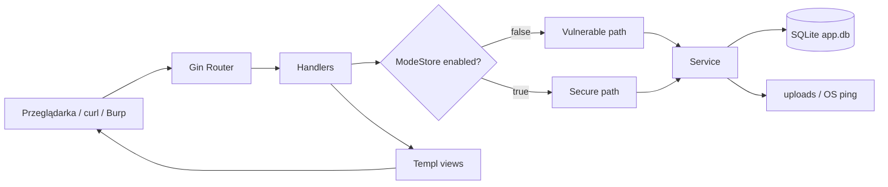
```mermaid
flowchart LR
    A[Przeglądarka / curl / Burp] --> B[Gin Router]
    B --> C[Handlers]
    C --> D{ModeStore enabled?}
    D -->|false| E[Vulnerable path]
    D -->|true| F[Secure path]
    E --> G[Service]
    F --> G
    G --> H[(SQLite app.db)]
    C --> I[Templ views]
    I --> A
    G --> J[uploads / OS ping]
```

### 26.2. Ten sam payload w dwóch trybach

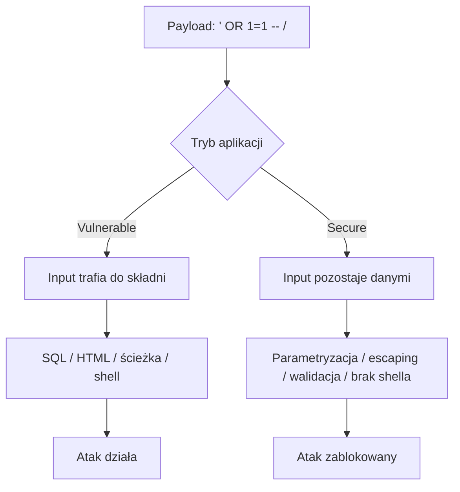
```mermaid
flowchart TB
    P["Payload: ' OR 1=1 -- / <script> / ../go.mod / ; whoami"] --> T{Tryb aplikacji}
    T -->|Vulnerable| V1[Input trafia do składni]
    V1 --> V2[SQL / HTML / ścieżka / shell]
    V2 --> V3[Atak działa]
    T -->|Secure| S1[Input pozostaje danymi]
    S1 --> S2[Parametryzacja / escaping / walidacja / brak shella]
    S2 --> S3[Atak zablokowany]
```

### 26.3. Sekwencja SQL Injection

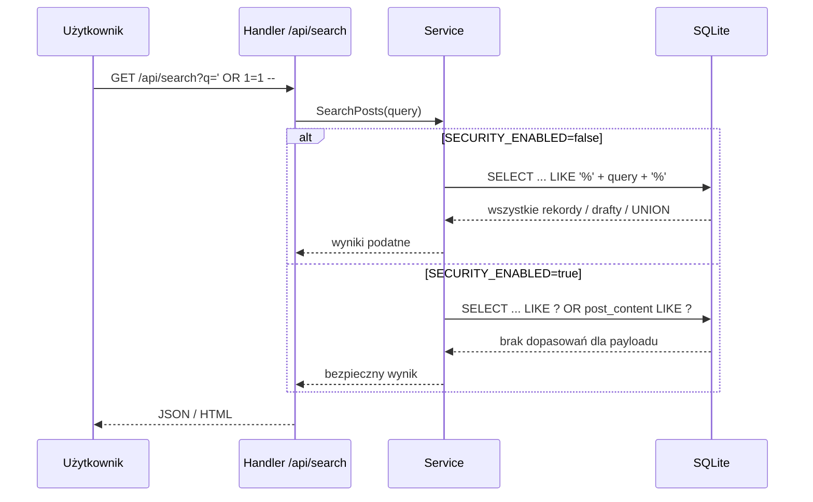
```mermaid
sequenceDiagram
    participant U as Użytkownik
    participant H as Handler /api/search
    participant S as Service
    participant DB as SQLite

    U->>H: GET /api/search?q=' OR 1=1 --
    H->>S: SearchPosts(query)
    alt SECURITY_ENABLED=false
        S->>DB: SELECT ... LIKE '%' + query + '%'
        DB-->>S: wszystkie rekordy / drafty / UNION
        S-->>H: wyniki podatne
    else SECURITY_ENABLED=true
        S->>DB: SELECT ... LIKE ? OR post_content LIKE ?
        DB-->>S: brak dopasowań dla payloadu
        S-->>H: bezpieczny wynik
    end
    H-->>U: JSON / HTML
```

### 26.4. Łańcuch ataku

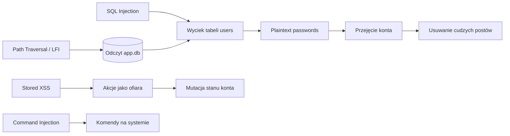
```mermaid
flowchart LR
    SQLi[SQL Injection] --> Users[Wyciek tabeli users]
    LFI[Path Traversal / LFI] --> DB[(Odczyt app.db)]
    DB --> Users
    Users --> Plain[Plaintext passwords]
    Plain --> Auth[Przejęcie konta]
    Auth --> IDOR[Usuwanie cudzych postów]
    XSS[Stored XSS] --> Victim[Akcje jako ofiara]
    Victim --> CSRF[Mutacja stanu konta]
    Cmd[Command Injection] --> Host[Komendy na systemie]
```

### 26.5. Timeline znanych incydentów

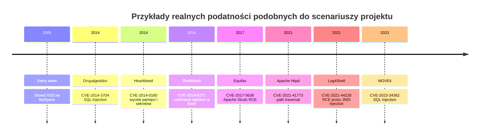
```mermaid
timeline
    title Przykłady realnych podatności podobnych do scenariuszy projektu
    2005 : Samy worm : Stored XSS na MySpace
    2014 : Drupalgeddon : CVE-2014-3704 SQL Injection
    2014 : Heartbleed : CVE-2014-0160 wyciek pamięci i sekretów
    2014 : Shellshock : CVE-2014-6271 command injection w Bash
    2017 : Equifax : CVE-2017-5638 Apache Struts RCE
    2021 : Apache httpd : CVE-2021-41773 path traversal
    2021 : Log4Shell : CVE-2021-44228 RCE przez JNDI injection
    2023 : MOVEit : CVE-2023-34362 SQL Injection
```

### 26.6. Mapa OWASP i CWE

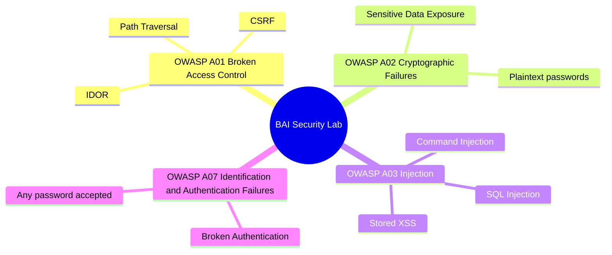
```mermaid
mindmap
  root((BAI Security Lab))
    OWASP A01 Broken Access Control
      IDOR
      CSRF
      Path Traversal
    OWASP A02 Cryptographic Failures
      Sensitive Data Exposure
      Plaintext passwords
    OWASP A03 Injection
      SQL Injection
      Stored XSS
      Command Injection
    OWASP A07 Identification and Authentication Failures
      Broken Authentication
      Any password accepted
```

<div style="page-break-after: always;"></div>

## 27. Realne incydenty, CVE i ciekawostki

Ta sekcja łączy laboratoryjne podatności z prawdziwymi incydentami. Celem nie jest twierdzenie, że aplikacja ma dokładnie te same błędy co opisane systemy, ale pokazanie, że klasy podatności demonstrowane w projekcie miały realne, kosztowne konsekwencje.

### 27.1. SQL Injection: Drupalgeddon i MOVEit

**Drupalgeddon, CVE-2014-3704.** W 2014 roku w Drupal Core 7.x wykryto błąd w budowaniu prepared statements. NVD klasyfikuje go jako CWE-89, czyli SQL Injection. Problem był szczególnie groźny, ponieważ dotyczył popularnego CMS-a i mógł być wykorzystywany zdalnie. W kontekście naszego projektu jest to bardzo podobna lekcja: sama deklaracja używania abstrakcji bazy danych nie wystarczy, jeżeli dane użytkownika nadal mogą zmienić strukturę zapytania.

**MOVEit Transfer, CVE-2023-34362.** W 2023 roku podatność SQL Injection w Progress MOVEit Transfer była aktywnie wykorzystywana przez grupę CL0P. CISA i FBI opisały kampanię jako wykorzystanie wcześniej nieznanej podatności SQLi w aplikacji do transferu plików. Konsekwencją był masowy wyciek danych z wielu organizacji, bo MOVEit często przechowywał pliki wrażliwe i biznesowo krytyczne. To dobry przykład, że SQL Injection nie jest „starą” podatnością z podręczników, tylko nadal pojawia się w nowoczesnych systemach.

**Smaczek do obrony:** w naszym projekcie payload UNION pokazuje wyciek tabeli `users`. MOVEit pokazuje ten sam rodzaj ryzyka w większej skali: jeżeli podatna aplikacja ma dostęp do wrażliwego repozytorium danych, SQLi może być początkiem incydentu organizacyjnego, prawnego i medialnego.

### 27.2. Stored XSS: Samy worm na MySpace

W 2005 roku Samy Kamkar stworzył słynny robak XSS na MySpace. Payload rozprzestrzeniał się przez profile użytkowników, dodając autora jako znajomego i kopiując kod dalej. Według opisów incydentu w mniej niż dobę payload wykonał się u ogromnej liczby użytkowników, a przypadek stał się klasycznym przykładem samoreplikującego Stored XSS.

W naszym projekcie komentarz XSS jest mniejszą, kontrolowaną demonstracją tej samej idei: treść zapisana w bazie zostaje później wykonana w przeglądarce kolejnych użytkowników. Różnica jest tylko w skali.

**Ciekawostka:** nazwa XSS historycznie pochodzi od „cross-site”, ale współcześnie problem jest szerzej rozumiany jako wstrzykiwanie aktywnej treści do strony. OWASP zwraca uwagę, że XSS może prowadzić m.in. do podszywania się pod użytkownika, obserwacji zachowania i ładowania zewnętrznej treści.

### 27.3. Broken Authentication i Equifax jako lekcja procesu

W projekcie Broken Authentication jest uproszczone: aplikacja vulnerable akceptuje dowolne hasło dla istniejącego użytkownika. W świecie rzeczywistym błędy uwierzytelniania często są mniej oczywiste: słabe wymagania haseł, brak rate limitingu, błędne resetowanie haseł, brak MFA albo złe zarządzanie sesją.

Incydent Equifax z 2017 roku nie był prostym „dowolnym hasłem”, ale dobrze pokazuje, że jeden błąd techniczny plus słaby proces bezpieczeństwa może skończyć się katastrofą. FTC podała, że naruszenie dotyczyło około 147 milionów osób, a ugoda wyniosła co najmniej 575 mln USD, z możliwością wzrostu do 700 mln USD. Podatność bazowa była związana z Apache Struts, CVE-2017-5638, czyli zdalnym wykonaniem kodu.

**Smaczek do obrony:** Equifax jest dobrym argumentem, że bezpieczeństwo to nie tylko „czy istnieje patch”, ale też inwentaryzacja, monitoring, skanowanie, odpowiedzialność za wdrożenie i reakcja na alerty.

### 27.4. IDOR i Broken Access Control: najczęstszy problem webowy

OWASP Top 10:2021 umieszcza Broken Access Control na pierwszym miejscu. IDOR jest jedną z najbardziej intuicyjnych odmian tej klasy: użytkownik zmienia ID zasobu i dostaje dostęp do cudzych danych albo operacji.

W projekcie IDOR jest pokazany przez usuwanie postów. To proste, ale dobrze oddaje istotę problemu: widoczny identyfikator obiektu nie jest dowodem uprawnienia. Autoryzację trzeba sprawdzić po stronie serwera dla każdej operacji.

**Ciekawostka:** ukrycie przycisku w UI nie jest zabezpieczeniem. Jeżeli endpoint przyjmuje `POST /ui/posts/delete/2`, to atakujący może wysłać takie żądanie ręcznie nawet wtedy, gdy przycisk nie jest widoczny w HTML.

### 27.5. CSRF: cookie potwierdza tożsamość, ale nie intencję

CSRF jest ciekawą podatnością, bo wykorzystuje poprawne działanie przeglądarki. Przeglądarka automatycznie dołącza cookie do żądania, więc aplikacja wie, kto wysłał request, ale nie wie, czy użytkownik naprawdę chciał wykonać akcję.

W projekcie akcją mutującą jest zmiana emaila. OWASP opisuje, że CSRF celuje przede wszystkim w funkcje zmieniające stan, np. zmianę emaila, hasła albo wykonanie zakupu. Dlatego secure mode używa tokena CSRF jako dodatkowego dowodu intencji.

**Smaczek do obrony:** SameSite w cookie pomaga, ale nie zastępuje całego modelu obrony. W aplikacjach z formularzami i sesją cookie nadal warto rozumieć synchronizer token albo double-submit token.

### 27.6. Sensitive Data Exposure: Heartbleed i wycieki sekretów

W projekcie Sensitive Data Exposure dotyczy haseł zapisanych jawnie w SQLite. Realnym przykładem szeroko znanego wycieku danych wrażliwych jest Heartbleed, CVE-2014-0160. Był to błąd w OpenSSL, który pozwalał odczytywać fragmenty pamięci procesu. CISA opublikowała alert dotyczący tej podatności w 2014 roku.

Heartbleed nie jest tym samym błędem co plaintext password storage, ale konsekwencja jest podobna: wrażliwe dane, które miały pozostać tajne, mogą zostać ujawnione. W przypadku Heartbleed mogły to być m.in. dane sesyjne lub materiał kryptograficzny, a w naszym projekcie hasła w kolumnie `password_hash`.

**Smaczek do obrony:** nazwa kolumny `password_hash` nie chroni hasła. Jeżeli aplikacja wpisuje tam plaintext, to jest to plaintext.

### 27.7. Path Traversal: Apache HTTP Server CVE-2021-41773

CVE-2021-41773 w Apache HTTP Server 2.4.49 to przykład podatności Path Traversal i file disclosure. Przy określonej konfiguracji można było mapować URL-e do plików poza oczekiwanym katalogiem. To bardzo bliskie naszemu endpointowi `/api/files-vulnerable?name=../go.mod`.

W projekcie naprawa polega na `filepath.Clean`, odrzuceniu ścieżek absolutnych i sprawdzeniu, czy finalna ścieżka nadal zaczyna się od katalogu `uploads`. To jest dokładnie ten typ myślenia, którego brakuje w wielu błędach Path Traversal: nie wystarczy szukać `../` tekstowo, trzeba sprawdzić ścieżkę po normalizacji.

### 27.8. Command Injection: Shellshock i Log4Shell

**Shellshock, CVE-2014-6271.** To podatność w Bash związana ze specjalnie przygotowanymi zmiennymi środowiskowymi. NVD ocenia ją jako krytyczną. W praktyce problem był szczególnie niebezpieczny tam, gdzie dane z żądania HTTP trafiały do środowiska procesu CGI i mogły wywołać Bash.

**Log4Shell, CVE-2021-44228.** To nie jest klasyczne `sh -c`, ale jest świetnym przykładem klasy injection prowadzącej do RCE. Podatny Log4j interpretował kontrolowaną przez atakującego treść w sposób prowadzący do zdalnego wykonania kodu. Badania akademickie nad incydentem Log4Shell opisują, jak szybko po publicznym ujawnieniu rozpoczęło się skanowanie i wykorzystywanie podatności.

W naszym projekcie `exec.Command("sh", "-c", "ping -c1 "+host)` pokazuje najbardziej bezpośrednią wersję problemu: metaznaki shella są składnią. Secure mode usuwa shella z równania i przekazuje `host` jako argument.

<div style="page-break-after: always;"></div>

## 28. Literatura, książki, artykuły naukowe i źródła branżowe

Poniższa bibliografia została dobrana jako podstawa merytoryczna sprawozdania. Część pozycji to źródła formalne, część to artykuły naukowe, a część to dokumentacja branżowa. Źródła podpierają zarówno opisy klas podatności, jak i realne przykłady CVE.

### 28.1. Standardy i klasyfikacje

| Źródło | Dlaczego warto cytować |
|---|---|
| [OWASP Top 10:2021](https://owasp.org/Top10/2021/) | Standardowy punkt odniesienia dla ryzyk webowych; obejmuje m.in. Broken Access Control, Cryptographic Failures, Injection i Identification and Authentication Failures. |
| [MITRE CWE-89 SQL Injection](https://cwe.mitre.org/data/definitions/89.html) | Oficjalna definicja SQL Injection oraz rekomendacja prepared statements / parameterized queries. |
| [MITRE CWE-79 Cross-site Scripting](https://cwe.mitre.org/data/definitions/79.html) | Oficjalna klasyfikacja XSS. |
| [MITRE CWE-287 Improper Authentication](https://cwe.mitre.org/data/definitions/287.html) | Oficjalna klasyfikacja błędów uwierzytelniania. |
| [MITRE CWE-639 Authorization Bypass Through User-Controlled Key](https://cwe.mitre.org/data/definitions/639.html) | Dobre dopasowanie do IDOR, gdzie użytkownik kontroluje ID zasobu. |
| [MITRE CWE-352 CSRF](https://cwe.mitre.org/data/definitions/352.html) | Oficjalna klasyfikacja Cross-Site Request Forgery. |
| [MITRE CWE-200 Exposure of Sensitive Information](https://cwe.mitre.org/data/definitions/200.html) | Podstawa dla Sensitive Data Exposure. |
| [MITRE CWE-22 Path Traversal](https://cwe.mitre.org/data/definitions/22.html) | Oficjalna klasyfikacja Path Traversal. |
| [MITRE CWE-78 OS Command Injection](https://cwe.mitre.org/data/definitions/78.html) | Oficjalna klasyfikacja OS Command Injection. |

### 28.2. OWASP Cheat Sheets

| Źródło | Zastosowanie w projekcie |
|---|---|
| [OWASP Cross Site Scripting Prevention Cheat Sheet](https://cheatsheetseries.owasp.org/cheatsheets/Cross_Site_Scripting_Prevention_Cheat_Sheet.html) | Uzasadnia escaping, sanityzację, unikanie escape hatchy takich jak `templ.Raw`. |
| [OWASP CSRF Prevention Cheat Sheet](https://cheatsheetseries.owasp.org/cheatsheets/Cross-Site_Request_Forgery_Prevention_Cheat_Sheet.html) | Uzasadnia tokeny CSRF i projekt secure formularza. |
| [OWASP CSRF community page](https://owasp.org/www-community/attacks/csrf) | Krótko wyjaśnia, że CSRF wykorzystuje uprawnienia ofiary do wykonania niechcianej akcji. |

### 28.3. CVE i incydenty

| CVE / incydent | Źródło | Związek z projektem |
|---|---|---|
| CVE-2014-3704 Drupalgeddon | [NVD CVE-2014-3704](https://nvd.nist.gov/vuln/detail/CVE-2014-3704) | SQL Injection przez błędne budowanie prepared statements. |
| CVE-2023-34362 MOVEit | [CISA alert](https://www.cisa.gov/news-events/alerts/2023/06/01/progress-software-releases-security-advisory-moveit-transfer), [CISA/FBI advisory](https://www.cisa.gov/news-events/cybersecurity-advisories/aa23-158a) | SQL Injection wykorzystane masowo do kradzieży danych. |
| CVE-2017-5638 Apache Struts / Equifax | [NVD CVE-2017-5638](https://nvd.nist.gov/vuln/detail/CVE-2017-5638), [FTC settlement](https://www.ftc.gov/node/47878) | Przykład konsekwencji braku patchowania i procesu bezpieczeństwa. |
| CVE-2014-0160 Heartbleed | [CISA Heartbleed alert](https://www.cisa.gov/news-events/alerts/2014/04/08/openssl-heartbleed-vulnerability-cve-2014-0160) | Realny przykład ujawnienia danych wrażliwych. |
| CVE-2021-41773 Apache httpd | [NVD CVE-2021-41773](https://nvd.nist.gov/vuln/detail/cve-2021-41773), [Qualys analysis](https://blog.qualys.com/vulnerabilities-threat-research/2021/10/27/apache-http-server-path-traversal-remote-code-execution-cve-2021-41773-cve-2021-42013) | Path Traversal i file disclosure. |
| CVE-2014-6271 Shellshock | [NVD CVE-2014-6271](https://nvd.nist.gov/vuln/detail/cve-2014-6271), [CISA Shellshock alert](https://www.cisa.gov/news-events/alerts/2014/09/25/gnu-bourne-again-shell-bash-shellshock-vulnerability-cve-2014-6271-cve-2014-7169-cve-2014-7186-cve) | Command injection / code execution przez Bash. |
| CVE-2021-44228 Log4Shell | [Red Hat advisory](https://access.redhat.com/security/vulnerabilities/RHSB-2021-009), [arXiv: The Race to the Vulnerable](https://arxiv.org/abs/2205.02544) | Injection prowadzące do RCE i masowego skanowania internetu. |
| Samy worm MySpace | [Computerworld](https://www.computerworld.com/article/1697719/teen-uses-worm-to-boost-ratings-on-myspace-com.html), [Help Net Security](https://www.helpnetsecurity.com/2006/05/04/cross-site-scripting-worms-and-viruses-the-impending-threat-and-the-best-defense/) | Klasyczny przykład Stored XSS i samoreplikacji payloadu. |

### 28.4. Artykuły naukowe

| Pozycja | Dane bibliograficzne | DOI / link | Jak użyć w sprawozdaniu |
|---|---|---|---|
| Halfond, Viegas, Orso, 2006 | W. G. J. Halfond, J. Viegas, A. Orso, "A Classification of SQL Injection Attacks and Countermeasures", Proceedings of the IEEE International Symposium on Secure Software Engineering, 2006. | https://faculty.cc.gatech.edu/~orso/papers/halfond.viegas.orso.ISSSE06.pdf | Podparcie sekcji SQL Injection, szczególnie klasyfikacji payloadów i prepared statements. |
| Hydara et al., 2015 | I. Hydara, A. B. M. Sultan, H. Zulzalil, N. Admodisastro, "Current state of research on cross-site scripting (XSS): A systematic literature review", Information and Software Technology, vol. 58, 2015, s. 170-186. | DOI: 10.1016/j.infsof.2014.07.010 | Podparcie sekcji Stored XSS i metod detekcji/prewencji. |
| Durumeric et al., 2014 | Z. Durumeric, F. Li, J. Kasten, J. Amann, J. Beekman, M. Payer, N. Weaver, D. Adrian, V. Paxson, M. Bailey, J. A. Halderman, "The Matter of Heartbleed", Proceedings of the 2014 ACM Internet Measurement Conference, IMC 2014, Vancouver, Canada, 2014. | DOI: 10.1145/2663716.2663755 | Podparcie sekcji Sensitive Data Exposure i znaczenia szybkiego patchowania. |
| Hiesgen et al., 2022 | R. Hiesgen, M. Nawrocki, T. C. Schmidt, M. Wählisch, "The Race to the Vulnerable: Measuring the Log4j Shell Incident", Proceedings of the Network Traffic Measurement and Analysis Conference, TMA 2022. | DOI: 10.48550/arXiv.2205.02544 | Podparcie sekcji o Log4Shell i szybkości eksploatacji po ujawnieniu. |

### 28.5. Książki

| Książka | Autorzy | Zastosowanie |
|---|---|---|
| *The Web Application Hacker's Handbook*, 2nd ed. | Dafydd Stuttard, Marcus Pinto | Praktyczne podejście do testowania SQLi, XSS, CSRF, auth i access control. |
| *Web Application Security* | Andrew Hoffman | Nowoczesne omówienie bezpieczeństwa aplikacji webowych dla developerów. |
| *Real-World Cryptography* | David Wong | Uzasadnienie, dlaczego hasła wymagają sprawdzonych prymitywów i bibliotek, a nie własnych rozwiązań. |
| *Secure by Design* | Dan Bergh Johnsson, Daniel Deogun, Daniel Sawano | Dobre źródło do wniosków o projektowaniu domeny i ograniczaniu błędów dostępu. |
| *Security Engineering*, 3rd ed. | Ross Anderson | Szeroki kontekst systemowy: dlaczego incydenty wynikają z połączenia błędów technicznych, procesowych i organizacyjnych. |
| *Designing Data-Intensive Applications* | Martin Kleppmann | Nie jest książką stricte security, ale pomaga wyjaśnić konsekwencje wycieków danych i zależności od storage. |

### 28.6. Proponowany opis bibliograficzny do końca pracy

Przykładowe wpisy w stylu prostym:

```text
[1] OWASP Foundation, OWASP Top 10:2021, https://owasp.org/Top10/2021/, dostęp: 22.05.2026.
[2] MITRE, CWE-89: SQL Injection, https://cwe.mitre.org/data/definitions/89.html, dostęp: 22.05.2026.
[3] MITRE, CWE-79: Cross-site Scripting, https://cwe.mitre.org/data/definitions/79.html, dostęp: 22.05.2026.
[4] CISA, Progress Software Releases Security Advisory for MOVEit Transfer, 2023, https://www.cisa.gov/news-events/alerts/2023/06/01/progress-software-releases-security-advisory-moveit-transfer, dostęp: 22.05.2026.
[5] FTC, Equifax to Pay $575 Million as Part of Settlement, 2019, https://www.ftc.gov/node/47878, dostęp: 22.05.2026.
[6] W. G. J. Halfond, J. Viegas, A. Orso, "A Classification of SQL Injection Attacks and Countermeasures", IEEE ISSSE, 2006.
[7] I. Hydara, A. B. M. Sultan, H. Zulzalil, N. Admodisastro, "Current state of research on cross-site scripting (XSS): A systematic literature review", Information and Software Technology, 58, 2015, s. 170-186, DOI: 10.1016/j.infsof.2014.07.010.
[8] Z. Durumeric et al., "The Matter of Heartbleed", ACM IMC 2014, DOI: 10.1145/2663716.2663755.
[9] R. Hiesgen, M. Nawrocki, T. C. Schmidt, M. Wählisch, "The Race to the Vulnerable: Measuring the Log4j Shell Incident", TMA 2022, DOI: 10.48550/arXiv.2205.02544.
[10] D. Stuttard, M. Pinto, The Web Application Hacker's Handbook, 2nd ed., Wiley, 2011.
[11] R. Anderson, Security Engineering, 3rd ed., Wiley, 2020.
```
